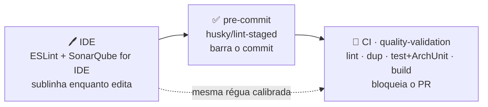
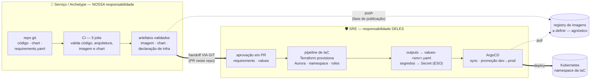

# ⚙️ CI/CD & Esteira — users-api

> **📖 Documentação** · [Visão geral](./README.md) · [🔐 Segurança & Governança](./SECURITY-README.md) · [💻 Execução local](./LOCAL-EXECUTION-README.md) · **CI/CD & Esteira** (este arquivo)

Como o código vira artefato validado e onde termina a nossa fronteira e começa a do SRE. A
espinha é uma **esteira única de qualidade** que acompanha o dev do editor ao merge — não um
portão que só aparece no fim.

## 1 · A esteira de qualidade — um mecanismo, três pontos de contato

O ponto central: **o que o IDE sublinha é o que o pre-commit barra é o que o CI bloqueia.** Não
são três ferramentas — é a **mesma** régua (ESLint type-aware + sonarjs + jscpd + ArchUnitTS),
rodando em três momentos. Isso é tanto **visão do dev** (feedback na hora, sem esperar o PR)
quanto **gate da entrega** (nada regride no merge):

- **O que cada gate cobre** (limiares, regras ArchUnit, exemplo de violação): [Visão geral › §5](./README.md).
- **Como o dev roda localmente** (`npm run lint`, `dup:check`, `npm test`): [Execução local › §4](./LOCAL-EXECUTION-README.md).
- **Como vira barreira de PR**: a seção 3 abaixo (`quality-validation`).

## 2 · Plataforma — catálogo e artefatos

| Artefato | Papel |
|---|---|
| `catalog-info.yaml` | Registro no catálogo do Backstage (Component, ownership, tags). Dois `PLACEHOLDER`s: `spec.owner` e `github.com/project-slug`. |
| `.github/workflows/ci.yml` | Cinco jobs, todos **sem publicar nada** (publicação e deploy são de outra fase). `quality-validation` e `security` são os required status checks do golden path, para humanos e agentes de IA. **Detalhe de cada job na seção 3.** |
| `deploy/helm/users-api/` | Chart: Deployment com probes, `securityContext` endurecido (non-root, rootfs read-only, drop ALL), `resources`, ConfigMap + `existingSecret`, Job PreSync de migrations, NetworkPolicy. `image.repository`/`tag` parametrizados (o registry de imagens é decisão em aberto — quando definido, é um value, não retrabalho). |
| `docker-compose.ci.yml` | Override do smoke: usa a imagem `users-api:ci` recém-construída. |
| `deploy/infra/requirements.yaml` | **Declaração de infraestrutura** — o que o serviço exige (nesta variante: Postgres, com separação de papéis owner/runtime da RLS), com os outputs esperados. Nós declaramos; o SRE aprova em PR e realiza via Terraform. Paridade 1:1 com o compose local. |
| `deploy/helm/*/values-{dev,prod}.yaml` | O **ponto de junção** entre a IaC e o chart: estrutura nossa, valores preenchidos com os outputs do Terraform (`[TERRAFORM OUTPUT]`/`[SRE]`/`[CI]` marcados campo a campo). |
| `deploy/argocd/application.example.yaml` | Referência para o SRE: o chart é consumível **direto do git** pelo ArgoCD — o Application real vive no território deles. |

## 3 · O CI em detalhe — o que cada job executa e o que cada auditoria cobre

**`quality-validation`** — qualidade do código-fonte (o terceiro ponto da esteira da seção 1):

| Step | O que faz | O que audita/garante |
|---|---|---|
| `npm ci --ignore-scripts` | Instala **exatamente** o `package-lock.json`; divergência lockfile×package.json = falha | Integridade da árvore de dependências + **bloqueio dos scripts de pós-install** de terceiros no runner (vetor clássico de supply chain) |
| `npm run lint` | ESLint 9 flat config, regras **type-aware** + **quality gate** (sonarjs, complexidade, bloaters, max-params) | Consistência, type-safety e as métricas de qualidade — smells e complexidade bloqueiam o build |
| `npm run dup:check` | **jscpd** — detector de código duplicado | Densidade de duplicação acima de **3%** = gate vermelho |
| `npm run format:check` | Prettier em modo verificação | Formato único — diff de PR sem ruído |
| `npm run test:cov` | Testes unitários **+ `architecture.spec.ts` (ArchUnitTS)** com cobertura | Regras de negócio **e regras de arquitetura** (fronteira esqueleto×exemplo, camadas, ciclos, pilares de segurança, anti-contrabando) como gate |
| `npm run build` | Compilação Nest/tsc de produção | O artefato TypeScript compila de verdade — não só passa no editor |

**`security`** — auditoria de dependências (SCA):

| Step | O que faz | Cobertura |
|---|---|---|
| `npm audit --audit-level=high` | **Software Composition Analysis** de TODAS as dependências declaradas (produção e dev) contra a base de advisories do npm | HIGH/CRITICAL = gate vermelho; *moderates* só são aceitas com registro no README. Não cobre o que está fora do lockfile — para isso existe o scan de imagem abaixo |

> Este job é o **slot** para ferramentas dedicadas: **socket.dev** (análise de
> **comportamento** de pacote — scripts de instalação, acesso à rede, troca suspeita de
> mantenedor — pega ataques *antes* de virarem advisory), **Snyk** e **SonarQube**. Todas
> exigem credencial de org — por isso não vêm pré-conectadas.

**`e2e-testing`** — a aplicação real contra infraestrutura real:

| Step | O que faz | O que garante |
|---|---|---|
| `npm run test:e2e` | Sobe um Postgres **real e efêmero** (Testcontainers), aplica as **migrations reais**, boota o AppModule completo | Boot de verdade (o Joi fail-fast e o wiring de DI são exercitados), probes respondendo, contrato de erro, CRUD ponta a ponta, matriz de segurança e RLS |

**`build-image`** — empacotamento e as auditorias do artefato:

| Step | O que faz | O que audita/garante |
|---|---|---|
| Build (`push: false`) | Docker multi-stage; o estágio final roda **non-root** (`USER node`), tem o **toolchain removido** (npm/corepack/yarn saem após o `npm ci --omit=dev --ignore-scripts`), base **pinada** (`node:22-alpine`) | **Segurança do empacotamento**: a imagem carrega só o runtime (`node dist/main`) — superfície mínima; nada é publicado, o artefato morre com o runner |
| Trivy — camada 1 (Job Summary) | Scan completo da imagem: **vulnerabilidades do SO** (pacotes Alpine), **pacotes Node dentro da imagem** (o que o `npm audit` não vê — ex.: software embutido na base) e **varredura de segredos** nas camadas | Visibilidade: o relatório inteiro aparece na página do run, antes de qualquer log |
| Trivy — camada 2 (SARIF) | Opt-in via variável `TRIVY_SARIF_UPLOAD=true` (exige GHAS em repo privado) | Cada CVE vira **alerta rastreável na aba Security** — o canal do time de segurança |
| Trivy — camada 3 (gate) | `--severity HIGH,CRITICAL --exit-code 1` | Derruba o job; exceção **só** via `.trivyignore` (CVE + justificativa + dono + expiração + aval do time de segurança) — runbook na seção 7 |
| Smoke | `docker compose` com override usa **a imagem recém-construída** contra o Postgres real e espera `GET /health/readiness` | O artefato **sobe de verdade** com a dependência real — não só builda |
| Teardown (`if: always()`) | `compose down -v` | Runner limpo mesmo em falha |

> **O que é o smoke ("teste de fumaça"):** o "isso liga?" do artefato. Ele **não** valida regra
> de negócio (isso é papel do unit e do e2e) — prova que a **imagem empacotada** boota e
> responde o mínimo (readiness `ok`) contra o Postgres real. É raso de propósito e pega a
> classe de defeito que nenhum teste de código vê: o que só existe **dentro da imagem de
> produção** (ex.: dependência de dev ausente derrubando o boot — defeito real já capturado
> por este gate na família do archetype). Reproduza-o na sua máquina:
> [Execução local › §8.2](./LOCAL-EXECUTION-README.md).

**`helm-validate`** — o chart sem tocar em cluster:

| Step | O que faz | O que garante |
|---|---|---|
| `helm lint` | Higiene do chart | Estrutura e values coerentes |
| `helm template` | Renderiza os manifests de verdade | Template quebrado não chega ao deploy |
| `kubeconform -strict` | Valida os manifests renderizados contra o **schema do Kubernetes** | Manifest inválido pego sem cluster, sem kubeconfig — o CI nunca segura credencial de cluster |

## 4 · CI × CD — o fluxo e as fronteiras de responsabilidade

| Fronteira | Responsável | O quê |
|---|---|---|
| 🧩 Nossa | serviço/archetype | Código, chart, `requirements.yaml` (declaração), CI com todos os gates, artefatos validados |
| 🤝 Conjunta | as duas pontas | `values-<env>.yaml` — **estrutura** nossa; **valores** são outputs do Terraform do SRE |
| 🛡️ SRE | plataforma | Aprovação dos PRs de infra, pipeline Terraform, ArgoCD (Applications, sync, promoção), políticas de segurança, registry |

### Migrations no deploy — Job PreSync (separação de papéis da RLS)

As migrations rodam como um **passo PreSync** (Helm hook / ArgoCD PreSync), **antes** do
Deployment subir, com o role de **MIGRAÇÃO/OWNER** (Secret `migrations.existingSecret`, distinto
do runtime). É onde a separação de papéis da RLS vira operação: o schema/RLS é criado pelo owner;
a app nunca tem privilégio de DDL. O contexto completo em [🔐 Segurança › §6](./SECURITY-README.md).

### Handoff — os insumos que o SRE fornece (e a chave que cada um liga)

O desenho acima está **acordado com o SRE**. O que falta para ligar cada chave são insumos
operacionais deles — este é o checklist do handoff:

| # | Insumo do SRE | A chave que ele liga |
|---|---|---|
| 1 | **Registry de imagens** + método de autenticação do CI | `push: true` no job `build-image` + `image.repository` nos values |
| 2 | Como o **Application/namespace** nasce no processo deles (Terraform/repo de config) | O `application.example.yaml` vira o Application real, no território deles |
| 3 | Formato dos **outputs do Terraform → values** + nomes dos Secrets (ESO): runtime, migração/owner e chave pública JWT | Campos `[TERRAFORM OUTPUT]` dos `values-<env>.yaml` + `existingSecret` / `migrations.existingSecret` / `jwtPublicKey.existingSecret` |
| 4 | **Endpoint do Collector** + política de sampling | Campos `OTEL_*` dos values — liga a Fase 2 da observabilidade |
| 5 | **Políticas de admissão** do cluster (PSA/Kyverno/OPA) + CNI que imponha **NetworkPolicy** | Validação do chart contra as policies reais antes do primeiro sync; ativa a NetworkPolicy default-deny |

Fora do escopo desta fase: **publicação** da imagem e do chart (armazenamento agnóstico —
o registry acordado entra como insumo 1) — os jobs `build-image` e `helm-validate` são os
pontos de plug, sem retrabalho.

## 5 · Camada 3 — o que um setup produtivo ainda vai pedir e não existe no chart hoje

O chart cobre o dia a dia por values (réplicas, Service, resources, probes, segurança do pod,
NetworkPolicy, Job de migrations) e deixa namespace para a IaC. A **terceira camada** são os
recursos que um Kubernetes produtivo tipicamente exige e que ficaram como **gap deliberado**
desta fase — cada um com o dono certo:

| Recurso ausente | Para que serve em produção | Quem define a exigência | Quem implementa |
|---|---|---|---|
| **HPA** | Escalar réplicas por carga | 🛡️ SRE (política de capacidade) | 🧩 chart (`hpa.enabled` + values) |
| **PodDisruptionBudget** | Sobreviver a manutenção de nodes sem indisponibilidade | 🛡️ SRE | 🧩 chart (`pdb.enabled`) |
| **Ingress** | Exposição HTTP externa (TLS, rotas) | 🛡️ SRE (ingress controller, certificados) | 🧩 chart (`ingress.enabled`) |
| **ServiceAccount dedicado** | **IRSA** — o pod assume IAM Role para falar com serviços AWS sem access keys (nesta variante não há consumo AWS direto hoje; a necessidade nasce junto com a primeira capacidade que falar com a AWS) | 🛡️ SRE (cria a Role via Terraform) | 🧩 chart (SA + annotation da Role) |
| **affinity / tolerations / topologySpread** | Distribuição e colocação de pods conforme a topologia do cluster | 🛡️ SRE (só eles conhecem os node groups) | 🧩 chart (pass-through de values) |
| **Estratégia de rollout** | Controle fino do RollingUpdate (surge/unavailable) | 🛡️ SRE | 🧩 chart |

**A regra de evolução, em ordem de preferência:**

1. **Evoluir o chart do archetype** *(o caminho certo)*: cada exigência do SRE vira template +
   toggle em values (`hpa.enabled`, `pdb.enabled`…), adicionada **uma vez** e herdada por todo
   serviço gerado. O SRE pede/propõe via PR — o chart é nosso, a revisão é conjunta, e o
   `helm-validate` do CI valida qualquer mudança automaticamente (kubeconform continua de guarda).
2. **Lado ArgoCD** *(sem tocar no repo)*: o SRE pode sobrepor com Kustomize post-rendering ou
   parâmetros Helm no Application — útil para emergência/experimento, **ruim como regime**: a
   verdade do deploy sai do git do serviço.

> Em uma frase: **o SRE é o dono do "o que produção exige"; o chart é o lugar onde isso vira
> padrão reutilizável** — exceção operacional é do ArgoCD, nunca o caminho permanente.

## 6 · Segurança de dependências (supply chain)

- **`package-lock.json` versionado + `npm ci` sempre** (local, Docker e CI);
- **`overrides` para transitiva vulnerável sem fix no pai** — ex.: `js-yaml` forçado a `5.2.3`
  sob `@nestjs/swagger`, escopado;
- **`--ignore-scripts` em toda instalação** — bloqueia pós-install de terceiros;
- **`npm audit --audit-level=high` como gate** (job `security`) + **scan Trivy da imagem**
  (job `build-image`) — o audit cobre o lockfile do app; o Trivy cobre a imagem inteira;
- **Imagem final sem toolchain**: npm/corepack/yarn removidos após o `npm ci` — o runtime é
  só `node dist/main`.

## 7 · Quando o scan de imagem quebrar — runbook de triagem

O relatório completo vai para o **Job Summary** do run; o **gate** derruba o job em
HIGH/CRITICAL. Três destinos, todos com dono:

| Onde está o achado | Ação |
|---|---|
| `app/node_modules/...` — dependência da aplicação | Corrigir: bump, pin ou `overrides` (o `Fixed Version` do relatório diz o alvo) |
| SO base ou software embutido na base | Atualizar a base **ou** hardening (remover o que o runtime não usa) |
| Risco aceito / não explorável | **Somente** via [`.trivyignore`](./.trivyignore): CVE + justificativa + dono + expiração + aprovação do time de segurança |

O que **não** existe como opção: baixar a severidade do gate, remover o step, ou mergear com
o scan vermelho sem registro.

---

**Continue em:** [📖 Visão geral](./README.md) · [🔐 Segurança & Governança](./SECURITY-README.md) · [💻 Execução local](./LOCAL-EXECUTION-README.md)
