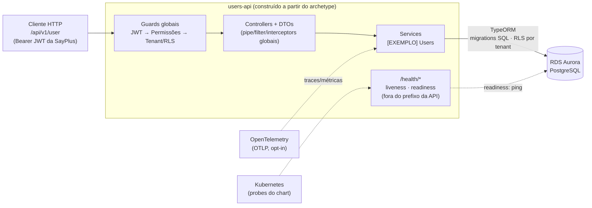

# users-api — construído a partir do Archetype Backend NestJS (SUPREMA) · variante simples

> **📖 Documentação** · **Visão geral** (este arquivo) · [🔐 Segurança & Governança](./SECURITY-README.md) · [💻 Execução local](./LOCAL-EXECUTION-README.md) · [⚙️ CI/CD & Esteira](./CI-CD.md)

**O que você está olhando:** o `users-api` é um **serviço de exemplo construído a partir da
variante simples do Archetype Backend NestJS** da SUPREMA: REST + regra de negócio +
PostgreSQL (TypeORM) — **sem cache distribuído e sem mensageria**. O archetype é o produto:
um esqueleto **não-funcional** (ambiente reprodutível, gates de qualidade e segurança, saúde,
padrões resolvidos). O módulo `users` existe para **provar e demonstrar** o esqueleto com um
domínio mínimo — você o apaga e implementa o seu.

## Onde está cada coisa — os quatro documentos

Este README é a **visão geral**: o que o archetype é, o que entrega e como está organizado.
Os detalhes de cada dimensão vivem em documentos próprios, para leitura focada:

| Documento | Para quem / quando | O que cobre |
|---|---|---|
| **README.md** *(aqui)* | Primeiro contato; entender o produto | Stacks, arquitetura dos componentes, o que vem pronto (qualidade + arquitetura), estrutura, como adotar |
| [🔐 **SECURITY-README.md**](./SECURITY-README.md) | Entender auth/autorização/tenant | Governança que **inicia na SayPlus**, o JWT e a chave pública, a fechadura em camadas, multi-tenancy e RLS no banco |
| [💻 **LOCAL-EXECUTION-README.md**](./LOCAL-EXECUTION-README.md) | Rodar na sua máquina | Passo a passo local, testes, observabilidade local, e a imagem via Dockerfile + docker-compose |
| [⚙️ **CI-CD.md**](./CI-CD.md) | Esteira e entrega | Os 5 jobs do CI, a esteira de qualidade (IDE → pre-commit → CI), fronteiras CI × CD e o handoff com o SRE |

---

## 1 · De onde veio o desenho — ADRs → Archetype → users-api

O desenho de arquitetura foi **acordado em ADRs antes de o exemplo existir**:

```
ADRs acordadas  ──▶  Archetype (esqueleto + regras)  ──▶  users-api (exemplo executável)
```

| ADR | Decisão | Por quê |
|---|---|---|
| Natureza do archetype | **Não-funcional primeiro**: ambiente local, CI, saúde e padrões resolvidos; o funcional vem depois, sobre o esqueleto | Serviço nasce pronto para operar; o domínio é a única parte que varia |
| Composição por necessidade | Esta variante **não carrega** cache nem mensageria | Capacidade só entra quando o domínio precisa — infra ociosa é custo e superfície de ataque |
| Stack | Node 22 · NestJS 11 · TypeScript strict | Golden path único por categoria |
| Persistência | TypeORM → Aurora PostgreSQL; migrations em SQL explícito, `synchronize: false` | Migration é código de produção — revisável e determinística |
| Autenticação | **Consumida da plataforma SayPlus** — o módulo valida o JWT (RS256, chave pública), nunca emite | AuthN/AuthZ são capacidade transversal da plataforma; cada serviço só declara o que cada rota exige (`@Permissions`). Detalhes em [SECURITY-README](./SECURITY-README.md) |
| Saúde | Terminus: liveness sem dependências; readiness = PostgreSQL | Contrato com o Kubernetes; o chart aponta as probes para cá |
| Supply chain | Lockfile + `npm ci` + `--ignore-scripts` + gates (IDE → pre-commit → CI) + imagem sem toolchain | Defesa em camadas contra o vetor nº 1 do ecossistema npm — ver [CI-CD](./CI-CD.md) |
| Empacotamento | CI **empacota e valida sem publicar**; publicação e deploy (GitOps/ArgoCD) são outra fase | Artefato validado antes de existir infraestrutura |
| Exemplo × esqueleto | O módulo de negócio é `[EXEMPLO]` demarcado e descartável | O dev apaga o exemplo e mantém o esqueleto — ver seção 8 |

## 2 · Stacks disponíveis

O que esta variante traz de fábrica — o "golden path" desta categoria de serviço:

| Camada | Stack | Observação |
|---|---|---|
| Runtime | **Node 22** · **NestJS 11** · **TypeScript** strict | Um caminho único por categoria de serviço |
| API | REST + **Swagger** code-first (`/docs`) · `class-validator`/`class-transformer` · `ValidationPipe` global | Contrato gerado do código |
| Persistência | **TypeORM** → **RDS Aurora PostgreSQL** · migrations SQL explícito | `synchronize: false` sempre |
| AuthN/AuthZ | **passport-jwt** RS256 (consumo da SayPlus) · guards globais | Ver [SECURITY-README](./SECURITY-README.md) |
| Multi-tenancy | `tenant_id` por tabela + **RLS/FORCE** no PostgreSQL | Isolamento na app **e** no banco |
| Saúde | **@nestjs/terminus** (liveness/readiness) | Contrato com o K8s |
| Observabilidade | **OpenTelemetry** (OTLP) + logs JSON (pino) com `trace_id` | Interruptor fail-safe por env |
| Qualidade | **ESLint type-aware** + `eslint-plugin-sonarjs` + **jscpd** + **ArchUnitTS** | Gate local e no CI — seção 5 |
| Entrega | **Dockerfile** multi-stage non-root · **Helm** com hardening · CI 5 jobs | Ver [CI-CD](./CI-CD.md) |

> **Precisa de mais?** Cache (Redis/ElastiCache), mensageria (SNS→SQS) ou integração HTTP
> externa resiliente já estão resolvidos na **variante completa** (`petstore-api`): chaves de
> cache centralizadas com invalidação explícita, consumidor SQS idempotente com DLQ/backoff,
> cliente HTTP com timeout/retry/degradação. Importe de lá em vez de reinventar.

## 3 · Arquitetura dos componentes



| Capacidade | Implementação no esqueleto |
|---|---|
| API REST | Controllers finos + DTOs (`class-validator`/`class-transformer`) + `ValidationPipe` global (whitelist estrita) + Swagger code-first em `/docs` |
| Regra de negócio | Services por módulo; colaboração entre módulos **só via service exportado** |
| Persistência | **TypeORM** → **RDS Aurora PostgreSQL**; migrations versionadas em SQL explícito, `synchronize: false` |
| Segurança | Guards globais (JWT RS256 + permissões) + multi-tenancy + RLS no banco — ver [SECURITY-README](./SECURITY-README.md) |
| Erros | Exception filter global no contrato `{ code, message }` |
| Saúde | **`@nestjs/terminus`**: `/health/liveness` e `/health/readiness` (seção 7) |
| Config | `registerAs` tipado por namespace + schema **Joi fail-fast** no boot |
| Observabilidade | **OpenTelemetry** (traces + métricas OTLP, interruptor fail-safe por env — seção 7) · logs **JSON estruturados** (pino) com trace_id · interceptors de logging/timeout |
| **Arquitetura como teste** | **ArchUnitTS** em `src/architecture.spec.ts` — as regras rodam como gate no `npm test` (seção 5) |
| Entrega | Dockerfile multi-stage non-root **sem toolchain npm** · chart Helm com hardening (`deploy/helm/`) · CI com 5 jobs (ver [CI-CD](./CI-CD.md)) |

## 4 · Estrutura — o que é esqueleto, o que é exemplo

```
src/
├── main.ts                bootstrap: prefixo configurável, Swagger, shutdown hooks
├── app.module.ts          raiz: config validada + providers globais (APP_*)
├── auth/                  consumo da auth SayPlus (guards, strategy, decorators)
├── config/                registerAs tipado + schema Joi (fail-fast)
├── common/                exception filter global, interceptors (log, timeout)
├── database/              TypeORM + data-source da CLI + contexto de tenant (RLS)
│   └── migrations/        ← [EXEMPLO] a InitialSchema cria a tabela users
├── health/                probes liveness/readiness (Terminus)
└── modules/
    └── users/             ← [EXEMPLO]
deploy/
├── helm/users-api/        chart do serviço (fragment cd-helm)
└── infra/                 requirements.yaml — declaração de infraestrutura
```

Todo arquivo descartável carrega o marcador **`[EXEMPLO]`** no topo. O que não tem marcador é
esqueleto: fica.

## 5 · Qualidade e arquitetura, prontas de fábrica

Duas coisas que o archetype **entrega junto com o código** — não como configuração que o time
precisa montar depois, mas como gate que já nasce verde e barra a regressão. Aqui está **o que
são**; onde o dev as vê rodando está em [💻 Execução local](./LOCAL-EXECUTION-README.md), e como
elas viram barreira de PR está em [⚙️ CI/CD](./CI-CD.md) — **um mesmo mecanismo, três pontos de
contato: IDE → pre-commit → CI.**

### 5.1 Quality gate — smells, complexidade, bloaters e duplicação

Sem servidor nenhum: as regras rodam no ESLint que já existe (+ um detector de duplicação),
com os limiares **calibrados contra esta base** (nascem verdes; mudar limiar é decisão
registrada em PR):

| O que pega | Mecanismo | Limiar |
|---|---|---|
| **Code smells** (funções idênticas, branches duplicados, ifs colapsáveis…) | `eslint-plugin-sonarjs` — as regras da própria SonarSource, sem servidor Sonar | ruleset recommended |
| **Complexidade cognitiva** (dificuldade de LER o fluxo) | `sonarjs/cognitive-complexity` | 15 |
| **Complexidade ciclomática** (caminhos independentes) | ESLint core `complexity` | 15 |
| **Bloaters** (função/arquivo grandes demais) | `max-lines-per-function` / `max-lines` / `max-depth` | 80 / 400 / 4 |
| **Lista longa de parâmetros** | `max-params` (limiar acomoda o padrão de DI do Nest; acima disso é sinal legítimo de SRP violado) | 5 |
| **Densidade de duplicação** | **`jscpd`** — step próprio no CI | **3%** (hoje: 0,53%) |

Exceções calibradas: testes ficam fora dos *bloaters* (`describe()` é longo por natureza) e
podem repetir literais (fixtures legíveis); o rigor de type-safety continua valendo neles.

> **Sonar e afins:** a publicação destas métricas em ferramentas como **SonarQube é possível**
> (mesma família de regras), mas os archetypes **ainda não estão plugados** a Sonar via CI
> (`.github/workflows`) — exige servidor/token de organização. Hoje o gate é local + CI, e
> um limite conhecido dessa escolha: sem servidor não existe o escopo "código novo" (baseline);
> o `jscpd` mede o repositório inteiro — para um archetype, que nasce limpo, isso é até mais
> estrito.

### 5.2 Arquitetura como teste — ArchUnitTS

Regra de arquitetura em prosa vale até o primeiro import errado — humano ou **gerado por IA**.
Por isso as regras verificáveis estão codificadas em
[`src/architecture.spec.ts`](./src/architecture.spec.ts) com **ArchUnitTS** e rodam no
`npm test` — dentro do `quality-validation` do CI, sem job novo:

| Regra executável | O que garante |
|---|---|
| Esqueleto (`common/`, `config/`, `database/`, `health/`) ⊬ `[EXEMPLO]` | Apagar o módulo de exemplo **provadamente** não quebra o esqueleto |
| Sem ciclos de dependência | Proteção que nenhum outro gate dava |
| `entities/` só `*.entity.ts`, `dto/` só `*.dto.ts` | Organização NestJS pelo nome |
| Controller não importa `typeorm` · service não importa controller | Camadas finas e direção única (padrão NestJS) |
| `joi` só em `config/` | Validação de ambiente num único lugar |
| **Pilares de segurança**: toda rota declara `@Permissions(...)` ou `@Public()` | O deny-by-default do runtime antecipado para o build — rota nova sem declaração não compila o PR (funciona também para código gerado por IA) |
| **Anti-contrabando**: nenhum arquivo importa `@aws-sdk/*`, `cache-manager`, `@nestjs/axios`, `@ssut/nestjs-sqs`, `@keyv/*` | A ADR da variante ("capacidade só entra quando o domínio precisa") como gate — cache/mensageria/HTTP externo não entram por acidente |

**Exemplo de resultado real** — violação plantada de propósito (import de cache na variante
simples) e capturada pelo gate:

```
× sem contrabando de capacidades: cache, mensageria e HTTP externo não existem nesta variante
  Architecture rule failed with 1 violation:
     path: "src/modules/users/violacao-temporaria.ts"
     rule: "variante simples não usa cache/mensageria/HTTP externo —
            adote a variante completa se precisar"
```

A mensagem já diz o caminho certo: precisa da capacidade? É decisão consciente — remove-se a
regra e importam-se os padrões prontos do `petstore-api`, nunca um import solto.

## 6 · Regras de arquitetura (agnósticas ao domínio)

1. **Autenticação é da plataforma; o módulo CONSOME** — nenhum serviço emite token, guarda
   senha ou chama a SayPlus para validar: o JWT (RS256) é verificado offline com a chave
   PÚBLICA da plataforma, e cada rota declara o code de permissão que exige
   (`@Permissions`). Detalhes em [🔐 SECURITY-README](./SECURITY-README.md).
2. **Upload binário fora do escopo** — quando o domínio exigir, S3 com presigned URL; arquivo
   nunca atravessa o pod.
3. **Colaboração entre módulos só via service exportado** — nunca importar repositório ou
   entidade de outro módulo.
4. **Migrations em SQL explícito, `synchronize: false`** — migration é código de produção,
   revisável em PR.
5. **Erro sai sempre no contrato `{ code, message }`** — o filter global garante; não invente
   formatos por módulo.
6. **Config nova = namespace `registerAs` + entrada no schema Joi** — variável sem validação
   não existe.
7. **Chaves primárias `SERIAL` por padrão**; coluna anulável declara `type` explícito
   (uniões TS refletem como `Object` e derrubam o boot).
8. **Ao adotar cache/mensageria/integração externa**, siga os padrões da variante completa
   (`petstore-api`): invalidação explícita, consumidor idempotente, degradação de terceiro.

## 7 · Saúde e telemetria (o que o componente expõe)

| Rota | Pergunta | Verifica |
|---|---|---|
| `GET /health/liveness` | o processo responde? | nada externo |
| `GET /health/readiness` | posso receber tráfego? | **PostgreSQL** (ping TypeORM) |

As probes ficam **fora do prefixo da API**: contrato com o orquestrador não é endpoint de
negócio versionado. O chart em `deploy/helm/` já as referencia.

O esqueleto emite **traces + métricas via OTLP** (`src/telemetry/otel.ts`) e **logs JSON
estruturados** (pino) com `trace_id` injetado, governados por **um interruptor de ambiente** —
a mesma imagem nos três estados:

| Estado | Como | Quem vê o quê |
|---|---|---|
| **Desligado** *(padrão)* | Sem `OTEL_EXPORTER_OTLP_ENDPOINT` — o SDK **nem inicia** | Dev local, unit e CI rodam sem custo nenhum |
| **Ligado local** *(opt-in do dev)* | Profile `observability` do compose + endpoint no `.env` | **Grafana em `localhost:3300`** — ver [💻 Execução local](./LOCAL-EXECUTION-README.md) |
| **Ligado no cluster** | `OTEL_*` nos `values-<env>.yaml`, preenchidos pelo **SRE** | Collector do cluster; backend, dashboards e sampling são do SRE — ver [⚙️ CI/CD](./CI-CD.md) |

Nesta variante a auto-instrumentação cobre HTTP de entrada (sem `/health/*` — probe não é
sinal) e **TypeORM/pg**.

> **O que é um span:** a unidade do trace — **uma operação com início, fim, duração e
> atributos**, encadeada em árvore pai→filho. O trace é a árvore inteira; olhar para ela
> responde "onde foi o tempo?" e "onde quebrou?" sem caçar log. Nesta variante:
>
> ```
> trace: POST /user                 (span raiz)
> ├── span: SELECT users WHERE username  (TypeORM/pg — a checagem de unicidade)
> └── span: INSERT INTO users            (TypeORM/pg)
> ```

**Fail-open provado por teste:** o e2e roda com a telemetria **ligada contra um Collector
propositalmente morto** (`test/otel-failopen.setup.ts`) — suíte verde = observabilidade nunca
derruba a aplicação. **O app só fala OTLP; tudo após o Collector é do SRE.**

## 8 · Os módulos de exemplo — users

O exemplo demonstra a arquitetura funcionando de ponta a ponta antes de você escrever o seu
domínio (a sequência executável está em [💻 Execução local](./LOCAL-EXECUTION-README.md)).

O que o CRUD de usuários (insumo: o agregado `User` da spec Swagger Petstore) exercita: DTOs
com validação (inclusive em lote, via `ParseArrayPipe`), unicidade com `409` no contrato de
erro, `@Exclude` garantindo que `password` **nunca** sai numa resposta (aplicado pelo
`ClassSerializerInterceptor` global — vale até com serialização indireta), e `404`
padronizado. Endpoints de autenticação (`/user/login`, `/user/logout`) não existem — quem
autentica é a plataforma SayPlus (regra 1); as rotas consomem o JWT dela via `@Permissions`.

## 9 · Adotando o archetype no seu serviço

1. **Execute o exemplo** ([💻 Execução local](./LOCAL-EXECUTION-README.md)) para ver os padrões vivos.
2. **Crie seu módulo** em `modules/<seu-dominio>/` com controller fino + DTOs validados +
   entities + service (+ spec colocalizada) — as regras da seção 6 são o contrato.
3. **Apague o exemplo** — tudo que tem `[EXEMPLO]` no topo: `modules/users/` e a migration
   `InitialSchema` (substitua pela sua).
4. **Limpe os pontos acoplados ao exemplo**: `POSTGRES_*`/nomes de container no
   `docker-compose.yml`, `DB_NAME` nos `.env*`, título do Swagger no `main.ts`, values do
   chart (`deploy/helm/users-api/values.yaml`) e `catalog-info.yaml`.
   *O ajuste de `catalog-info.yaml`/`package.json` só existe no fluxo manual (copiar o exemplo
   à mão): quando o serviço nascer via **Backstage Template**, estes campos já vêm preenchidos
   pelo formulário de criação — o template gera o `catalog-info.yaml` do serviço novo e o
   `catalog:register` o registra.*
5. Rode `npm run lint && npm test` — os gates são os mesmos do CI.

---

**Continue em:** [🔐 Segurança & Governança](./SECURITY-README.md) · [💻 Execução local](./LOCAL-EXECUTION-README.md) · [⚙️ CI/CD & Esteira](./CI-CD.md) · [🧪 Estratégia de testes](./TESTING.md)
