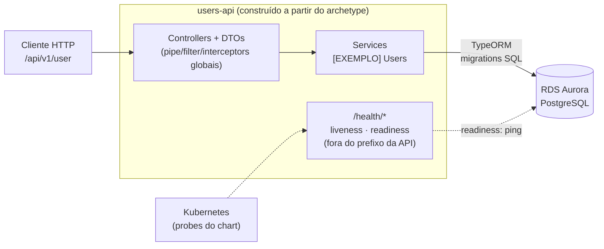
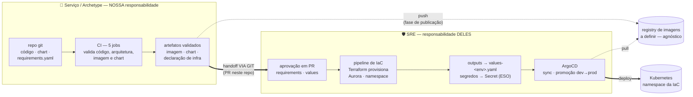

# users-api — construído a partir do Archetype Backend NestJS (SUPREMA) · variante simples

**O que você está olhando:** o `users-api` é um **serviço de exemplo construído a partir da
variante simples do Archetype Backend NestJS** da SUPREMA: REST + regra de negócio +
PostgreSQL (TypeORM) — **sem cache distribuído e sem mensageria**. O archetype é o produto:
um esqueleto **não-funcional** (ambiente reprodutível, gates de qualidade e segurança, saúde,
padrões resolvidos). O módulo `users` existe para **provar e demonstrar** o esqueleto com um
domínio mínimo — você o apaga e implementa o seu.

**Como ler este documento:** a seção 1 explica de onde o desenho veio (ADRs); a seção 2 coloca
o serviço **rodando na sua máquina**; o restante aprofunda o que o archetype fornece e como
adotá-lo.

---

## 1 · De onde veio o desenho — ADRs → Archetype → users-api

O desenho de arquitetura foi **acordado em ADRs antes de o exemplo existir**:

```
ADRs acordadas  ──▶  Archetype (esqueleto + regras)  ──▶  users-api (exemplo executável)
```

| ADR | Decisão | Por quê |
|---|---|---|
| Natureza do archetype | **Não-funcional primeiro**: ambiente local, CI, saúde e padrões resolvidos; o funcional vem depois, sobre o esqueleto | Serviço nasce pronto para operar; o domínio é a única parte que varia |
| Composição por necessidade | Esta variante **não carrega** cache nem mensageria | Capacidade só entra quando o domínio precisa — infra ociosa é custo e superfície de ataque |
| Stack | Node 22 · NestJS 11 · TypeScript strict | Golden path único por categoria |
| Persistência | TypeORM → Aurora PostgreSQL; migrations em SQL explícito, `synchronize: false` | Migration é código de produção — revisável e determinística |
| Autenticação | **Fora do escopo do archetype** — sem guards na aplicação | AuthN/AuthZ entram como capacidade transversal da plataforma (Keycloak) |
| Saúde | Terminus: liveness sem dependências; readiness = PostgreSQL | Contrato com o Kubernetes; o chart aponta as probes para cá |
| Supply chain | Lockfile + `npm ci` + `--ignore-scripts` + gates (IDE → pre-commit → CI) + imagem sem toolchain | Defesa em camadas contra o vetor nº 1 do ecossistema npm |
| Empacotamento | CI **empacota e valida sem publicar**; publicação e deploy (GitOps/ArgoCD) são outra fase | Artefato validado antes de existir infraestrutura |
| Exemplo × esqueleto | O módulo de negócio é `[EXEMPLO]` demarcado e descartável | O dev apaga o exemplo e mantém o esqueleto — ver seção 7 |

## 2 · Como executar

Pré-requisitos: **Node 22** (`nvm use`) e **Docker**.

### 2.1 Subir o serviço

```bash
cp .env.example .env
docker compose up -d          # PostgreSQL
npm ci                        # instala exatamente o lockfile
npm run migration:run         # cria o schema
npm run start:dev             # hot-reload
```

| Onde | O quê |
|---|---|
| `http://localhost:3000/docs` | Swagger UI (contrato code-first) |
| `http://localhost:3000/health/liveness` | Probe de vida (sem dependências) |
| `http://localhost:3000/health/readiness` | PostgreSQL: `"status":"ok"` |

### 2.2 Exercitar o CRUD

```bash
curl -s -X POST localhost:3000/api/v1/user -H 'content-type: application/json' \
  -d '{"username":"theUser","email":"john@email.com","password":"s3cret"}'
curl -s localhost:3000/api/v1/user/theUser        # password NUNCA aparece
curl -s -X POST localhost:3000/api/v1/user -H 'content-type: application/json' \
  -d '{"username":"theUser"}'                     # duplicado → 409 { code, message }
```

### 2.3 Tudo containerizado / testes / reproduzir o CI

```bash
docker compose --profile full up --build          # API inclusive
npm test                                          # unit — segundos, sem Docker
npm run test:e2e                                  # Testcontainers (exige Docker)

# o que o job build-image faz com o artefato:
docker build -t users-api:ci .
docker compose -f docker-compose.yml -f docker-compose.ci.yml --profile full up -d
curl -fsS http://localhost:3000/health/readiness
docker compose -f docker-compose.yml -f docker-compose.ci.yml --profile full down -v
```

Estratégia de testes em **[TESTING.md](./TESTING.md)**.

## 3 · O que o archetype fornece (capacidades estruturais)

| Capacidade | Implementação no esqueleto |
|---|---|
| API REST | Controllers finos + DTOs (`class-validator`/`class-transformer`) + `ValidationPipe` global (whitelist estrita) + Swagger code-first em `/docs` |
| Regra de negócio | Services por módulo; colaboração entre módulos **só via service exportado** |
| Persistência | **TypeORM** → **RDS Aurora PostgreSQL**; migrations versionadas em SQL explícito, `synchronize: false` |
| Erros | Exception filter global no contrato `{ code, message }` |
| Saúde | **`@nestjs/terminus`**: `/health/liveness` e `/health/readiness` (ver seção 6) |
| Config | `registerAs` tipado por namespace + schema **Joi fail-fast** no boot |
| Observabilidade | **OpenTelemetry** (traces + métricas OTLP, interruptor fail-safe por env — seção 6) · logs **JSON estruturados** (pino) com trace_id · interceptors de logging/timeout |
| **Arquitetura como teste** | **ArchUnitTS** em `src/architecture.spec.ts` — as regras da seção 5 rodam como gate no `npm test` (fronteira esqueleto×exemplo, camadas, ciclos, anti-contrabando de capacidades) |
| Entrega | Dockerfile multi-stage non-root **sem toolchain npm** · chart Helm com hardening (`deploy/helm/`) · CI com 5 jobs (seção 9) |

Precisa de cache, mensageria ou integração externa resiliente? Esses padrões já estão
resolvidos na variante completa do archetype (`petstore-api`) — importe-os de lá em vez de
reinventar: chaves de cache centralizadas com invalidação explícita, consumidor SQS idempotente
com DLQ/backoff, cliente HTTP com timeout/retry/degradação.

## 4 · Estrutura — o que é esqueleto, o que é exemplo

```
src/
├── main.ts                bootstrap: prefixo configurável, Swagger, shutdown hooks
├── app.module.ts          raiz: config validada + providers globais (APP_*)
├── config/                registerAs tipado + schema Joi (fail-fast)
├── common/                exception filter global, interceptors (log, timeout)
├── database/              TypeORM + data-source da CLI
│   └── migrations/        ← [EXEMPLO] a InitialSchema cria a tabela users
├── health/                probes liveness/readiness (Terminus)
└── modules/
    └── users/             ← [EXEMPLO]
deploy/
└── helm/users-api/        chart do serviço (fragment cd-helm)
```

Todo arquivo descartável carrega o marcador **`[EXEMPLO]`** no topo. O que não tem marcador é
esqueleto: fica.

## 5 · Regras de arquitetura (agnósticas ao domínio)

1. **Autenticação fora do escopo do archetype** — sem guards na camada de aplicação, por
   decisão. AuthN/AuthZ entram como capacidade transversal quando a organização definir o
   padrão (Keycloak).
2. **Upload binário fora do escopo** — quando o domínio exigir, S3 com presigned URL; arquivo
   nunca atravessa o pod.
3. **Colaboração entre módulos só via service exportado** — nunca importar repositório ou
   entidade de outro módulo.
4. **Migrations em SQL explícito, `synchronize: false`** — migration é código de produção,
   revisável em PR.
5. **Erro sai sempre no contrato `{ code, message }`** — o filter global garante; não invente
   formatos por módulo.
6. **Config nova = namespace `registerAs` + entrada no schema Joi** — variável sem validação
   não existe.
7. **Chaves primárias `SERIAL` por padrão**; coluna anulável declara `type` explícito
   (uniões TS refletem como `Object` e derrubam o boot).
8. **Ao adotar cache/mensageria/integração externa**, siga os padrões da variante completa
   (`petstore-api`): invalidação explícita, consumidor idempotente, degradação de terceiro.

### As regras como gate — testes de arquitetura (ArchUnitTS)

Regra de arquitetura em prosa vale até o primeiro import errado — humano ou **gerado por IA**.
Por isso as regras verificáveis por grafo de imports estão codificadas em
[`src/architecture.spec.ts`](./src/architecture.spec.ts) com **ArchUnitTS** e rodam no
`npm test` — dentro do `quality-validation` do CI, sem job novo:

| Regra executável | O que garante |
|---|---|
| Esqueleto (`common/`, `config/`, `database/`, `health/`) ⊬ `[EXEMPLO]` | Apagar o módulo de exemplo **provadamente** não quebra o esqueleto |
| Sem ciclos de dependência | Proteção que nenhum outro gate dava |
| `entities/` só `*.entity.ts`, `dto/` só `*.dto.ts` | Organização NestJS pelo nome |
| Controller não importa `typeorm` · service não importa controller | Camadas finas e direção única (padrão NestJS) |
| `joi` só em `config/` | Validação de ambiente num único lugar |
| **Anti-contrabando**: nenhum arquivo importa `@aws-sdk/*`, `cache-manager`, `@nestjs/axios`, `@ssut/nestjs-sqs`, `@keyv/*` | A ADR da variante ("capacidade só entra quando o domínio precisa") como gate — cache/mensageria/HTTP externo não entram por acidente |

**Exemplo de resultado real** — violação plantada de propósito (import de cache na variante
simples) e capturada pelo gate:

```
× sem contrabando de capacidades: cache, mensageria e HTTP externo não existem nesta variante
  Architecture rule failed with 1 violation:
     path: "src/modules/users/violacao-temporaria.ts"
     rule: "variante simples não usa cache/mensageria/HTTP externo —
            adote a variante completa se precisar"
```

A mensagem já diz o caminho certo: precisa da capacidade? É decisão consciente — remove-se a
regra e importam-se os padrões prontos do `petstore-api`, nunca um import solto.

## 6 · Probes de saúde

| Rota | Pergunta | Verifica |
|---|---|---|
| `GET /health/liveness` | o processo responde? | nada externo |
| `GET /health/readiness` | posso receber tráfego? | **PostgreSQL** (ping TypeORM) |

As probes ficam **fora do prefixo da API**: contrato com o orquestrador não é endpoint de
negócio versionado. O chart em `deploy/helm/` já as referencia.

### Telemetria (OpenTelemetry) — o interruptor e as responsabilidades

O esqueleto emite **traces + métricas via OTLP** (`src/telemetry/otel.ts`) e **logs JSON
estruturados** (pino) com `trace_id` injetado. O comportamento é governado por **um
interruptor de ambiente** — a mesma imagem nos três estados:

| Estado | Como | Quem vê o quê |
|---|---|---|
| **Desligado** *(padrão)* | Sem `OTEL_EXPORTER_OTLP_ENDPOINT` — o SDK **nem inicia** | Dev local, unit e CI rodam sem custo nenhum |
| **Ligado local** *(opt-in do dev)* | `docker compose --profile observability up -d` + endpoint no `.env` | **Grafana em `localhost:3300`**: requests e queries do TypeORM como spans, logs correlacionados por trace |
| **Ligado no cluster** | `OTEL_*` nos `values-<env>.yaml`, preenchidos pelo **SRE** | O Collector do cluster recebe OTLP; backend, dashboards, retenção, alertas e sampling são **do SRE** |

Nesta variante a auto-instrumentação cobre HTTP de entrada (sem `/health/*` — probe não é
sinal) e **TypeORM/pg**. Ao adotar capacidades da variante completa, os spans delas vêm junto.

> **O que é um span:** a unidade do trace — **uma operação com início, fim, duração e
> atributos**, encadeada em árvore pai→filho. O trace é a árvore inteira; olhar para ela
> responde "onde foi o tempo?" e "onde quebrou?" sem caçar log. Nesta variante:
>
> ```
> trace: POST /user                 (span raiz)
> ├── span: SELECT users WHERE username  (TypeORM/pg — a checagem de unicidade)
> └── span: INSERT INTO users            (TypeORM/pg)
> ```

**Fail-open provado por teste:** o e2e roda com a telemetria **ligada contra um Collector
propositalmente morto** (`test/otel-failopen.setup.ts`) — suíte verde = observabilidade nunca
derruba a aplicação. O estado desligado é provado pelo smoke do CI (a imagem sobe sem env OTEL).
Mesma fronteira do CD: **o app só fala OTLP; tudo após o Collector é do SRE.**

## 7 · Os módulos de exemplo — users

O exemplo demonstra a arquitetura funcionando de ponta a ponta antes de você escrever o seu
domínio (a sequência executável está na seção 2.2):



O que o CRUD de usuários (insumo: o agregado `User` da spec Swagger Petstore) exercita: DTOs
com validação (inclusive em lote, via `ParseArrayPipe`), unicidade com `409` no contrato de
erro, `@Exclude` garantindo que `password` **nunca** sai numa resposta (aplicado pelo
`ClassSerializerInterceptor` global — vale até com serialização indireta), e `404`
padronizado. Endpoints de autenticação (`/user/login`, `/user/logout`) não existem — regra 1.

## 8 · Adotando o archetype no seu serviço

1. **Execute o exemplo** (seção 2) para ver os padrões vivos.
2. **Crie seu módulo** em `modules/<seu-dominio>/` com controller fino + DTOs validados +
   entities + service (+ spec colocalizada) — as regras da seção 5 são o contrato.
3. **Apague o exemplo** — tudo que tem `[EXEMPLO]` no topo: `modules/users/` e a migration
   `InitialSchema` (substitua pela sua).
4. **Limpe os pontos acoplados ao exemplo**: `POSTGRES_*`/nomes de container no
   `docker-compose.yml`, `DB_NAME` nos `.env*`, título do Swagger no `main.ts`, values do
   chart (`deploy/helm/users-api/values.yaml`) e `catalog-info.yaml`.
5. Rode `npm run lint && npm test` — os gates são os mesmos do CI.

## 9 · Plataforma — catálogo e CI

| Artefato | Papel |
|---|---|
| `catalog-info.yaml` | Registro no catálogo do Backstage (Component, ownership, tags). Dois `PLACEHOLDER`s: `spec.owner` e `github.com/project-slug`. |
| `.github/workflows/ci.yml` | Cinco jobs, todos **sem publicar nada** (publicação e deploy são de outra fase). `quality-validation` e `security` são os required status checks do golden path, para humanos e agentes de IA. **Detalhe técnico de cada job na subseção abaixo.** |
| `deploy/helm/users-api/` | Chart: Deployment com probes, `securityContext` endurecido (non-root, rootfs read-only, drop ALL), `resources`, ConfigMap + `existingSecret`. `image.repository`/`tag` parametrizados (o registry de imagens é decisão em aberto — quando definido, é um value, não retrabalho). |
| `docker-compose.ci.yml` | Override do smoke: usa a imagem `users-api:ci` recém-construída. |
| `deploy/infra/requirements.yaml` | **Declaração de infraestrutura** — o que o serviço exige (nesta variante: só Postgres), com os outputs esperados. Nós declaramos; o SRE aprova em PR e realiza via Terraform. Paridade 1:1 com o compose local. |
| `deploy/helm/*/values-{dev,prod}.yaml` | O **ponto de junção** entre a IaC e o chart: estrutura nossa, valores preenchidos com os outputs do Terraform (`[TERRAFORM OUTPUT]`/`[SRE]`/`[CI]` marcados campo a campo). |
| `deploy/argocd/application.example.yaml` | Referência para o SRE: o chart é consumível **direto do git** pelo ArgoCD — o Application real vive no território deles. |

### O CI em detalhe — o que cada job executa e o que cada auditoria cobre

**`quality-validation`** — qualidade do código-fonte:

| Step | O que faz | O que audita/garante |
|---|---|---|
| `npm ci --ignore-scripts` | Instala **exatamente** o `package-lock.json`; divergência lockfile×package.json = falha | Integridade da árvore de dependências + **bloqueio dos scripts de pós-install** de terceiros no runner (vetor clássico de supply chain) |
| `npm run lint` | ESLint 9 flat config, regras **type-aware** | Consistência + classes de erro que exigem o type-checker (`no-unsafe-*`, `unbound-method`…) |
| `npm run format:check` | Prettier em modo verificação | Formato único — diff de PR sem ruído |
| `npm run test:cov` | Testes unitários **+ `architecture.spec.ts` (ArchUnitTS)** com cobertura | Regras de negócio **e regras de arquitetura** (fronteira esqueleto×exemplo, camadas, ciclos, anti-contrabando — seção 5) como gate |
| `npm run build` | Compilação Nest/tsc de produção | O artefato TypeScript compila de verdade — não só passa no editor |

**`security`** — auditoria de dependências (SCA):

| Step | O que faz | Cobertura |
|---|---|---|
| `npm audit --audit-level=high` | **Software Composition Analysis** de TODAS as dependências declaradas (produção e dev) contra a base de advisories do npm | HIGH/CRITICAL = gate vermelho; *moderates* só são aceitas com registro no README. Não cobre o que está fora do lockfile — para isso existe o scan de imagem abaixo |

> Este job é o **slot** para ferramentas dedicadas: **socket.dev** (análise de
> **comportamento** de pacote — scripts de instalação, acesso à rede, troca suspeita de
> mantenedor — pega ataques *antes* de virarem advisory), **Snyk** e **SonarQube**. Todas
> exigem credencial de org — por isso não vêm pré-conectadas.

**`e2e-testing`** — a aplicação real contra infraestrutura real:

| Step | O que faz | O que garante |
|---|---|---|
| `npm run test:e2e` | Sobe um Postgres **real e efêmero** (Testcontainers), aplica as **migrations reais**, boota o AppModule completo | Boot de verdade (o Joi fail-fast e o wiring de DI são exercitados), probes respondendo, contrato de erro, CRUD ponta a ponta |

**`build-image`** — empacotamento e as auditorias do artefato:

| Step | O que faz | O que audita/garante |
|---|---|---|
| Build (`push: false`) | Docker multi-stage; o estágio final roda **non-root** (`USER node`), tem o **toolchain removido** (npm/corepack/yarn saem após o `npm ci --omit=dev --ignore-scripts`), base **pinada** (`node:22-alpine`) | **Segurança do empacotamento**: a imagem carrega só o runtime (`node dist/main`) — superfície mínima; nada é publicado, o artefato morre com o runner |
| Trivy — camada 1 (Job Summary) | Scan completo da imagem: **vulnerabilidades do SO** (pacotes Alpine), **pacotes Node dentro da imagem** (o que o `npm audit` não vê — ex.: software embutido na base) e **varredura de segredos** nas camadas | Visibilidade: o relatório inteiro aparece na página do run, antes de qualquer log |
| Trivy — camada 2 (SARIF) | Opt-in via variável `TRIVY_SARIF_UPLOAD=true` (exige GHAS em repo privado) | Cada CVE vira **alerta rastreável na aba Security** — o canal do time de segurança |
| Trivy — camada 3 (gate) | `--severity HIGH,CRITICAL --exit-code 1` | Derruba o job; exceção **só** via `.trivyignore` (CVE + justificativa + dono + expiração + aval do time de segurança) — runbook na seção 11 |
| Smoke | `docker compose` com override usa **a imagem recém-construída** contra o Postgres real e espera `GET /health/readiness` | O artefato **sobe de verdade** com a dependência real — não só builda |
| Teardown (`if: always()`) | `compose down -v` | Runner limpo mesmo em falha |

> **O que é o smoke ("teste de fumaça"):** o "isso liga?" do artefato. Ele **não** valida regra
> de negócio (isso é papel do unit e do e2e) — prova que a **imagem empacotada** boota e
> responde o mínimo (readiness `ok`) contra o Postgres real. É raso de propósito e pega a
> classe de defeito que nenhum teste de código vê: o que só existe **dentro da imagem de
> produção** (ex.: dependência de dev ausente derrubando o boot — defeito real já capturado
> por este gate na família do archetype).

**`helm-validate`** — o chart sem tocar em cluster:

| Step | O que faz | O que garante |
|---|---|---|
| `helm lint` | Higiene do chart | Estrutura e values coerentes |
| `helm template` | Renderiza os manifests de verdade | Template quebrado não chega ao deploy |
| `kubeconform -strict` | Valida os manifests renderizados contra o **schema do Kubernetes** | Manifest inválido pego sem cluster, sem kubeconfig — o CI nunca segura credencial de cluster |

### CI × CD — o fluxo e as fronteiras de responsabilidade



| Fronteira | Responsável | O quê |
|---|---|---|
| 🧩 Nossa | serviço/archetype | Código, chart, `requirements.yaml` (declaração), CI com todos os gates, artefatos validados |
| 🤝 Conjunta | as duas pontas | `values-<env>.yaml` — **estrutura** nossa; **valores** são outputs do Terraform do SRE |
| 🛡️ SRE | plataforma | Aprovação dos PRs de infra, pipeline Terraform, ArgoCD (Applications, sync, promoção), políticas de segurança, registry |

Fora do escopo desta fase: **publicação** da imagem e do chart (armazenamento agnóstico —
registry a definir com o SRE) — os jobs `build-image` e `helm-validate` são os pontos de plug
quando o destino for definido, sem retrabalho.

### Camada 3 — o que um setup produtivo ainda vai pedir e não existe no chart hoje

O chart cobre o dia a dia por values (réplicas, Service, resources, probes, segurança do pod)
e deixa namespace para a IaC. A **terceira camada** são os recursos que um Kubernetes
produtivo tipicamente exige e que ficaram como **gap deliberado** desta fase — cada um com o
dono certo:

| Recurso ausente | Para que serve em produção | Quem define a exigência | Quem implementa |
|---|---|---|---|
| **HPA** | Escalar réplicas por carga | 🛡️ SRE (política de capacidade) | 🧩 chart (`hpa.enabled` + values) |
| **PodDisruptionBudget** | Sobreviver a manutenção de nodes sem indisponibilidade | 🛡️ SRE | 🧩 chart (`pdb.enabled`) |
| **NetworkPolicy** | Restringir quem fala com quem na rede do cluster | 🛡️ SRE (segurança) | 🧩 chart, conforme o padrão deles |
| **Ingress** | Exposição HTTP externa (TLS, rotas) | 🛡️ SRE (ingress controller, certificados) | 🧩 chart (`ingress.enabled`) |
| **ServiceAccount dedicado** | **IRSA** — o pod assume IAM Role para falar com serviços AWS sem access keys (nesta variante não há consumo AWS direto hoje; a necessidade nasce junto com a primeira capacidade que falar com a AWS) | 🛡️ SRE (cria a Role via Terraform) | 🧩 chart (SA + annotation da Role) |
| **affinity / tolerations / topologySpread** | Distribuição e colocação de pods conforme a topologia do cluster | 🛡️ SRE (só eles conhecem os node groups) | 🧩 chart (pass-through de values) |
| **Estratégia de rollout** | Controle fino do RollingUpdate (surge/unavailable) | 🛡️ SRE | 🧩 chart |

**A regra de evolução, em ordem de preferência:**

1. **Evoluir o chart do archetype** *(o caminho certo)*: cada exigência do SRE vira template +
   toggle em values (`hpa.enabled`, `pdb.enabled`…), adicionada **uma vez** e herdada por todo
   serviço gerado. O SRE pede/propõe via PR — o chart é nosso, a revisão é conjunta, e o
   `helm-validate` do CI valida qualquer mudança automaticamente (kubeconform continua de guarda).
2. **Lado ArgoCD** *(sem tocar no repo)*: o SRE pode sobrepor com Kustomize post-rendering ou
   parâmetros Helm no Application — útil para emergência/experimento, **ruim como regime**: a
   verdade do deploy sai do git do serviço.

> Em uma frase: **o SRE é o dono do "o que produção exige"; o chart é o lugar onde isso vira
> padrão reutilizável** — exceção operacional é do ArgoCD, nunca o caminho permanente.

## 10 · Setup padronizado de desenvolvimento

| Ferramenta | Papel |
|---|---|
| ESLint 9 (flat, type-aware) + Prettier 3 | Lint e formato únicos — o mesmo `quality-validation` do CI |
| Husky + lint-staged + commitlint | `pre-commit` lint/format nos staged; Conventional Commits |
| **Snyk + SonarQube for IDE** (`.vscode/extensions.json`) | **Shift-left**: alerta enquanto se edita, antes do commit |
| `.editorconfig` / `.nvmrc` / `engines` / `.gitattributes` | Mesmo editor, mesmo Node (22), LF em `*.sh`, em qualquer máquina |
| `.env.example` / `.env.test` / `.env.docker` | Contrato de ambiente versionado; `.env` real nunca versionado |

## 11 · Segurança de dependências (supply chain)

- **`package-lock.json` versionado + `npm ci` sempre** (local, Docker e CI);
- **`overrides` para transitiva vulnerável sem fix no pai** — ex.: `js-yaml` forçado a `5.2.3`
  sob `@nestjs/swagger`, escopado;
- **`--ignore-scripts` em toda instalação** — bloqueia pós-install de terceiros;
- **`npm audit --audit-level=high` como gate** (job `security`) + **scan Trivy da imagem**
  (job `build-image`) — o audit cobre o lockfile do app; o Trivy cobre a imagem inteira;
- **Imagem final sem toolchain**: npm/corepack/yarn removidos após o `npm ci` — o runtime é
  só `node dist/main`.

### Quando o scan de imagem quebrar — runbook de triagem

O relatório completo vai para o **Job Summary** do run; o **gate** derruba o job em
HIGH/CRITICAL. Três destinos, todos com dono:

| Onde está o achado | Ação |
|---|---|
| `app/node_modules/...` — dependência da aplicação | Corrigir: bump, pin ou `overrides` (o `Fixed Version` do relatório diz o alvo) |
| SO base ou software embutido na base | Atualizar a base **ou** hardening (remover o que o runtime não usa) |
| Risco aceito / não explorável | **Somente** via [`.trivyignore`](./.trivyignore): CVE + justificativa + dono + expiração + aprovação do time de segurança |

O que **não** existe como opção: baixar a severidade do gate, remover o step, ou mergear com
o scan vermelho sem registro.
