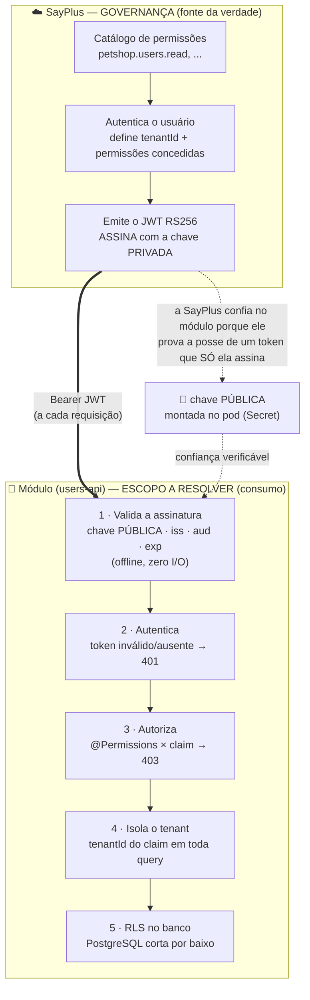
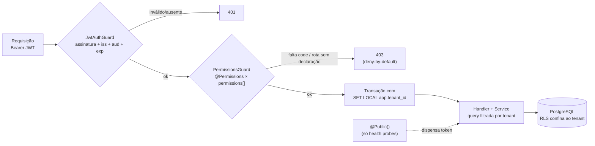

# 🔐 Segurança & Governança — users-api

> **📖 Documentação** · [Visão geral](./README.md) · **Segurança & Governança** (este arquivo) · [💻 Execução local](./LOCAL-EXECUTION-README.md) · [⚙️ CI/CD & Esteira](./CI-CD.md)

Este documento explica **como a segurança do módulo funciona de ponta a ponta**: a governança
que **nasce na SayPlus** e o escopo que **cada módulo plugado precisa resolver** — autenticação,
autorização, tenant e a rede de segurança no banco. O módulo **não implementa** identidade:
ele **consome** a da plataforma e **prova** que confia nela de forma verificável.

## 1 · O fluxo, de ponta a ponta — quem resolve o quê

A identidade **começa na SayPlus** (governança) e é **aplicada em cada módulo** (consumo).
A fronteira é nítida: a SayPlus decide *quem é* e *o que pode*; o módulo *verifica e obedece*.



**Escopo de cada lado, resumido:**

| Responsabilidade | SayPlus (plataforma) | Módulo (este serviço) |
|---|---|---|
| Cadastro de permissões (catálogo) | ✅ governa | consome os *codes* |
| Login / emissão de token | ✅ emite (assina com a privada) | **nunca** emite |
| Definição do tenant do usuário | ✅ coloca no claim | lê do claim, nunca de body/header |
| Validação do token | — | ✅ offline, com a chave pública |
| Autorização por rota | concede em runtime | ✅ exige via `@Permissions` |
| Isolamento de dados | — | ✅ filtro na app + RLS no banco |

## 2 · Modelo de confiança — como a SayPlus confia no módulo

Não há chamada de rede, sessão compartilhada nem banco comum entre a SayPlus e o módulo. A
confiança é **criptográfica e unidirecional**, no padrão de chave assimétrica (RS256):

- a **SayPlus** guarda a **chave privada** e é a única que consegue **assinar** um token;
- o **módulo** recebe só a **chave pública** e com ela **verifica** a assinatura — consegue
  provar que um token foi emitido pela SayPlus, mas **não consegue forjar** nenhum;
- por isso a validação é **offline e sem I/O**: verificar uma assinatura é CPU pura
  (microssegundos), não uma ida à rede. A SayPlus continua dona de todo o ciclo de identidade.

`RS256` é **requisito, não opção**: o algoritmo é fixado na strategy (`algorithms: ['RS256']`),
o que fecha o ataque clássico de **downgrade para HS256** — em que alguém usaria a chave
pública (que não é secreta) como segredo simétrico para forjar tokens. Ver a matriz na seção 7.

## 3 · O que vem no JWT

O token que chega em `Authorization: Bearer <jwt>` carrega o contrato de identidade da SayPlus.
O módulo lê estes campos (`src/auth/jwt-payload.interface.ts`) e **nada mais**:

| Claim | Exemplo | Uso no módulo |
|---|---|---|
| `sub` | `"user-42"` | Identificador do usuário (auditoria/log) |
| `email` | `"maria@empresa.com"` | Informativo |
| `tenantId` | `"tenant-a"` | **Única** fonte de tenant — alimenta o filtro da app e o GUC da RLS |
| `permissions[]` | `["petshop.users.read", ...]` | Confrontado com o `@Permissions` de cada rota |
| `iss` | `"sayplus"` | Conferido: emissor esperado |
| `aud` | `["sayplus", "petshop"]` | Conferido: o módulo pertence ao catálogo `petshop` |
| `exp` | *(timestamp)* | Conferido: token expirado → 401 |
| *(header)* `alg` | `"RS256"` | **Fixo** — qualquer outro algoritmo é recusado |

```jsonc
// payload de um token válido (decodificado)
{
  "sub": "user-42",
  "email": "maria@empresa.com",
  "tenantId": "tenant-a",
  "permissions": ["petshop.users.read", "petshop.users.create"],
  "iss": "sayplus",
  "aud": ["sayplus", "petshop"],
  "iat": 1735000000,
  "exp": 1735003600
}
```

## 4 · A fechadura — o caminho de uma requisição

Dois guards **globais** ([`src/auth/`](./src/auth/)) valem para toda rota que existir ou vier
a existir — na ordem em que executam:



| Guard | Pergunta | Falhou |
|---|---|---|
| `JwtAuthGuard` | Quem é? JWT **RS256** válido (assinatura contra a chave pública da SayPlus + `iss` + `aud` + expiração — zero I/O, criptografia pura) | **401** |
| `PermissionsGuard` | O que pode? `@Permissions('petshop.users.read')` da rota × claim `permissions[]` do token | **403** |

O mesmo invariante falha FECHADO em três camadas, em momentos diferentes do ciclo de vida:

1. **Build/CI** — regra ArchUnitTS: rota sem `@Permissions`/`@Public` derruba o `npm test`
   (detalhe da regra em [Visão geral › §5.2](./README.md) e [CI/CD](./CI-CD.md));
2. **Runtime** — *deny-by-default*: rota sem declaração responde 403, sempre;
3. **Chave ausente** — o app SOBE (probes são `@Public`, readiness passa), grita no log e
   toda rota protegida responde 401 até a chave ser montada: deploy mal configurado vira
   alarme, nunca outage nem brecha.

## 5 · Governança — nova feature, zero código de segurança

**Nova feature = zero código de segurança**: registra-se o code no catálogo SayPlus,
adiciona-se 1 constante em [`permissions.constants.ts`](./src/auth/permissions.constants.ts)
e o decorator na rota — a concessão (quem tem o quê) é governada na SayPlus em runtime,
sem redeploy.

```typescript
@Permissions(PETSHOP_USERS.EXPORT)   // ← a única "mudança de segurança" numa rota nova
@Get('export')
exportUsers() { ... }
```

Convenção canônica dos codes: `modulo.recurso.acao`, com verbos `read | create | edit | delete`
(é `edit`, nunca `update`). Os codes são **strings opacas** para o módulo — quem os concede é o
catálogo. Todo code precisa estar **registrado na SayPlus** antes de aparecer num token.

## 6 · Multi-tenancy — isolamento de dados em duas camadas

Cada tenant vive numa fatia isolada do mesmo banco. Toda tabela de domínio carrega `tenant_id`
(coluna interna, nunca exposta na resposta) e as unicidades de negócio são COMPOSTAS com o
tenant — `username` é único *por tenant*. Toda query dos services filtra pelo `tenantId`
**do claim** (lido via `@CurrentUser()`, nunca de body/header): para o tenant B, um registro do
tenant A simplesmente "não existe" (404), em leitura, escrita e remoção. Enviar `tenantId` no
body é rejeitado com 400 pela whitelist estrita do ValidationPipe — o claim é a única fonte.

### Camada 3 — RLS no banco: a rede de segurança abaixo da aplicação

As camadas 1–2 vivem na aplicação. Se um `WHERE tenant_id` for esquecido num query novo, o dado
vaza — a menos que o **próprio PostgreSQL** recuse. É o que a Row-Level Security com **FORCE**
garante:

| Peça | O que faz |
|---|---|
| **Separação de papéis** | Migrations rodam como um role **OWNER** (não-super, dono do schema); a app conecta como um role de **RUNTIME** não-owner, só com DML. Sem isso (usuário único = owner) a proteção seria nula |
| **RLS + FORCE** em toda tabela de domínio | `FORCE ROW LEVEL SECURITY` sujeita **até o owner** à policy (só superuser/BYPASSRLS escapam) — o "zero protection" do usuário único deixa de existir |
| **Policy por GUC** `app.tenant_id` | A fatia visível é o `SET LOCAL app.tenant_id` da transação. **Sem** o GUC → `NULL` → zero linhas (fail-safe: contexto ausente esconde tudo, nunca vaza tudo) |
| **GUC por unidade de trabalho** | [`tenant-context.ts`](./src/database/tenant-context.ts) (AsyncLocalStorage nativo) + o `TenantTransactionInterceptor`: cada requisição roda numa transação com o `SET LOCAL` do tenant do **claim**; os services resolvem o repositório desse contexto — nunca de um repo injetado fixo |

**Papéis e credenciais (entrega ao SRE):** dois Secrets distintos — runtime (app,
`existingSecret`) e migração/owner (Job **PreSync**, `migrations.existingSecret`) — declarados
em [`deploy/infra/requirements.yaml`](./deploy/infra/requirements.yaml). Os roles são criados
pelo IaC/Terraform (no local, por `scripts/initdb/01-roles.sql`). Como exercitar a RLS de
verdade localmente está em [💻 Execução local](./LOCAL-EXECUTION-README.md).

## 7 · Provado por teste — a matriz de forja

`test/security.e2e-spec.ts` transforma as garantias da strategy em comportamento travado por
teste — cada 401 é uma FORJA que precisa ser rejeitada. Se alguém relaxar `algorithms`, `issuer`
ou `audience` na strategy, o CI quebra antes do merge.

| Tentativa | Esperado |
|---|---|
| Chave certa + iss/aud/permissão corretos | passa a auth (o domínio responde) |
| Token assinado por **outra** chave privada RS256 | **401** |
| **Downgrade HS256** com a chave pública como segredo | **401** (algorithms fixo em RS256) |
| `alg: none` (sem assinatura) | **401** |
| `issuer` errado · `audience` errada · expirado | **401** |
| Assinatura válida, **sem** a permissão | **403** (deny-by-default) |

Nos testes, [`test/auth-helper.ts`](./test/auth-helper.ts) faz o papel da SayPlus com um par
RS256 efêmero em memória (o mesmo mecanismo do `npm run auth:token` local) — é ele que assina
os tokens válidos e as forjas da matriz acima.

E a RLS, provada no nível de conexão ([`test/rls.e2e-spec.ts`](./test/rls.e2e-spec.ts)) e com a
**aplicação como runtime role** ([`test/rls-app.e2e-spec.ts`](./test/rls-app.e2e-spec.ts)):

| Cenário | Resultado |
|---|---|
| Runtime **sem** GUC | enxerga **zero** linhas (fail-safe) |
| Runtime com GUC do tenant A | só o tenant A |
| Runtime grava linha de outro tenant | bloqueado (`WITH CHECK`) |
| Runtime apaga linha de outro tenant | invisível → nada afetado |
| Owner **não-super** sem GUC | zero linhas (FORCE ativo) |
| App (runtime) via interceptor | lê/grava no seu tenant; outro tenant → 404 |

## 8 · Entrega da chave, rede e serviço-a-serviço

**Entrega da chave em produção:** o chart monta um Secret do namespace como o arquivo apontado
por `JWT_PUBLIC_KEY_PATH` (value `jwtPublicKey.existingSecret`). O Secret vive **fora** do
chart; trade-off registrado em `deploy/infra/requirements.yaml`: para uma chave **pública**
(sem requisito de confidencialidade, rotação rara), provisionamento direto/GitOps é
suficiente — o trilho ASM(+KMS)+ESO é opcional, só se paga como trilho único da operação.
Evolução registrada: quando o IdP federado (Keycloak) publicar **JWKS**, a troca fica
confinada ao `secretOrKeyProvider` da strategy (comentário no ponto exato) — guards,
decorators e claims não mudam.

**Rede (Leste/Oeste):** o chart traz uma **NetworkPolicy default-deny de ingress** que
**nasce habilitada** nos values de ambiente — por padrão, nenhum pod do cluster abre conexão
com este serviço; o único allow é o caminho do gateway, declarado pelo SRE
(`networkPolicy.ingress.gatewayNamespace`, marcador `[SRE]` — vazio = deny-all total).
Pré-requisito no `requirements.yaml`: o CNI do cluster precisa impor NetworkPolicy.
Egress default-deny é evolução futura registrada.

**Serviço-a-serviço:** decisão registrada — **não** existe guard interno nem rota de
serviço adormecida: toda rota exige JWT de usuário (`@Permissions`) ou é `@Public`.
Necessidade real de chamada serviço-a-serviço passa por avaliação de arquitetura
(mTLS/mesh, client-credentials da plataforma), caso a caso — nunca um default do archetype.

---

**Continue em:** [📖 Visão geral](./README.md) · [💻 Execução local](./LOCAL-EXECUTION-README.md) · [⚙️ CI/CD & Esteira](./CI-CD.md)
