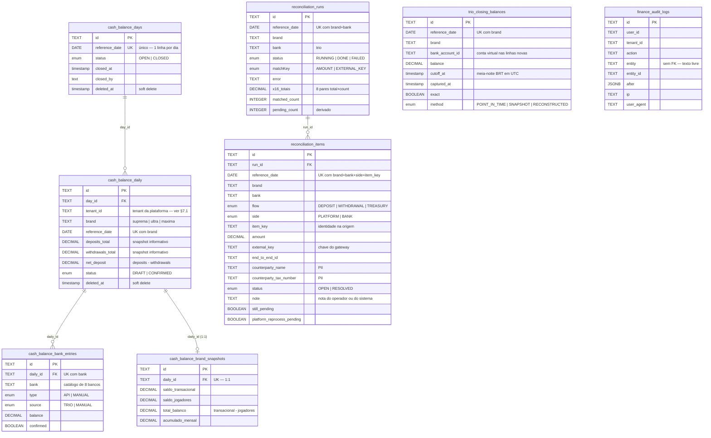

# Modelo de dados do módulo Finance — tabelas e relacionamentos

**Origem analisada:** `/home/feh/sayplus-modules/finance/finance-api`
**Arquivos-fonte deste documento:** `prisma/schema.prisma`, as 7 migrations em `prisma/migrations/`,
`src/modules/*/infrastructure/*.repository.ts`, `src/modules/*/*.constants.ts`,
`src/common/interceptors/audit.interceptor.ts`, `src/common/utils/date.util.ts`.
**Escopo:** somente dados. Regras de negócio das rotas estão em
[`REGRAS-NEGOCIO-ROTAS.md`](./REGRAS-NEGOCIO-ROTAS.md); infraestrutura em
[`INFRA-FINANCE.md`](./INFRA-FINANCE.md); o plano de migração em
[`MIGRACAO-FINANCE.md`](./MIGRACAO-FINANCE.md).

---

## 0 · Resumo

| Dimensão | Valor |
|---|---|
| Tabelas próprias | **8** (5 de balanço de caixa, 2 de conciliação, 1 de auditoria) |
| Enums Postgres nativos | **10** |
| Chaves estrangeiras | **3** (todas dentro do domínio de balanço) |
| Índices únicos (chave natural) | **7** |
| Índices não-únicos | **8** |
| Tabelas com soft delete (`deleted_at`) | 2 (`cash_balance_days`, `cash_balance_daily`) |
| Tabelas com `DELETE` físico de negócio | 1 (`reconciliation_items`, em caso único e documentado) |
| CHECK constraints / índices parciais | **zero** — topologia deliberadamente simples |
| Tipo de PK | `TEXT` com UUID gerado pela aplicação (não `uuid` nativo, não `SERIAL`) |
| Tipo monetário | `DECIMAL(18,2)` em **todas** as colunas de dinheiro — nunca `float` |
| Fontes de leitura externas (não são tabelas do módulo) | 5 marts `dw_bet.*` no ClickHouse |

**A frase que resume o modelo:** três tabelas guardam *estado editável* (`cash_balance_days`,
`cash_balance_daily`, `cash_balance_bank_entries`), três guardam *fato imutável ou recapturável*
(`cash_balance_brand_snapshots`, `trio_closing_balances`, `reconciliation_runs`), uma guarda *trabalho
humano* (`reconciliation_items` — a nota do operador) e uma guarda *rastro* (`finance_audit_logs`).
Saber em qual grupo uma tabela está é o que decide se corrigir um dado é `UPDATE`, reprocessamento ou
proibido.

---

## 1 · Diagrama de entidades



**O que o diagrama mostra e vale dizer em palavras:** há **duas ilhas sem relação declarada entre si**
(balanço e conciliação) e **duas tabelas totalmente soltas** (`trio_closing_balances`,
`finance_audit_logs`). A ligação entre as ilhas é lógica, não referencial: `brand` +
`reference_date` são as colunas que as costuram, e nenhuma FK impõe isso. Isso é deliberado — quem
escreve `trio_closing_balances` e `reconciliation_runs` é um job sem usuário, que não tem uma linha
de `cash_balance_daily` para apontar (o dia pode nem ter sido aberto na tela ainda).

---

## 2 · Convenções gerais do schema

| Convenção | Valor | Observação de migração |
|---|---|---|
| Nome de tabela | `snake_case` plural, via `@@map` | vira `@Entity('nome')` explícito no TypeORM |
| Nome de coluna | `snake_case`, via `@map` | vira `name:` em cada `@Column` — **uma exceção, ver §2.1** |
| PK | `TEXT` + UUID v4 gerado na aplicação (`@default(uuid())`) | `@PrimaryGeneratedColumn('uuid')` cria coluna `uuid` **nativa**, não `TEXT` — divergência de tipo, ver §8.2 |
| Dinheiro | `DECIMAL(18,2)` | regra explícita da origem: dinheiro nunca é `float`. No TypeORM exige transformer string↔number |
| Data de referência | `DATE` (só data, sem hora) | é uma **etiqueta de dia em BRT**, não um instante — ver §2.2 |
| Instantes | `TIMESTAMP(3)` (sem timezone) | Prisma grava UTC; no TypeORM prefira `timestamptz` e trate a diferença na migration |
| Timestamps de linha | `created_at` (default `CURRENT_TIMESTAMP`) + `updated_at` (Prisma `@updatedAt`, atualizado pela aplicação) | `@updatedAt` **não** é trigger de banco: no TypeORM, `@UpdateDateColumn` mantém o mesmo comportamento (aplicação) |
| Soft delete | `deleted_at` nullable **só** em `cash_balance_days` e `cash_balance_daily` | toda query do repositório filtra `deletedAt: null` à mão — não há índice parcial nem policy |
| Enum | tipo nativo do Postgres, `@@map` para `snake_case` | 10 tipos; iguais nas duas ORMs |

### 2.1 · A única coluna camelCase — pegadinha real

`reconciliation_runs.matchKey` **não tem `@map`** no schema Prisma. A migration
`20260731002441_add_reconciliation` confirma: a coluna nasceu como `"matchKey"` (aspas duplas,
camelCase) no meio de uma tabela onde todas as outras são `snake_case`.

```sql
-- prisma/migrations/20260731002441_add_reconciliation/migration.sql
"status"    "reconciliation_run_status" NOT NULL,
"matchKey"  "reconciliation_match_key"  NOT NULL,   -- ← camelCase, sem aspas some
"started_at" TIMESTAMP(3) NOT NULL,
```

Consequência para a migração: se a entidade TypeORM declarar `@Column({ name: 'match_key' })`, o
schema novo divergirá do de origem sem erro nenhum aparecendo — só um `column does not exist` no
primeiro `SELECT` contra um banco restaurado da origem. Duas saídas legítimas: (a) manter
`name: 'matchKey'` e documentar; (b) padronizar para `match_key` na migration nova, **desde que** o
cutover seja por recriação a partir das fontes e não por dump/restore. A decisão precisa ser
consciente, porque é invisível.

### 2.2 · `reference_date` é etiqueta de dia, não instante

Toda coluna `DATE` do módulo carrega um dia **em BRT**, e a conversão é explícita em
`common/utils/date.util.ts`:

- `toDateOnly('2026-08-15')` → `Date` em `2026-08-15T00:00:00.000Z` — é o formato que o `@db.Date`
  do Prisma espera. **Não** é meia-noite BRT: é meia-noite UTC usada como rótulo.
- `fromDateOnly(date)` → `date.toISOString().slice(0, 10)`, o caminho de volta.
- `brtMidnightUtc('2026-08-15')` → o **instante** UTC da meia-noite BRT (usado em `cutoff_at`, nas
  janelas de conciliação e na leitura point-in-time da Trio). O offset é consultado via
  `Intl.DateTimeFormat` a cada chamada, não fixado em `-03:00`, para o dia continuar certo se o
  horário de verão brasileiro voltar.

A distinção importa na migração: `reference_date` e `cutoff_at` descrevem o mesmo dia com semânticas
diferentes, e trocar uma pela outra desloca o fechamento em 3 horas — exatamente o tipo de erro que
não aparece em teste sintético e aparece no valor do caixa.

---

## 3 · Domínio Balanço de Caixa (5 tabelas)

### 3.1 · `cash_balance_days` — o dia

Uma linha por data de referência. É o portão do fechamento: o dia só é `CLOSED` quando as três marcas
estão `CONFIRMED`.

| Coluna | Tipo | Null | Default | Semântica |
|---|---|---|---|---|
| `id` | `TEXT` | não | uuid (app) | PK |
| `reference_date` | `DATE` | não | — | **único**. O dia em BRT |
| `status` | `cash_balance_day_status` | não | `OPEN` | `OPEN` → `CLOSED` → `OPEN` (reabertura) |
| `closed_at` | `TIMESTAMP(3)` | sim | — | preenchido no momento em que a 3ª marca confirma |
| `closed_by` | `TEXT` | sim | — | `userId` de quem fechou a 3ª marca (ou marcador de importação) |
| `created_at` / `updated_at` | `TIMESTAMP(3)` | não | now / app | — |
| `deleted_at` | `TIMESTAMP(3)` | sim | — | soft delete; nunca usado pelo código atual |

**Índices:** `UNIQUE(reference_date)`, `INDEX(status)`.
**Quem escreve:** `POST /:brand/register` (upsert do dia + fechamento), `POST /:brand/reopen`
(reabertura), `POST /:brand/banks/:bank/confirm` (upsert do dia via `ensureDaily`), CLI
`balance:import`.
**Ciclo de vida:** criada pela primeira confirmação de banco do dia, portanto pode existir com
`status = OPEN` e nenhuma marca confirmada.

> O `INDEX(status)` cobre uma consulta que o código atual **não faz** (não há listagem por status).
> É índice sem consumidor — vale checar antes de replicar.

### 3.2 · `cash_balance_daily` — o dia × marca

O centro do domínio. Uma linha por `(reference_date, brand)`.

| Coluna | Tipo | Null | Default | Semântica |
|---|---|---|---|---|
| `id` | `TEXT` | não | uuid (app) | PK |
| `day_id` | `TEXT` | não | — | **FK** → `cash_balance_days.id` |
| `tenant_id` | `TEXT` | não | — | id do tenant da plataforma SayPlus resolvido por `GET /auth/me`. Ver §7.1 |
| `brand` | `TEXT` | não | — | `suprema` \| `ultra` \| `maxima` (catálogo em código, **sem** FK nem CHECK) |
| `reference_date` | `DATE` | não | — | duplica a data do `day` — é o que permite consultar por marca sem join |
| `deposits_total` | `DECIMAL(18,2)` | não | 0 | **snapshot informativo** do KPI do dia no momento do registro |
| `withdrawals_total` | `DECIMAL(18,2)` | não | 0 | idem |
| `net_deposit` | `DECIMAL(18,2)` | não | 0 | `deposits_total − withdrawals_total`, calculado na aplicação |
| `status` | `cash_balance_brand_status` | não | `DRAFT` | `DRAFT` ↔ `CONFIRMED` |
| `confirmed_at` / `confirmed_by` | `TIMESTAMP(3)` / `TEXT` | sim | — | zerados na reabertura |
| `created_at` / `updated_at` / `deleted_at` | — | — | — | soft delete filtrado à mão em todas as queries |

**Índices:** `UNIQUE(reference_date, brand)` ← chave natural do upsert;
`INDEX(tenant_id, brand, reference_date)`; `INDEX(day_id)`.

**Pontos que exigem decisão na migração:**

1. **`deposits_total`/`withdrawals_total`/`net_deposit` são cópia, não fonte.** Depósito e saque são
   sempre lidos do warehouse (`fct_kpi_daily`) a cada request; estas colunas guardam o valor que
   estava lá no instante do registro. O CLI `balance:import` grava **zero** nelas de propósito. Ou
   seja: somar estas colunas para produzir relatório é errado por construção — o histórico usa o
   warehouse.
2. **O índice `(tenant_id, brand, reference_date)` não tem consumidor.** Nenhuma query do repositório
   filtra por `tenant_id`; os filtros reais são `(brand, reference_date)` e `(reference_date, brand)`
   — este último já coberto pelo índice único. Candidato a ser trocado por nada, ou por
   `(brand, reference_date)` se medição mostrar necessidade.
3. **`brand` é texto livre no banco.** A validação vive em `findBrand()`
   (`cash-balance.constants.ts`). Um `INSERT` direto no banco com `brand = 'xpto'` passa.

### 3.3 · `cash_balance_bank_entries` — o saldo por banco

Uma linha por `(daily_id, bank)`. É a granularidade da confirmação individual: o botão "OK" da marca
só libera quando todos os bancos manuais têm linha aqui com `confirmed = true`.

| Coluna | Tipo | Null | Default | Semântica |
|---|---|---|---|---|
| `id` | `TEXT` | não | uuid (app) | PK |
| `daily_id` | `TEXT` | não | — | **FK** → `cash_balance_daily.id` |
| `bank` | `TEXT` | não | — | chave do catálogo: `caixa`, `trio`, `onekey`, `zro`, `celcoin`, `okto`, `topazio`, `genial` |
| `type` | `cash_balance_bank_type` | não | — | `API` só para `trio`; `MANUAL` para os outros 7 |
| `source` | `cash_balance_bank_source` | não | — | `TRIO` ou `MANUAL` — redundante com `type` hoje |
| `balance` | `DECIMAL(18,2)` | não | 0 | saldo do banco naquele dia+marca |
| `confirmed` | `BOOLEAN` | não | `false` | a confirmação individual do operador |
| `confirmed_at` / `confirmed_by` | — | sim | — | `confirmed_by` fica **nulo** na linha da Trio (não há operador) |
| `created_at` / `updated_at` | — | não | — | sem soft delete |

**Índices:** `UNIQUE(daily_id, bank)`, `INDEX(daily_id)` (redundante com o prefixo do único —
candidato a remoção).

**Regras de dado embutidas:**

- A linha do banco `trio` **não** é criada pela rota de confirmação (ela recusa `trio` com 400): é
  criada dentro do `register`, com `source = 'TRIO'` e o valor lido de `trio_closing_balances`.
- `type`/`source` são derivados do catálogo em código no momento da escrita. Se o catálogo mudar (um
  banco manual virar API), as linhas antigas continuam com o valor antigo — o que está certo, é
  histórico.

### 3.4 · `cash_balance_brand_snapshots` — os agregados registrados

Relação **1:1** com `cash_balance_daily` (`UNIQUE(daily_id)`). É a única fonte do histórico de
balanços: a tela do histórico só lista dia+marca que tem snapshot.

| Coluna | Tipo | Semântica |
|---|---|---|
| `id` | `TEXT` | PK |
| `daily_id` | `TEXT` | **FK único** → `cash_balance_daily.id` |
| `saldo_transacional` | `DECIMAL(18,2)` | soma dos saldos de todos os bancos da marca (7 manuais + Trio) |
| `saldo_jogadores` | `DECIMAL(18,2)` | `dw_bet.fct_sigap_saldo_diario FINAL` → `saldo_financeiro_total_disponivel_apostadores` |
| `total_balanco` | `DECIMAL(18,2)` | **`saldo_transacional − saldo_jogadores`** |
| `acumulado_mensal` | `DECIMAL(18,2)` | soma corrente dos `total_balanco` confirmados do mês, inclusive este |

> ⚠️ **O sinal de `total_balanco` é `transacional − jogadores`.** Foi corrigido em 30/07/2026 (a
> especificação original tinha o inverso). Positivo = excedente a transferir da conta transacional;
> negativo = a transacional está abaixo do que se deve aos jogadores, situação de alerta. Qualquer
> "correção" que inverta isso durante a migração é regressão.

**`acumulado_mensal` é soma corrente — e isso tem consequência de dado:** inserir ou alterar um dia
no meio do mês invalida o valor gravado em todos os dias seguintes daquela marca. A origem trata isso
com `recomputeMonthlyAccumulated(isoDate)`, que recalcula o mês inteiro em ordem de data, dentro de
uma transação. Este método é chamado pelo CLI de importação; **não** é chamado pela reabertura de
marca. Ou seja: reabrir e registrar de novo um dia passado deixa os dias posteriores do mês com
`acumulado_mensal` defasado até alguém recalcular. É um débito conhecido do modelo, não um bug de
tradução — e vale registrar no destino em vez de "descobrir" depois.

### 3.5 · `trio_closing_balances` — o fechamento capturado do banco integrado

Tabela solta (sem FK). Uma linha por `(reference_date, brand)`. Existe porque a banking-api da Trio
não tem endpoint de saldo histórico: o fechamento é lido no instante do corte por job agendado e fica
gravado aqui. **Nenhum request de tela chama a Trio para saldo** — todos leem esta tabela.

| Coluna | Tipo | Semântica |
|---|---|---|
| `id` | `TEXT` | PK |
| `reference_date` | `DATE` | dia que fechou (saldo de 23:59:59 em BRT desta data) |
| `brand` | `TEXT` | marca |
| `bank_account_id` | `TEXT` | id da conta lida, para auditoria. **Nas linhas novas é a conta *virtual*; nas antigas é o `bank_account.id`** |
| `balance` | `DECIMAL(18,2)` | o saldo |
| `cutoff_at` | `TIMESTAMP(3)` | instante exato do corte = `brtMidnightUtc(dia seguinte)` |
| `captured_at` | `TIMESTAMP(3)` | quando a leitura aconteceu de fato (pode ser dias depois, sem prejuízo) |
| `exact` | `BOOLEAN` | `true` = saldo do corte sem estimativa. Sempre `true` em `POINT_IN_TIME` |
| `method` | `trio_closing_balance_method` | como o valor foi obtido |

**Índices:** `UNIQUE(reference_date, brand)`, `INDEX(reference_date)`.

**O `method` é o rótulo de confiabilidade do dado histórico:**

| `method` | Gerado hoje? | Confiança |
|---|---|---|
| `POINT_IN_TIME` | **sim**, único caminho desde 10/08/2026 | exato — conferido contra o extrato oficial, diferença zero nas 3 marcas |
| `SNAPSHOT` | não | suspeito |
| `RECONSTRUCTED` | não | suspeito — **8 das 18 linhas** escritas por reconstrução estavam erradas, de −1.044,00 a +140,04 |

Os dois valores mortos ficam no enum exatamente porque são o único jeito de identificar as linhas
antigas. Consequência prática para a migração: se algum dado for portado,
`WHERE method <> 'POINT_IN_TIME'` é a lista do que precisa ser **recapturado**
(`npm run trio:capture -- <data> --overwrite`), não do que precisa ser copiado.

**Concorrência sem lock:** o `save()` do repositório faz `create` puro quando `overwrite = false` e
trata a violação de unicidade (`P2002`) como "já existia, mantido". É a `UNIQUE(reference_date,
brand)` que serializa duas réplicas do job — ler-antes-de-decidir deixaria janela de corrida. Esse
comportamento tem de sobreviver à troca de ORM: no TypeORM, capturar o erro de unique violation
(`23505`) no lugar do `P2002`.

---

## 4 · Domínio Conciliação Bancária (2 tabelas)

### 4.1 · `reconciliation_runs` — a execução

Uma linha por `(reference_date, brand, bank)`, em **upsert que preserva o `id`**. Reexecutar o mesmo
dia atualiza a linha; nunca duplica. Preservar o `id` é o que mantém as pendências já registradas
ligadas à execução.

| Grupo | Colunas | Semântica |
|---|---|---|
| Identidade | `id`, `reference_date`, `brand`, `bank` | `bank` é sempre `'trio'` hoje (`RECONCILIATION_BANK_TRIO`); os outros bancos virão por CSV |
| Estado | `status` (`RUNNING`/`DONE`/`FAILED`), `matchKey`, `started_at`, `finished_at`, `error` | `error` guarda a mensagem da falha — **nunca contém credencial** |
| Totais de depósito | `platform_deposits_total/_count`, `bank_deposits_total/_count` | soma **só do dia de referência** (`core`); dia vizinho não entra |
| Totais de saque | `platform_withdrawals_total/_count`, `bank_withdrawals_total/_count` | idem. **Já descontados os estornos liquidados** — significam "o que de fato saiu para jogadores", não o bruto do extrato |
| Tesouraria | `treasury_total/_count` | débito/crédito com contraparte no CNPJ próprio (`OWN_TAX_NUMBERS`) — nunca é pendência |
| Tarifas | `fees_total/_count` | `transaction_type = fee` da Trio, em linha própria; fora do casamento |
| Virada do dia | `deposits_crossover_total/_count`, `withdrawals_crossover_total/_count` | par cuja chave casou com um lado no dia vizinho. O `_total` é o quanto isso **desloca** a diferença `banco − plataforma` |
| Contagens | `matched_count`, `pending_count` | `pending_count` é **derivado** — ver abaixo |

São **16 colunas de totais** (8 pares total+count). O enum `matchKey` tem dois valores por herança
histórica: `AMOUNT` (casamento por valor, **removido do código em 13/08/2026**) e `EXTERNAL_KEY` (o
único gravado hoje — o `run-reconciliation.use-case.ts` fixa `const matchKey = 'EXTERNAL_KEY'`).
Linhas antigas com `AMOUNT` são de um algoritmo que não existe mais.

**`pending_count` é dado derivado, e é recalculado em 4 caminhos diferentes:** ao salvar o resultado
(`saveResult`), ao resolver um item, ao reabrir um item e ao dar baixa em lote — sempre com a mesma
contagem (`status = OPEN AND still_pending = true` para aquele dia+marca+banco), dentro da mesma
transação da mutação. Qualquer caminho novo que altere `reconciliation_items` sem chamar esse
recálculo deixa o número da tela mentindo.

**Invariante aritmética que o modelo sustenta:**

```
diferença (banco − plataforma)  =  virada do dia (crossover)  +  pendências
```

É o único jeito de explicar diferença de caixa sem pendência aparente. Se ela não fechar, ou os
totais estão errados ou algo foi filtrado sem ser contado.

### 4.2 · `reconciliation_items` — a pendência

A tabela mais sensível do módulo, porque é a única que guarda **trabalho humano**.

| Coluna | Tipo | Semântica |
|---|---|---|
| `id` | `TEXT` | PK |
| `run_id` | `TEXT` | **FK** → `reconciliation_runs.id`. Atualizado a cada reexecução para apontar a execução corrente |
| `reference_date`, `brand`, `bank` | — | parte da identidade natural |
| `flow` | `reconciliation_flow` | `DEPOSIT` \| `WITHDRAWAL` \| `TREASURY` |
| `side` | `reconciliation_side` | `PLATFORM` (registro da plataforma de apostas) \| `BANK` (extrato) |
| `item_key` | `TEXT` | identificador **estável na origem**: `deposit_id`/`withdrawal_id` na plataforma, `ref_id` na Trio |
| `amount` | `DECIMAL(18,2)` | valor, sempre positivo |
| `occurred_at` | `TIMESTAMP(3)` | instante do lançamento. Do lado banco vem do UUIDv7 do `ref_id` (a Trio devolve `transaction_date` nulo) |
| `external_key` | `TEXT` | a chave do gateway (`gateway_external_id` / `external_id`) — a chave do casamento |
| `end_to_end_id` | `TEXT` | EndToEnd do PIX — é por ele que o operador acha o lançamento no banco |
| `counterparty_name` | `TEXT` | **PII** |
| `counterparty_tax_number` | `TEXT` | **PII** — CPF/CNPJ da contraparte, só dígitos no banco |
| `status` | `reconciliation_item_status` | `OPEN` \| `RESOLVED` |
| `note` | `TEXT` | 10–1000 caracteres. Nota do operador **ou** nota automática do sistema |
| `resolved_at` / `resolved_by` | — | `resolved_by` guarda o `userId` **ou** a string `'sistema'` (`SYSTEM_ACTOR`) |
| `still_pending` | `BOOLEAN` | `false` quando uma execução posterior conciliou a linha |
| `platform_reprocess_pending` | `BOOLEAN` | exclusivo do fluxo de estorno — ver §4.4 |

**Índices:** `UNIQUE(reference_date, brand, bank, side, item_key)` ← **a identidade real**;
`INDEX(run_id)`; `INDEX(reference_date, brand, status)`.

#### A identidade é a chave natural, não o `run_id`

Esta é a decisão de modelagem mais importante das duas tabelas de conciliação. A pendência é
identificada por `(reference_date, brand, bank, side, item_key)`. Reexecutar a conciliação faz
`upsert` por essa chave e **atualiza** os campos de fato (valor, contraparte, chave) sem tocar em
`status`, `note`, `resolved_at` e `resolved_by`. É isso, e só isso, que faz a nota escrita por um
operador sobreviver a uma reexecução.

Se a migração transformasse `run_id` em parte da identidade (o que parece "mais normalizado"), toda
reexecução criaria linhas novas e o trabalho do operador desapareceria da tela — sem erro nenhum
sendo lançado.

#### `still_pending` × `DELETE` — a única exclusão física de dado de negócio

Quando uma execução posterior não vê mais uma linha que estava pendente:

| Estado da linha | O que acontece | Por quê |
|---|---|---|
| `status = OPEN` (sem nota) | **`DELETE` físico** | era pendência falsa; ninguém investiu trabalho nela |
| `status = RESOLVED` (com nota) | `still_pending = false` + `run_id` atualizado | a nota é registro contábil; sai da contagem, fica para auditoria |

Portanto: `reconciliation_items` **não** é append-only, e a exceção é estreita e proposital. Um teste
de migração que assuma "nada é deletado" vai falhar por motivo certo.

#### Como as contagens se compõem

Três números diferentes saem desta tabela, e confundi-los muda o que a tela afirma:

| Contagem | Filtro | Significa |
|---|---|---|
| `open` | `status = OPEN AND still_pending` | bloqueia o fechamento do dia |
| `resolved` | `status = RESOLVED` | já investigado; **não** bloqueia |
| `reprocessPending` | `platform_reprocess_pending AND still_pending` | não bloqueia o caixa — é cobrança para o time de pagamentos |

`reconciled` (marca conciliada) = `run.status = 'DONE' AND open = 0`. Estorno com reprocessamento
pendente **não** impede `reconciled`, de propósito: o caixa do dia fecha; o que falta é a plataforma
reverter uma operação que o banco desfez.

### 4.3 · Onde vive o dado pessoal

`counterparty_name` e `counterparty_tax_number` são os únicos campos de PII do módulo (fora do
payload de `finance_audit_logs`, §5). Regras que o código impõe hoje e que precisam sobreviver:

- **Sai completo e pontuado na API** (`formatTaxNumber`): `123.456.789-01` para CPF,
  `12.345.678/0001-90` para CNPJ. Decisão de produto de 10/08/2026, ciente de expor dado pessoal na
  tela, porque é a **única identidade** da pendência que existe no banco e não existe na plataforma —
  sem ela o operador não acha o jogador no backoffice. O caminho definitivo (resolver documento →
  `client_id` via `pii_compliance.vw_player_pii`) está bloqueado por falta de grant na credencial do
  módulo (`ACCESS_DENIED`).
- **No banco fica só dígitos** — a pontuação é de apresentação.
- **Nunca vai para log.** Os logs contam quantidades ("120 contas para 231 documentos"), nunca o
  documento. Vale para o CPF, para o nome e para o token.
- O CLI `trio:transactions` gera CSV linha a linha **contendo dado pessoal** — é o único artefato do
  módulo que exporta PII para arquivo.

> Isso resolve, com o código na mão, a divergência que o `MIGRACAO-FINANCE.md` §3.2 registrou como "a
> confirmar" entre o `HANDOFF.md` (CPF mascarado) e o `ARQUITETURA.md` (CPF completo): **o código faz
> completo**, e o comentário de `tax-number.util.ts` documenta quem decidiu e por quê. O que continua
> valendo confirmar é se a decisão de produto segue de pé no destino, não qual é o comportamento
> atual.

### 4.4 · `platform_reprocess_pending` — a coluna com uma história

Adicionada em 17/08/2026 (migration `20260817151922`). Marca o caso em que o **banco estornou** a
operação mas a **plataforma continua com ela aprovada**: o jogador teve saldo movimentado por um
pagamento que o banco desfez.

Como é derivada: o mart de saques só devolve lançamento `APPROVED`, então *achar* a operação do outro
lado já é a prova de que nada foi revertido lá. O valor é **recalculado a cada execução** — se o time
de pagamentos reprocessar o saque, a operação sai do mart de aprovados e o aviso desaparece sozinho,
sem intervenção. É a única coluna do módulo com esse comportamento auto-corretivo, e por isso não
deve ser tratada como estado persistido "de verdade" na migração: é cache de uma consulta.

---

## 5 · `finance_audit_logs` — auditoria local

Tabela sem FK nenhuma. `entity`/`entity_id` são texto livre, extraídos da URL pelo
`AuditInterceptor`.

| Coluna | Tipo | Semântica |
|---|---|---|
| `id` | `TEXT` | PK |
| `user_id` | `TEXT` | do JWT — obrigatório (só mutação autenticada é auditada) |
| `tenant_id` | `TEXT` | do JWT, nullable |
| `action` | `TEXT` | `REGISTER`, `CONFIRM`, `REOPEN`, `CLOSE` quando o último segmento da URL é um desses; senão `CREATE`/`UPDATE`/`DELETE` pelo método HTTP |
| `entity` | `TEXT` | **primeiro segmento** da URL sem o prefixo `/api` → `cash-balance` ou `reconciliation` |
| `entity_id` | `TEXT` | **nunca preenchido pelo interceptor atual** |
| `after` | `JSONB` | o corpo da resposta inteiro, ou `JsonNull` |
| `ip`, `user_agent` | `TEXT` | do request |
| `created_at` | `TIMESTAMP(3)` | — |

**Índices:** `INDEX(user_id, created_at)`, `INDEX(entity, entity_id)`.

Três observações que a migração precisa encarar:

1. **`entity_id` é sempre nulo**, então metade do índice `(entity, entity_id)` é decorativa. A
   granularidade real da auditoria é "o usuário X fez REGISTER em cash-balance", não "no dia
   2026-08-15 da marca suprema" — isso está só dentro do JSON de `after`.
2. **`after` guarda a resposta, não o estado anterior.** Não há `before`. Para rotas `204 No Content`
   (confirm, reopen, resolve, reopen-item) o `after` é `JsonNull` — o log registra que aconteceu, não
   o quê.
3. **Fire-and-forget:** falha de auditoria é silenciada para não afetar a resposta
   (`.catch(() => {})`). É escolha defensável, mas significa que a auditoria não é garantia — não use
   esta tabela como prova de completude.

No destino, vale avaliar se essa tabela sobrevive ou se é substituída pelo mecanismo de auditoria do
archetype (se houver). Migrá-la como está replica os três problemas acima.

---

## 6 · Enums (10 tipos nativos)

| Tipo Postgres | Valores | Onde é usado | Observação |
|---|---|---|---|
| `cash_balance_day_status` | `OPEN`, `CLOSED` | `cash_balance_days.status` | — |
| `cash_balance_brand_status` | `DRAFT`, `CONFIRMED` | `cash_balance_daily.status` | — |
| `cash_balance_bank_type` | `API`, `MANUAL` | `cash_balance_bank_entries.type` | `API` só para `trio` hoje |
| `cash_balance_bank_source` | `TRIO`, `MANUAL` | `cash_balance_bank_entries.source` | redundante com `type` |
| `trio_closing_balance_method` | `POINT_IN_TIME`, `SNAPSHOT`, `RECONSTRUCTED` | `trio_closing_balances.method` | 2 valores mortos, mantidos para rotular linhas antigas |
| `reconciliation_run_status` | `RUNNING`, `DONE`, `FAILED` | `reconciliation_runs.status` | `NOT_RUN` **não** é valor de banco: é a ausência de linha, calculada na leitura |
| `reconciliation_match_key` | `AMOUNT`, `EXTERNAL_KEY` | `reconciliation_runs.matchKey` | `AMOUNT` é morto (algoritmo removido em 13/08/2026) |
| `reconciliation_flow` | `DEPOSIT`, `WITHDRAWAL`, `TREASURY` | `reconciliation_items.flow` | `TREASURY` nunca é pendência |
| `reconciliation_side` | `PLATFORM`, `BANK` | `reconciliation_items.side` | parte da chave natural |
| `reconciliation_item_status` | `OPEN`, `RESOLVED` | `reconciliation_items.status` | — |

> **Detalhe da ordem de criação:** `trio_closing_balance_method` nasceu com dois valores
> (`SNAPSHOT`, `RECONSTRUCTED`) e recebeu `POINT_IN_TIME` por `ALTER TYPE ... ADD VALUE` em
> 10/08/2026. Na migration única do destino os três entram juntos, mas a **ordem** dos valores no
> enum muda (`POINT_IN_TIME` passa a ser o primeiro). Só importa se algo ordenar por enum — hoje nada
> ordena.

---

## 7 · Chaves, upserts e identidade

### 7.1 · Chaves naturais (a lista completa)

| Tabela | Chave natural (único) | Usada como chave de upsert? |
|---|---|---|
| `cash_balance_days` | `(reference_date)` | sim |
| `cash_balance_daily` | `(reference_date, brand)` | sim |
| `cash_balance_bank_entries` | `(daily_id, bank)` | sim |
| `cash_balance_brand_snapshots` | `(daily_id)` | sim |
| `trio_closing_balances` | `(reference_date, brand)` | sim (`create` + tratamento de violação quando não é overwrite) |
| `reconciliation_runs` | `(reference_date, brand, bank)` | sim — preserva o `id` |
| `reconciliation_items` | `(reference_date, brand, bank, side, item_key)` | sim — preserva nota/status/autor |
| `finance_audit_logs` | — | não (append) |

**Todas as escritas de negócio do módulo são upsert por chave natural.** Nenhuma depende do valor da
PK. Isso é o que torna a discussão "UUID ou `SERIAL`" (regra 7 do archetype) irrelevante para a
correção: o tipo da PK não sustenta nenhuma garantia aqui.

### 7.2 · A marca é a chave de tenant — e `tenant_id` só existe em 2 tabelas

Achado que o `MIGRACAO-FINANCE.md` §4.3 registrou como pendente de confirmação. Os dados respondem:

- `cash_balance_daily.tenant_id` — **existe e é populado**, com o id do tenant da plataforma
  resolvido por `GET /auth/me` (`BrandAccess.tenantId`).
- `finance_audit_logs.tenant_id` — existe, nullable, vem do claim do JWT.
- `reconciliation_runs` e `reconciliation_items` — **tinham** `tenant_id` e ele foi **removido de
  propósito** pela migration `20260731003414_reconciliation_without_tenant_id`, que também derrubou
  os dois índices que o usavam. O comentário no schema explica: quem grava é um job sem usuário, que
  não tem como resolver tenant na plataforma.
- `trio_closing_balances`, `cash_balance_days`, `cash_balance_bank_entries`,
  `cash_balance_brand_snapshots` — nunca tiveram.

Conclusão para a modelagem no destino: `tenant_id` **não** é a chave de isolamento deste módulo — é
um dado de rastreabilidade em duas tabelas. A chave de isolamento é `brand`, e ela é multi-valorada
por request (até 3 marcas simultâneas), o que é exatamente o que uma RLS de tenant único não modela.
O único lugar onde `tenant_id` é lido de volta é `findTenantIdsByBrand()`, usado pelo CLI de
importação para não inventar tenant numa carga histórica.

---

## 8 · Tradução Prisma → TypeORM

### 8.1 · Tipos

| Prisma | Postgres real (migration) | TypeORM sugerido |
|---|---|---|
| `String @id @default(uuid())` | `TEXT` | ver §8.2 |
| `String` | `TEXT` | `@Column({ type: 'text' })` |
| `Decimal @db.Decimal(18,2)` | `DECIMAL(18,2)` | `@Column({ type: 'numeric', precision: 18, scale: 2, transformer })` |
| `DateTime @db.Date` | `DATE` | `@Column({ type: 'date' })` — mapeado para `string` `YYYY-MM-DD`, não `Date` |
| `DateTime` | `TIMESTAMP(3)` | `@Column({ type: 'timestamptz' })` (mudança consciente) ou `timestamp` para paridade literal |
| `DateTime @default(now())` | `DEFAULT CURRENT_TIMESTAMP` | `@CreateDateColumn` |
| `DateTime @updatedAt` | sem default — escrito pela aplicação | `@UpdateDateColumn` |
| `Boolean @default(x)` | `BOOLEAN DEFAULT x` | `@Column({ default: x })` |
| `Int @default(0)` | `INTEGER DEFAULT 0` | `@Column({ type: 'int', default: 0 })` |
| `Json?` | `JSONB` | `@Column({ type: 'jsonb', nullable: true })` |
| `enum` | tipo nativo | `@Column({ type: 'enum', enum: X })` |

### 8.2 · Três armadilhas de tipo

1. **PK é `TEXT`, não `uuid`.** `@PrimaryGeneratedColumn('uuid')` no TypeORM cria coluna `uuid` com
   `DEFAULT gen_random_uuid()` — comportamento melhor, tipo diferente. Se houver restore de dado da
   origem, `TEXT` → `uuid` é cast implícito só se todo valor for UUID válido. Escolha: manter `TEXT`
   para paridade ou adotar `uuid` nativo e recriar o dado a partir das fontes (§9).
2. **`Decimal` volta como objeto no Prisma e como *string* no `pg`/TypeORM.** A origem já normaliza
   tudo com `toNumber()` (`common/utils/number.util.ts`), que aceita `number`, `string` e objeto com
   `toString()`. Esse helper migra sem alteração e resolve o caso — mas o transformer da entidade
   precisa existir, senão o domínio recebe `string` onde espera `number` e a soma vira concatenação
   silenciosa.
3. **`@db.Date` volta como `Date` no Prisma e como `string` no TypeORM.** Os repositórios da origem
   convertem nas duas direções com `toDateOnly`/`fromDateOnly`. Com TypeORM, metade dessas conversões
   deixa de ser necessária — e é justamente por isso que é fácil errar: manter as duas conversões
   desloca a data em um dia em fusos negativos.

### 8.3 · O que a origem faz em transação (e precisa continuar fazendo)

| Operação | Escopo da transação | Por que |
|---|---|---|
| `registerBrand` | upsert do `day` + `daily` + N `bank_entries` + `trio` entry + cálculo e upsert do `snapshot` + contagem de marcas + fechamento do dia | um registro meio gravado descreve um caixa que não existiu |
| `importBrandBalance` | upsert `day` + `daily` + N `bank_entries` + `snapshot` | idem, para carga histórica |
| `recomputeMonthlyAccumulated` | N `update` de snapshot do mês | soma corrente precisa ser consistente entre si |
| `reopenBrand` | `update daily` + `update day` | reabrir marca sem reabrir o dia deixaria o dia `CLOSED` com marca `DRAFT` |
| `saveResult` (conciliação) | delete/update de itens que sumiram + upsert dos pendentes + upsert dos liquidados + recontagem + update do `run` | é sobre esse número que o operador decide |
| `resolveItems` (baixa em lote) | N updates + recontagem **uma vez por dia+marca+banco** | idempotência (`status = OPEN` no filtro) + performance |
| `resolveItem` / `reopenItem` | update + recontagem | `pending_count` não pode ficar defasado |

Sete blocos transacionais. Nenhum deles é opcional, e todos cruzam mais de uma tabela — é aqui que
uma tradução de ORM apressada quebra sem sintoma imediato.

---

## 9 · Migrations

### 9.1 · Histórico na origem (7 migrations)

| Data | Migration | O que fez |
|---|---|---|
| 30/07/2026 | `init_cash_balance` | 4 enums + 5 tabelas (as 4 de balanço + `finance_audit_logs`) |
| 30/07/2026 | `add_trio_closing_balances` | enum `method` (2 valores) + `trio_closing_balances` |
| 31/07/2026 | `add_reconciliation` | 5 enums + `reconciliation_runs` + `reconciliation_items`, **com** `tenant_id` |
| 31/07/2026 | `reconciliation_without_tenant_id` | **removeu** `tenant_id` das duas tabelas e os 2 índices que o usavam |
| 31/07/2026 | `reconciliation_crossover_totals` | +4 colunas de virada do dia em `reconciliation_runs` |
| 10/08/2026 | `add_point_in_time_closing_method` | `ALTER TYPE ... ADD VALUE 'POINT_IN_TIME'` |
| 17/08/2026 | `add_platform_reprocess_pending` | +`platform_reprocess_pending` em `reconciliation_items` |

Duas dessas 7 são **correções de rumo** (remoção de `tenant_id`, adição de `POINT_IN_TIME`) e uma é
**extensão do modelo de conciliação** (crossover). Nenhuma cria CHECK, índice parcial, trigger,
função ou view — o que torna a topologia simples de recriar.

### 9.2 · Recomendação para o destino

**Uma migration única `FinanceInitialSchema`**, em SQL explícito, com o estado final: 10 enums, 8
tabelas, 3 FKs, 7 índices únicos, 8 índices não-únicos. Não replicar as 7 migrations — elas contam a
história de um schema que ainda não existia; no destino a história começa agora.

Duas revisões a fazer **dentro** dessa migration única, com decisão registrada:

- **Índices sem consumidor:** `cash_balance_days(status)`,
  `cash_balance_daily(tenant_id, brand, reference_date)`, `cash_balance_bank_entries(daily_id)` (já
  coberto pelo prefixo do único) e `reconciliation_items(run_id)` (usado só por FK, não por query de
  leitura). Índice sem consulta custa escrita em toda gravação. Nascer com eles é copiar dívida.
- **`matchKey` × `match_key`** (§2.1) — padronizar ou documentar, mas escolher.

### 9.3 · Cutover de dado

O dado deste módulo é **reconstruível a partir das próprias fontes autoritativas**, e isso é uma
propriedade rara que vale explorar em vez de fazer dump/restore:

| Tabela | Reconstruível? | Como |
|---|---|---|
| `trio_closing_balances` | **sim, exatamente** | `npm run trio:capture -- <data> --overwrite` — a leitura point-in-time devolve o mesmo valor hoje e daqui a um ano |
| `reconciliation_runs` | **sim** | `npm run reconcile -- <data>` |
| `reconciliation_items` (fatos) | sim | idem |
| `reconciliation_items` (**notas dos operadores**) | **NÃO** | é trabalho humano; só existe no banco. Se houver nota registrada em homologação/produção, ela é o **único** dado que precisa de migração real |
| `cash_balance_*` | parcialmente | `npm run balance:import -- <csv>` reconstrói o histórico a partir da planilha; a confirmação banco a banco de dias abertos não é reconstruível |

Ou seja: a pergunta de cutover não é "como porto 8 tabelas", é **"existe nota de operador e
confirmação de banco em aberto no ambiente atual?"**. Se não existe, recriar é mais seguro que portar.
Se existe, o recorte a migrar é pequeno e específico — `reconciliation_items` com `note IS NOT NULL` e
`cash_balance_bank_entries` de dias ainda `DRAFT`.

### 9.4 · Nota sobre RLS

Se a RLS do archetype for aplicada a estas tabelas, ela alcança de forma útil apenas o **caminho
job** (3 crons + 5 CLIs), que hoje não tem guard nenhum: `runInTenantContext(dataSource, brandSlug,
work)` por iteração de marca dá defesa em profundidade onde não há nenhuma. O caminho HTTP não é
modelável por tenant único — o recorte é por até 3 marcas simultâneas, resolvido em
`BrandAccessService` na camada de aplicação. Detalhe e recomendação completa em
`MIGRACAO-FINANCE.md` §4.3; aqui fica só a consequência de dados: **nenhuma das 8 tabelas tem coluna
adequada para servir de chave de RLS de tenant único** — `brand` serviria, `tenant_id` não (existe em
2 de 8 tabelas).

---

## 10 · Fontes de leitura externas (não são tabelas do módulo)

O módulo lê 5 marts do ClickHouse. **Nunca escreve**, nunca lê tabela raw (regra ADR-034 da origem),
e sempre por `query_params` nomeados — nenhuma data ou marca é interpolada na string da query.

| Mart | Colunas usadas | Para quê | `FINAL`? |
|---|---|---|---|
| `dw_bet.fct_kpi_daily` | `dia_brt`, `brand`, `deposit_total`, `deposit_count`, `saque_total`, `saque_count` | KPIs do dia, do mês e do intervalo do histórico | não — é agregado |
| `dw_bet.fct_sigap_saldo_diario` | `summary_date`, `brand`, `saldo_financeiro_total_disponivel_apostadores` | **`saldo_jogadores`** do balanço | **sim** |
| `dw_bet.fct_deposit` | `deposit_id`, `gateway_external_id`, `deposit_ts`, `deposit_date`, `deposit_amount`, `state_normalized`, `brand` | lado plataforma da conciliação (depósitos) | **sim** |
| `dw_bet.fct_withdrawal` | `withdrawal_id`, `gateway_external_id`, `transaction_date`, `withdrawal_ts`, `withdrawal_date`, `withdrawal_amount`, `state_normalized`, `pix_key`, `pix_key_type`, `client_id`, `brand` | lado plataforma (saques) **e** ponte CPF → `client_id` | **sim** |
| `dw_bet.fct_correction` | `correction_id`, `correction_direction`, `correction_date`, `correction_ts`, `correction_amount`, `client_id`, `cpf`, `brand` | busca da correção de saldo que explica pendência de saque | **sim** |

**Quatro detalhes de leitura que são regra de negócio disfarçada de detalhe técnico:**

1. **`FINAL` é obrigatório nos 4 marts `ReplacingMergeTree`.** Sem ele, uma linha ainda não
   deduplicada aparece duas vezes: no casamento isso abre uma pendência que não existe; na soma de
   correções infla o valor. Em agregação de KPI não pesa — e é por isso que `fct_kpi_daily` não usa.
2. **Qual instante define "o dia" muda entre depósito e saque.** Depósito usa `deposit_ts` (aprovação
   do pagamento); saque usa `transaction_date` (o `allow_ts` da **liberação**, não o pedido). Usar
   `withdrawal_ts` no lugar abre diferença de caixa sem pendência para explicar — caso real de
   R$ 5.755,00 na ULTRA, com dois saques pedidos às 23:53 de um dia e liberados às 00:05 do seguinte.
3. **As duas queries filtram `state_normalized = 'APPROVED'`** — e isso é reaproveitado como
   *inferência*: a presença do lançamento no mart é a prova de que a plataforma segue com a operação
   aprovada, o que alimenta `platform_reprocess_pending` sem consulta extra.
4. **Nenhuma filtra `source_system`.** Depósito de `enigma` cai na mesma conta bancária; filtrar por
   `bc` abriria pendência falsa para cada um deles (conferido: `bc` 875.242,18 + `enigma` 11.982,00 =
   887.224,18, exatamente o crédito do extrato da Trio no dia).

A **normalização de marca** também é digna de nota: as queries fazem `multiIf(brand = 'suprema',
'Suprema', ...)` e o serviço reconverte para minúsculas na volta. O mart guarda a marca capitalizada;
o módulo trabalha com o slug. Um `brand` novo no catálogo exige tocar nessa expressão SQL — é
acoplamento entre catálogo em código e string em query.

---

## 11 · Volumetria e comportamento de crescimento

Estimativas derivadas do catálogo (3 marcas × 8 bancos × 1 banco conciliado), não medidas em
produção:

| Tabela | Linhas/dia | Linhas/ano | Crescimento |
|---|---|---|---|
| `cash_balance_days` | 1 | ~365 | linear, trivial |
| `cash_balance_daily` | 3 | ~1.100 | linear, trivial |
| `cash_balance_bank_entries` | até 24 | ~8.800 | linear, trivial |
| `cash_balance_brand_snapshots` | 3 | ~1.100 | linear, trivial |
| `trio_closing_balances` | 3 | ~1.100 | linear, trivial |
| `reconciliation_runs` | 3 | ~1.100 | linear; +3/ano por banco novo que entrar por CSV |
| `reconciliation_items` | **variável** | **imprevisível** | ver abaixo |
| `finance_audit_logs` | ~1 por mutação | proporcional ao uso da tela | append puro, sem expurgo |

**`reconciliation_items` é a única tabela com volumetria de risco.** Um dia saudável tem unidades de
pendência; um dia ruim teve **375** (12/08/2026, antes do casamento por chave). O teto de resposta é
`MAX_ITEMS_IN_RESPONSE = 500` por marca, e a resposta avisa quando truncou — mas o **banco** não tem
teto. Duas consequências:

- A tela do dia não pagina, de propósito: se passar de 500, o problema é sistêmico (integração fora do
  ar, chave faltando no mart) e a lista deixou de ser a ferramenta certa.
- O histórico **nunca** carrega itens: agrupa no banco (`groupBy` por
  `reference_date, brand, status, still_pending`). Um mês ruim tem milhares de linhas e a tela exibe
  zero. Essa agregação é servida pelo índice `(reference_date, brand, status)`.

**`finance_audit_logs` não tem política de expurgo** e guarda o corpo inteiro de cada resposta em
`JSONB` — incluindo respostas grandes, como o `register` (que devolve os agregados) e, indiretamente,
qualquer coisa que a rota passe a devolver no futuro. É o candidato natural a política de retenção no
destino, e a decisão de retenção precisa levar em conta que o `after` pode conter dado pessoal se
alguma rota nova devolver pendência com contraparte.

---

## 12 · Invariantes de dados — a lista para virar teste

Cada linha abaixo é uma afirmação verificável sobre o banco. São as que sustentam o valor do caixa; se
alguma quebrar, algum número na tela está mentindo.

| # | Invariante | Onde é imposta hoje |
|---|---|---|
| 1 | `cash_balance_days.status = 'CLOSED'` ⟹ existem 3 `cash_balance_daily` `CONFIRMED` (não deletadas) para a data | aplicação (`registerBrand`, contagem em transação) |
| 2 | `cash_balance_daily.status = 'CONFIRMED'` ⟹ existe `cash_balance_brand_snapshot` para aquele `daily_id` | aplicação; o histórico filtra `snapshot != null` por segurança |
| 3 | `snapshot.total_balanco = saldo_transacional − saldo_jogadores` (2 casas) | aplicação (`register-brand.use-case.ts`) |
| 4 | `snapshot.saldo_transacional` = soma de todos os `bank_entries.balance` daquele `daily_id` | aplicação |
| 5 | `snapshot.acumulado_mensal` = soma dos `total_balanco` confirmados do mês até a data, por marca | aplicação; **quebra silenciosamente** após reabrir+registrar dia passado (§3.4) |
| 6 | Registro de marca ⟹ todos os 7 bancos manuais têm entry com `confirmed = true` | aplicação (400 com `pendingBanks` se faltar) |
| 7 | `trio_closing_balances.method = 'POINT_IN_TIME'` ⟹ `exact = true` | aplicação (o adapter fixa `exact: true`) |
| 8 | `trio_closing_balances.cutoff_at = brtMidnightUtc(reference_date + 1 dia)` | aplicação |
| 9 | `reconciliation_runs.pending_count` = contagem de itens `OPEN AND still_pending` do mesmo dia+marca+banco | aplicação, em 4 caminhos distintos, sempre em transação |
| 10 | `diferença (banco − plataforma) = crossover + pendências` | aritmética do `matcher` + `totals.util` |
| 11 | `reconciliation_items.status = 'RESOLVED'` ⟹ `note IS NOT NULL AND resolved_by IS NOT NULL` | aplicação (nota obrigatória, 10–1000 chars; ou `'sistema'` no caminho automático) |
| 12 | Reexecução da conciliação **não** altera `note`/`status`/`resolved_by` de item já tratado | `update` do upsert omite esses campos |
| 13 | `flow = 'TREASURY'` ⟹ item nunca conta como pendência de caixa | classificação por `OWN_TAX_NUMBERS` antes do casamento |
| 14 | Item de estorno nasce `RESOLVED` com `resolved_by = 'sistema'` | `saveResult` (`settled`) |
| 15 | Item com `platform_reprocess_pending = true` **não** entra em `open` | contagem separada |
| 16 | Nenhuma coluna monetária é `float` | schema (`DECIMAL(18,2)` em todas) |

Nenhuma dessas 16 é imposta pelo **banco** — todas vivem na aplicação, porque o schema não tem um
único CHECK. Isso é o que faz a rede de testes ser o substituto obrigatório, e é a razão pela qual o
`MIGRACAO-FINANCE.md` coloca os testes **antes** da troca de ORM.
