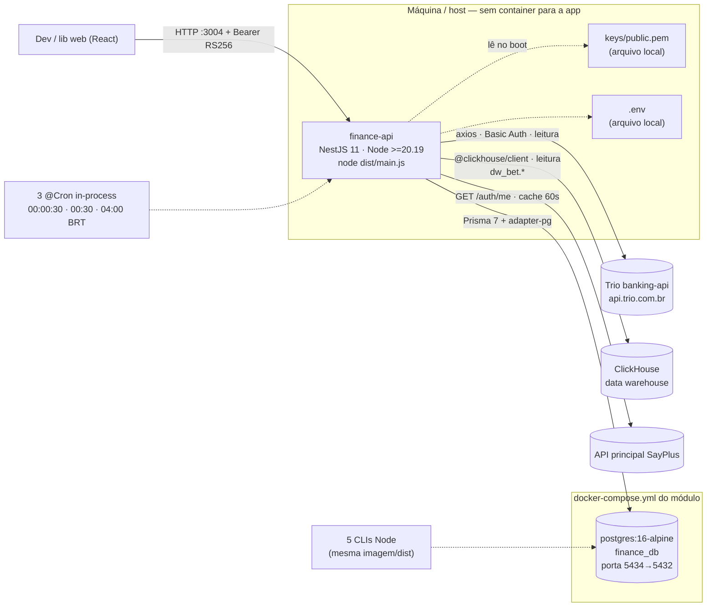
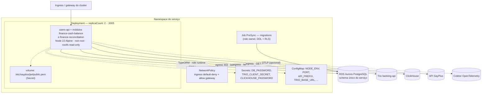

# Infraestrutura do módulo Finance — o que roda, onde e do que depende

**Origem analisada:** `/home/feh/sayplus-modules/finance` (`finance-api`, `docker-compose.yml`,
`.env.example`, `package.json`, `src/main.ts`, `src/app/app.module.ts`, schedulers, clientes de
integração).
**Destino:** `simplified-traditional-archetype` (`Dockerfile`, `docker-compose.yml`,
`deploy/helm/users-api/`, `deploy/infra/requirements.yaml`, `.github/workflows/ci.yml`).
**Escopo:** somente infraestrutura e operação. Dados em
[`DADOS-FINANCE.md`](./DADOS-FINANCE.md); regras de negócio em
[`REGRAS-NEGOCIO-ROTAS.md`](./REGRAS-NEGOCIO-ROTAS.md); plano de execução em
[`MIGRACAO-FINANCE.md`](./MIGRACAO-FINANCE.md).

---

## 0 · Resumo

| Dimensão | Origem hoje | Destino (archetype) |
|---|---|---|
| Processos | 1 API Nest (`:3004`) + 1 Postgres próprio (`:5434`) | 1 processo dentro do serviço do archetype (`:3005`), Postgres compartilhado do serviço |
| Empacotamento | **nenhum** — `node dist/main.js` no host | Dockerfile multi-stage já existente, Node 22 Alpine pinado, non-root, `readOnlyRootFilesystem` |
| Orquestração | **nenhuma** | Helm chart + ArgoCD (padrão do archetype) |
| CI/CD | **nenhum** | 5 jobs já existentes (`quality-validation`, `security`, `e2e-testing`, `build-image`, `helm-validate`) |
| Dependências externas | 3 remotas, **todas somente leitura** (ClickHouse, Trio banking, `GET /auth/me` da SayPlus) | as mesmas 3 — mudam de rede, não de contrato |
| Escrita | só no Postgres do módulo | só no Postgres do serviço |
| Processos agendados | 3 `@Cron` no mesmo processo da API | idem — **e é aqui que `replicaCount: 2` cria um problema novo** (§6) |
| Scripts operacionais | 5 CLIs Node (`npm run trio:capture`, `reconcile`, ...) | idem, executados como Job/`kubectl exec` (§7) |
| Segredos | `.env` no host + `keys/*.pem` no repo local | Secret do K8s (ESO/GitOps) + volume para a chave pública |
| Variáveis de ambiente novas | — | **15** (§4) |

**A frase que resume a obra de infra:** não há infraestrutura nova a inventar — o archetype já entrega
imagem, chart, CI e Postgres. O que existe de verdade a resolver são **quatro coisas específicas**:
egress para duas dependências externas novas (§5), crons em ambiente com múltiplas réplicas (§6),
escrita em disco dos CLIs de exportação contra `readOnlyRootFilesystem` (§7) e a semântica correta do
readiness num módulo que **degrada de propósito** quando o warehouse cai (§8).

---

## 1 · Topologia atual (origem)



O que a origem **não** tem: Dockerfile, chart, CI, probe de dependência, TLS terminado por
infraestrutura, rotação de segredo, limites de recurso, política de rede, observabilidade. Não é
crítica ao módulo — ele foi construído como módulo autocontido de desenvolvimento. É o inventário do
que o archetype passa a fornecer de graça.

---

## 2 · Topologia alvo (dentro do archetype)



**Três consolidações acontecem de uma vez:** o Postgres dedicado na 5434 desaparece (vira o mesmo
banco do serviço), a porta muda de 3004 para 3005, e o prefixo de rota muda de `api` para `api/v1`.
Nenhuma das três é opcional — são convenções do archetype, e cada uma quebra clientes HTTP que
apontem para o endereço antigo.

---

## 3 · Inventário de componentes de infraestrutura

| # | Componente | Papel | Local (dev) | Gerenciado (prod) | Quem provisiona | Novo para o archetype? |
|---|---|---|---|---|---|---|
| 1 | **PostgreSQL** | única escrita do módulo: as 8 tabelas | `postgres:16-alpine` do `docker-compose.yml` | RDS Aurora PostgreSQL | SRE (Terraform) | não — já declarado |
| 2 | **ClickHouse** | leitura dos 5 marts `dw_bet.*` | stub HTTP (`:8123`) ou credencial real de leitura | cluster do data warehouse (já existe, é de outro time) | time de dados concede credencial de leitura; SRE libera egress | **sim** |
| 3 | **Trio banking-api** | leitura de saldo e de extrato | stub HTTP (`:9001`) ou sandbox (`api.sandbox.trio.com.br`) | `api.trio.com.br` (SaaS de terceiro) | financeiro/parceria fornece `client_id`/`client_secret`; SRE libera egress | **sim** |
| 4 | **API principal SayPlus** | `GET /auth/me` → marcas do vínculo do usuário | stub (`:3100`) ou instância local (`:3000`) | serviço interno da plataforma | já existe | **sim** (chamada HTTP interna) |
| 5 | **Chave pública JWT (PEM)** | validação passiva RS256 | `./keys/public.pem` (gerada por script) | Secret do K8s montado em `/etc/sayplus/jwt/public.pem` | SRE / GitOps | não — já previsto |
| 6 | **Agendador** | 3 crons BRT | `@nestjs/schedule` in-process | idem, **com ressalva de réplicas** (§6) | — | **sim** (dependência nova, first-party do Nest) |
| 7 | **Volume de escrita temporária** | CSV dos 2 CLIs de exportação | disco local | `emptyDir` (rootfs é read-only) | chart | **sim** (§7) |
| 8 | Observabilidade | traces/métricas/logs | perfil `observability` do compose (Grafana OTEL LGTM) | coletor da organização | SRE | não |

**Componentes que o Finance explicitamente NÃO usa** — e vale registrar, porque o gate
anti-contrabando do `architecture.spec.ts` depende disso: nenhum Redis, nenhuma fila (SQS/SNS/Kafka),
nenhum S3, nenhum cache distribuído, nenhum serviço AWS além do banco. Os dois caches do módulo são
`Map` em memória do processo (marcas do usuário por 60s; conta virtual da Trio por tempo de vida do
processo) — e é justamente por serem em memória que não exigem infra.

---

## 4 · Variáveis de ambiente

15 variáveis novas em relação ao archetype, além das que ele já tem (`DB_*`, `JWT_*`, `PORT`,
`NODE_ENV`, `API_PREFIX`).

### 4.1 · Tabela completa

| Variável | Obrigatória | Sensível | Destino | Default no código | O que acontece se faltar |
|---|---|---|---|---|---|
| `CLICKHOUSE_URL` | sim (funcional) | não | ConfigMap | — | `isConfigured = false`: **o serviço sobe**, KPIs saem zerados com `available: false`, `register` falha com 503, busca de correção falha com 503 |
| `CLICKHOUSE_USER` | sim | não | ConfigMap | — | erro de autenticação na primeira query → 503 |
| `CLICKHOUSE_PASSWORD` | sim | **sim** | **Secret** | — | idem |
| `CLICKHOUSE_DATABASE` | não | não | ConfigMap | `dw_bet` | — |
| `TRIO_BASE_URL` | sim | não | ConfigMap | — | cliente `null`: captura de fechamento e conciliação indisponíveis |
| `TRIO_CLIENT_ID` | sim | **sim**¹ | **Secret** | — | idem |
| `TRIO_CLIENT_SECRET` | sim | **sim** | **Secret** | — | idem |
| `TRIO_AMOUNT_DIVISOR` | **sim em produção** | não | ConfigMap | `1` | **valor errado por fator de 100** — ver §4.2 |
| `TRIO_ACCOUNT_ID_SUPREMA` | sim | não² | ConfigMap | — | marca sem conta: conciliação devolve `error: 'Integração com o banco não configurada para esta marca'`; captura lança |
| `TRIO_ACCOUNT_ID_ULTRA` | sim | não² | ConfigMap | — | idem |
| `TRIO_ACCOUNT_ID_MAXIMA` | sim | não² | ConfigMap | — | idem |
| `TRIO_USER_ID` | não | não | ConfigMap | — | presente no `.env.example`, **não lido por nenhum código** — candidato a remoção |
| `TRIO_ORGANIZATION_ID` | não | não | ConfigMap | — | idem |
| `SAYPLUS_API_URL` | sim | não | ConfigMap | `http://localhost:3000` | toda rota autenticada falha com 503 ("Não foi possível validar as marcas do usuário") |
| `RECONCILIATION_SCHEDULE_ENABLED` | não | não | ConfigMap | `true` (só `'false'` desliga) | cron das 04:00 roda |
| `RECONCILIATION_BANK_KEY_FIELD` | não | não | ConfigMap | `external_id` | valor inválido → log de `error` e fallback para `external_id` (não derruba o processo) |
| `TRIO_CLOSING_CAPTURE_ENABLED` | não | não | ConfigMap | `true` (só `'false'` desliga) | crons de captura rodam |
| `THROTTLE_TTL_MS` | não | não | ConfigMap | `60000` | — |
| `THROTTLE_LIMIT` | não | não | ConfigMap | `100` | — |
| `FRONTEND_URL` | não | não | ConfigMap | `http://localhost:5173` | CORS restrito ao default |

¹ `TRIO_CLIENT_ID` é metade de uma credencial Basic Auth — trate como sensível, não como
identificador público.
² Os ids de conta não são segredo criptográfico, mas identificam contas bancárias reais. Ficar em
ConfigMap é aceitável; se a política da organização tratar identificador bancário como dado
restrito, movem-se para o Secret sem mudança de código.

### 4.2 · `TRIO_AMOUNT_DIVISOR` é a variável mais perigosa do conjunto

```bash
# .env.example da origem
# Unidade do valor devolvido pela Trio: 1 = reais, 100 = centavos.
# ⚠️ CONFIRMAR na doc da Trio antes de usar em produção.
TRIO_AMOUNT_DIVISOR=1
```

O default do **código** é `1`, e o comentário do próprio `.env.example` admite que o valor correto
não estava confirmado quando foi escrito. Toda a documentação do cliente Trio
(`trio-banking.client.ts`) afirma que a API trafega **centavos** ("Tudo em centavos: a Trio trafega
inteiros"), o que implica `100` em produção.

Consequência de errar: **todo saldo e todo valor de conciliação sai 100× maior ou 100× menor**, sem
erro nenhum sendo lançado. O balanço fecha "certo" internamente e está errado em duas ordens de
magnitude.

**Recomendação:** no destino, esta variável **não** deve ter default. Deve ser obrigatória no schema
Joi, com validação `Joi.number().valid(1, 100).required()`. É o único caso do conjunto em que
"funciona sem configurar" é pior que "não sobe".

**✅ CONFIRMADO (Fase 06, 2026-09-01):** `TRIO_AMOUNT_DIVISOR = 100` — a Trio devolve valores em
**centavos**. Decisão do usuário na PARADA HUMANA desta fase, confirmando a hipótese que a
documentação do cliente já indicava (item acima). O schema Joi do destino (`env.validation.ts`,
Fase 03) já trata a variável como `.required()`, sem default — só falta preencher `100` no `.env` de
homologação/produção antes do primeiro deploy que capture fechamento real da Trio (fora do escopo
desta fase de código).

### 4.3 · Fail-fast × degradação — a decisão a tomar

O archetype valida env com Joi em modo fail-fast: variável ausente derruba o boot. O Finance foi
escrito com a filosofia oposta: cada integração checa `isConfigured` e **degrada**.

Isso não é inconsistência a "consertar" — as duas posturas estão certas em domínios diferentes:

| Variável | Postura correta | Por quê |
|---|---|---|
| `TRIO_AMOUNT_DIVISOR` | **fail-fast** | valor errado corrompe todo número monetário silenciosamente |
| `DB_*` | fail-fast | sem banco não há serviço |
| `SAYPLUS_API_URL` | fail-fast | sem ela **nenhuma** rota funciona (é o resolvedor de escopo) |
| `TRIO_ACCOUNT_ID_*` | fail-fast | uma marca sem conta é erro de configuração, não estado operacional |
| `CLICKHOUSE_*` | **degradar** | é assim que a tela de bancos continua editável quando o warehouse cai — comportamento deliberado, testado em produção |
| `TRIO_BASE_URL`/credenciais | discutível | degradar deixa o operador ver a tela sem saldo Trio; fail-fast evita um dia inteiro capturado sem fechamento |

Minha recomendação: **fail-fast em tudo, exceto o comportamento de runtime do ClickHouse**. Ou seja,
exigir as variáveis no boot (Joi), e manter os `try/catch` de degradação que hoje protegem KPI e
saldo de jogadores — eles tratam *indisponibilidade em runtime*, que é outro problema. Assim não se
perde a resiliência real e se perde a possibilidade de subir mal configurado.

---

## 5 · Rede

### 5.1 · Ingress

Nada muda em relação ao archetype: `NetworkPolicy` com ingress default-deny + allow explícito só para a
SayPlus API (`gatewayNamespace: sayplus` + pods `app.kubernetes.io/name: sayplus-api`), na porta 3005
— a porta do Service é igual à do container, exigência da NetworkPolicy do VPC CNI no EKS. Os pods
levam o label `sayplus.io/module: "true"` (o namespace recebe o mesmo label pelo GitOps da
plataforma). O módulo não expõe porta nova nem protocolo novo.

### 5.2 · Egress — a novidade real

O `users-api` do archetype hoje só precisa alcançar o banco. Com o Finance, precisa alcançar **quatro
destinos**:

| Destino | Protocolo/porta | Direção | Volume esperado | Criticidade |
|---|---|---|---|---|
| Aurora PostgreSQL | TCP 5432 (TLS) | egress | contínuo | crítica |
| ClickHouse | HTTPS (porta do cluster — confirmar: 8443 gerenciado / 8123 HTTP) | egress | ~2–6 queries por request de tela; 2 queries pesadas na busca de correção | alta |
| Trio banking-api | HTTPS 443 | egress | **3 requisições/dia** para captura; **centenas a ~1.000 por marca** numa conciliação | alta |
| API SayPlus (`/auth/me`) | HTTP/HTTPS interno | egress | 1 por request, amortizado por cache de 60s | crítica |
| DNS | UDP/TCP 53 | egress | contínuo | crítica |
| Coletor OTLP (se habilitado) | 4317/4318 | egress | contínuo | baixa |

**Implementado no chart** (egress default-deny nos values de ambiente), bloco `networkPolicy.egress`:

| Destino | Onde no chart | Quem usa |
|---|---|---|
| DNS | `dns: true` | API, Jobs, CronJobs |
| Aurora | `postgres.cidrs` — [TERRAFORM OUTPUT] | API, Jobs, CronJobs |
| Trio | `https.enabled: true` (443 fora de faixas privadas) | API, CronJobs |
| SayPlus `/auth/me` | `sayplusApi.enabled: true` (porta 3000, só os pods da SayPlus) | API |
| ClickHouse | `extra` — **[SRE]** CIDR/porta do DW; endpoint público em 443 já é coberto por `https` | API, CronJobs |
| Coletor OTLP | `extra`, se habilitado | API |

O Job de migrations fica só com DNS + Aurora. Os CronJobs (`app.kubernetes.io/component: cronjob`)
recebem HTTPS e `extra` por uma policy aditiva (`networkpolicy-cronjobs.yaml`). Os pods de Job e
CronJob não são selecionados pelo Service nem pelo PDB (`jobSelectorLabels`).

**Ponto de atenção sobre o pico de egress da conciliação:** a varredura por bisseção do extrato pode
gastar até ~1.000 requisições HTTPS por marca em um dia movimentado, 3 marcas em paralelo, em uma
janela de ~2 minutos. Isso é padrão de tráfego de *scraping*, não de API de negócio — vale avisar o
SRE antes de o WAF/NAT gateway estranhar, e vale confirmar se há rate limit do lado da Trio (o cliente
já trata `429` com retry de backoff linear, 4 tentativas).

---

## 6 · Processos agendados — o problema que `replicaCount: 2` cria

A origem roda os 3 crons **dentro do processo da API**, e isso funcionava porque havia um processo. O
chart do archetype nasce com `replicaCount: 2`.

| Cron | Horário (BRT) | O que faz | Comportamento com 2 réplicas |
|---|---|---|---|
| `trio-closing-capture` | `00:00:30` | lê saldo point-in-time das 3 marcas e grava | **seguro** — a `UNIQUE(reference_date, brand)` serializa; a 2ª réplica gasta 3 chamadas HTTP e descobre que já existia. Custo: 3 requisições desperdiçadas |
| `trio-closing-catchup` | `00:30` | recaptura o que faltou | **seguro**, mesmo mecanismo |
| `daily-reconciliation` | `04:00` | concilia o dia anterior nas 3 marcas | **desperdício real** — as duas réplicas varrem o extrato inteiro (até ~1.000 requisições × 3 marcas cada), calculam o mesmo resultado, e a última gravação vence. A guarda de reentrância (`inFlight`) é **um `Set` em memória do processo**: não vê a outra réplica |

O comentário no código é explícito sobre isso: *"Não é lock distribuído — com duas instâncias as duas
calculam o mesmo resultado e a última gravação vale."* Correto do ponto de vista de resultado
(idempotente), caro do ponto de vista de recurso, e potencialmente visível para a Trio como tráfego
duplicado.

**Quatro caminhos, em ordem de preferência:**

1. **`CronJob` do Kubernetes chamando os CLIs** (`reconcile`, `trio:capture`), com
   `RECONCILIATION_SCHEDULE_ENABLED=false` e `TRIO_CLOSING_CAPTURE_ENABLED=false` no Deployment.
   Exatamente uma execução, visibilidade de sucesso/falha no próprio K8s, retry configurável, e usa
   um caminho de código que **já existe e é testado** (os CLIs batem nos mesmos use-cases). É a opção
   que não pede código novo — só manifesto.
2. **Deployment separado com 1 réplica** só para jobs, com as flags invertidas em relação à API. Mais
   simples de raciocinar que leader election, mas mantém um processo ocioso 23h por dia.
3. **Leader election** (lease do K8s ou advisory lock do Postgres). Correto e genérico, mas é código
   novo em um módulo que está sendo migrado — risco na hora errada.
4. **Deixar como está**, aceitando o desperdício. Defensável se `replicaCount: 1` for aceitável, o que
   contraria o default do chart.

**Recomendação: opção 1.** Ela transforma um problema de concorrência em um problema de manifesto, e o
manifesto é revisável em PR.

**Fuso horário:** os três crons declaram `timeZone: 'America/Sao_Paulo'` explicitamente
(`@Cron(expr, { timeZone: TIME_ZONE })`), então não dependem do `TZ` do container. Se a rota do
`CronJob` for adotada, a expressão do manifesto passa a ser em **UTC** (o `CronJob` do K8s aceita
`timeZone` a partir da 1.27, mas nem todo cluster habilita o feature gate) — `04:00` BRT vira `07:00`
UTC, e isso quebra sozinho se o horário de verão brasileiro voltar. O código atual, que consulta o
offset em runtime, não tem esse problema; o manifesto tem. Vale registrar a escolha.

---

## 7 · Os 5 CLIs em ambiente containerizado

| Script | Comando | Escreve em disco? | Contém PII? |
|---|---|---|---|
| Captura de fechamento | `npm run trio:capture -- <data> [--overwrite]` | não | não |
| Conciliação sob demanda | `npm run reconcile -- <data>` | não | grava PII no banco (contraparte) |
| Extrato diário por marca | `npm run trio:statement -- --from= --to= --out=<arquivo>` | **sim** (`writeFileSync`) | não |
| Extrato analítico linha a linha | `npm run trio:transactions -- --from= --to= --out=<arquivo>` | **sim** (`writeFileSync`) | **sim** |
| Carga de histórico de balanço | `npm run balance:import -- <csv>` | lê arquivo | não |

**Três consequências concretas da imagem do archetype:**

1. **`readOnlyRootFilesystem: true`** (`securityContext` do chart) impede `writeFileSync` em qualquer
   caminho, inclusive `/tmp`. Os dois CLIs de exportação precisam de um `emptyDir` montado (ou de
   escrever em `stdout` em vez de arquivo — mudança pequena de código que elimina a necessidade de
   volume). **Recomendação:** `--out=-` escrevendo em `stdout`, e o operador redireciona. Elimina
   volume, elimina arquivo com PII esquecido no pod.
2. **O toolchain `npm` é removido da imagem final** (o Dockerfile apaga `npm`, `npx`, `corepack`,
   `yarn`). Logo **`npm run <script>` não existe no container de produção**. Os CLIs têm de ser
   invocados como `node dist/cli/<arquivo>.js` — e os `package.json scripts` viram documentação, não
   ponto de entrada. Isso precisa estar escrito em algum runbook, senão o primeiro backfill em
   produção vira uma sessão de depuração.
3. **`trio:transactions` gera arquivo com dado pessoal.** Se rodar em pod, o arquivo fica em um
   volume efêmero de um pod de produção. Preferir `stdout` + redirecionamento na máquina do operador,
   ou execução fora do cluster com credencial temporária. É decisão de compliance, não de conveniência.

**Como executar:** `kubectl run` com a mesma imagem (`command: ["node", "dist/cli/run-reconciliation.js"]`)
e o mesmo ConfigMap/Secret do Deployment, como `Job` de uso único. Reaproveita a imagem já escaneada e
não exige `exec` em pod servindo tráfego.

---

## 8 · Health checks — a recomendação que divergem do plano geral

| | Origem | Archetype | Este documento recomenda |
|---|---|---|---|
| Rota | `GET /api/health` (dentro do prefixo) | `/health/liveness` + `/health/readiness` (fora do prefixo) | manter as duas do archetype |
| Conteúdo | `{ status: 'ok', module: 'finance' }` estático | Terminus | Terminus |
| Dependências verificadas | **nenhuma** | Postgres | **liveness:** nada. **readiness:** só Postgres |

O `MIGRACAO-FINANCE.md` §Onda 5 sugere readiness "pingando Postgres **e** ClickHouse". Discordo, e o
motivo é o próprio desenho do módulo:

**O Finance degrada de propósito quando o warehouse cai.** `GetSummaryUseCase` e
`GetBanksStateUseCase` capturam a falha do ClickHouse, logam `warn` e devolvem a tela **funcional** —
sem KPI e sem saldo de jogadores, mas com os bancos editáveis e a confirmação individual funcionando.
Isso é comportamento pensado ("KPI indisponível não bloqueia a tela: o bloco de bancos segue
editável").

Se o readiness reprovar quando o ClickHouse estiver fora, o Kubernetes **remove os pods do
balanceador** e o operador perde acesso a uma tela que funcionaria. A degradação projetada seria
anulada por uma probe. Pior: uma indisponibilidade de um sistema de **outro time** derrubaria este
serviço.

**Recomendação:** readiness verifica só o que o serviço não sobrevive sem — o Postgres. ClickHouse e
Trio viram **métrica/alerta**, não probe. Se houver necessidade de expor o estado das dependências,
uma rota informativa (`GET /health/dependencies`, autenticada, não usada por probe) resolve sem
acoplar o ciclo de vida do pod à saúde de terceiros.

---

## 9 · Imagem, recursos e limites

### 9.1 · O que a imagem do archetype já resolve

Nada a fazer, só registrar que o Finance herda: base pinada (`node:22.23.2-alpine3.24`), `apk upgrade`
de patches de segurança no build, `npm ci` do lockfile (defesa de supply chain), remoção do toolchain
npm da imagem final, `USER node`, `readOnlyRootFilesystem`, `allowPrivilegeEscalation: false`,
`capabilities: drop [ALL]`, `seccompProfile: RuntimeDefault`.

**Uma incompatibilidade de versão a resolver:** `package.json` da origem declara
`"engines": { "node": ">=20.19.0" }`; o archetype fixa Node 22 (`.nvmrc` + imagem). Não há uso de API
exclusiva de Node 20 no código lido — a atualização é de declaração, não de compatibilidade. Mas o
`prisma` sai junto com a troca de ORM, e é a dependência que mais implicava em versão de Node/OpenSSL
(`binaryTargets` com `linux-musl-arm64-openssl-3.0.x` no schema) — sair do Prisma **simplifica** a
imagem, não complica.

### 9.2 · Recursos — os defaults do chart merecem medição antes de valer

```yaml
resources:
  requests: { cpu: 100m, memory: 256Mi }
  limits:   { cpu: 500m, memory: 512Mi }
```

Esses valores foram desenhados para um CRUD. A conciliação tem um perfil diferente:

- **Memória:** o `run` carrega em memória, simultaneamente, os lançamentos das duas pontas para as 3
  marcas em paralelo. Ordem de grandeza conhecida: ~3.700 lançamentos/dia por marca do lado
  plataforma (Suprema, 12/08/2026) e ~5.200 linhas em 10h do lado banco (Ultra). São objetos pequenos
  — provavelmente dezenas de MB, não centenas —, mas **não medido**. O risco de `OOMKilled` durante o
  cron das 04:00 num dia de pico existe e é barato de eliminar: medir uma execução real e ajustar.
- **CPU:** a varredura é IO-bound (espera HTTP). `500m` de limite provavelmente sobra. O risco maior
  é o oposto: **CPU throttling** durante o parse de milhares de respostas JSON, o que estica um job
  de 2 minutos sem erro aparente.
- **`terminationGracePeriodSeconds: 30`:** um rolling update durante a conciliação mata a varredura no
  meio. Não corrompe dado (a execução fica `RUNNING` e a próxima reexecução refaz), mas deixa a marca
  presa em `RUNNING` na tela até alguém reexecutar — e `RUNNING` é o segundo status mais grave do
  histórico. Adotar a opção 1 do §6 (CronJob separado) resolve isso também: o deploy da API deixa de
  interferir na conciliação.

**Item de ação:** medir uma execução de conciliação real (marca mais movimentada) antes de fixar
`limits`. Antes da medição, `768Mi–1Gi` de limite é um chute mais seguro que `512Mi` para o caminho
job — e se a opção 1 do §6 for adotada, o `CronJob` pode ter recursos próprios, mais generosos, sem
inflar o pod que serve HTTP.

---

## 10 · `requirements.yaml` — o que declarar ao SRE

> **✅ Adotado na Fase 17** — os 3 itens abaixo (ClickHouse, Trio, identidade SayPlus) foram
> adicionados a `deploy/infra/requirements.yaml` como está aqui. O vocabulário de `type` continua
> como sugestão a validar com o SRE (não confirmado por eles nesta trilha).

O arquivo atual declara 3 itens (`postgres`, `k8s-secret` da chave JWT, `cni-network-policy`). O
Finance acrescenta dependências que o SRE precisa conhecer. Proposta de adição — o vocabulário de
`type` é do catálogo do SRE, então os nomes abaixo são sugestão a validar:

```yaml
  # --- Data warehouse (somente leitura) --------------------------------------
  - type: external-service            # confirmar vocabulário com o SRE
    purpose: >-
      ClickHouse do data warehouse — leitura EXCLUSIVA de marts dw_bet.*
      (fct_kpi_daily, fct_sigap_saldo_diario, fct_deposit, fct_withdrawal,
      fct_correction). Credencial de leitura concedida pelo time de dados.
      O serviço DEGRADA (não falha) quando indisponível: por isso NÃO entra
      no readiness probe — ver INFRA-FINANCE.md §8.
      Egress necessário: HTTPS para o endpoint do cluster.
    outputs:
      env: [CLICKHOUSE_URL, CLICKHOUSE_USER, CLICKHOUSE_DATABASE]
      secret: [CLICKHOUSE_PASSWORD]

  # --- Banking-api da Trio (somente leitura) ---------------------------------
  - type: external-service
    purpose: >-
      API bancária da Trio (SaaS de terceiro) — leitura de saldo point-in-time
      e de extrato. Auth = HTTP Basic (client_id:client_secret).
      PICO DE TRÁFEGO ATÍPICO: a varredura de extrato por bisseção pode emitir
      até ~1.000 requisições HTTPS por marca em ~2 min (3 marcas em paralelo),
      uma vez ao dia. Confirmar com o SRE se NAT gateway/WAF tolera o padrão.
      Egress necessário: HTTPS 443 para o host da Trio.
    outputs:
      env: [TRIO_BASE_URL, TRIO_AMOUNT_DIVISOR, TRIO_ACCOUNT_ID_SUPREMA, TRIO_ACCOUNT_ID_ULTRA, TRIO_ACCOUNT_ID_MAXIMA]
      secret: [TRIO_CLIENT_ID, TRIO_CLIENT_SECRET]

  # --- Identidade da plataforma ----------------------------------------------
  - type: internal-service
    purpose: >-
      API principal SayPlus — GET /auth/me resolve as MARCAS do vínculo do
      usuário (até 3 por request). É dependência CRÍTICA: sem ela nenhuma rota
      de negócio responde. Cache de 60s em memória, por hash SHA-256 do token.
    outputs:
      env: [SAYPLUS_API_URL]

```

> **Correção da Fase 17 ao rascunho original:** este §10 tinha um 4º item ("Execução agendada",
> `type: cronjob`) descrevendo `@Cron` in-process com flags `RECONCILIATION_SCHEDULE_ENABLED`/
> `TRIO_CLOSING_CAPTURE_ENABLED` — **nenhum dos dois existe**. A decisão real, fechada na Fase 15
> (`CLAUDE.md`, decisão 3 e item 16): **nunca portamos `@nestjs/schedule`/`@Cron` in-process**; a
> execução agendada é só o `CronJob` do Kubernetes (`deploy/helm/users-api/templates/cronjob.yaml`)
> invocando os 5 CLIs, com as MESMAS variáveis de ambiente dos 3 itens acima (`envFrom` do mesmo
> ConfigMap/Secret) — nenhuma flag nova de habilitar/desabilitar. Por ser um recurso já declarado
> dentro deste próprio chart (não uma dependência externa que o SRE provisiona por fora), o `CronJob`
> não entra como um 4º item de `requires:` em `requirements.yaml` — só os 3 itens externos entram.

A regra do arquivo é que **o `docker-compose.yml` espelha 1:1 esta lista**. Com o Finance, o compose
precisa ganhar os stubs (ou serviços reais) correspondentes a ClickHouse, Trio e identidade — senão a
paridade local declarada deixa de ser verdade e o gate anti-contrabando perde referência. Confirmado
na Fase 17: `.env.docker` ganhou as mesmas 3 URLs apontando para `host.docker.internal` (os stubs de
`scripts/finance-dev-stubs.js` rodam no host, fora da rede do compose).

---

## 11 · CI

Os 5 jobs existentes cobrem o Finance sem alteração estrutural. O que muda:

| Job | Impacto do Finance |
|---|---|
| `quality-validation` | `lint`, `dup:check` (gate de 3%), `format:check`, `test:cov`, `build`. **Atenção:** dois arquivos da origem estouram `max-lines: 400` (`reconciliation.repository.ts` com 692 linhas, `cash-balance.repository.ts` com 624) — precisam ser partidos durante a tradução, não depois. E `jscpd` nunca foi rodado contra este código |
| `security` | `npm audit --audit-level=high` sobre as dependências novas: `@clickhouse/client`, `axios`, `@nestjs/schedule`. Sai `@prisma/client`, `prisma`, `@prisma/adapter-pg`, `pg` (o archetype já tem `pg` via TypeORM) |
| `e2e-testing` | Testcontainers sobe Postgres efêmero. **As 3 integrações externas precisam de stub** — nunca credencial real no CI. O `scripts/dev-stubs.js` da origem (identidade `:3100`, Trio `:9001`, ClickHouse `:8123`) é o material pronto para isso |
| `build-image` | nada muda — a imagem é a mesma |
| `helm-validate` | valida o chart com as variáveis novas no ConfigMap. Renderiza sem Secret (`existingSecret: ''`) |

**Um risco de CI que vale antecipar:** o `e2e` que exercitar a conciliação contra stub precisa que o
stub da Trio devolva `has_more: false`, senão a bisseção entra em recursão até estourar o
`REQUEST_BUDGET` de 20.000 requisições — o teste não falha rápido, ele fica lento e depois falha com
mensagem obscura. Vale um teste dedicado à bisseção (janela com `has_more: true` → duas metades sem
overlap e sem buraco), que é regressão do caso real medido (janela de 10h, 5.234 linhas via cursor
contra 5.236 reais).

---

## 12 · Ambiente local

| Serviço | Origem | Destino |
|---|---|---|
| API | `:3004`, prefixo `/api` | `:3005`, prefixo `/api/v1` |
| Postgres | `:5434` → 5432 no container (`finance_db`) | `:5432` (`users`), com roles owner/app criados pelo `initdb` |
| Stub de identidade | `:3100` (`scripts/dev-stubs.js`) | portar |
| Stub da Trio | `:9001` | portar |
| Stub do ClickHouse | `:8123` | portar |
| Grafana (OTEL LGTM) | — | `:3300` (perfil `observability`) |
| pgAdmin | — | `:5050` (perfil `tools`) |
| Token de dev | `npm run dev:token` (assina com `keys/private.pem`) | portar (o archetype tem `npm run auth:keys`) |
| Smoke test | `npm run test:smoke` — **190 verificações** contra stubs, idempotente | portar para a suíte e2e, não descartar |

**Nenhuma credencial real é necessária para desenvolver.** Isso já é verdade na origem (é o que os
stubs entregam) e precisa continuar sendo — é a diferença entre um novo desenvolvedor produzindo no
primeiro dia e esperando três dias por acesso ao data warehouse e à Trio.

Sequência mínima no destino:

```bash
docker compose up -d                       # Postgres
npm run migration:run
node scripts/finance-dev-stubs.js &         # identidade :3100, Trio :9001, ClickHouse :8123
npm run start:dev
curl -s localhost:3005/api/v1/cash-balance/banks -H "Authorization: Bearer $(npm run -s dev:token)"
```

---

## 13 · Observabilidade e logs

O módulo já é disciplinado em log, e as regras precisam sobreviver porque foram escritas por causa de
incidentes:

| Regra | Onde é imposta |
|---|---|
| **Nunca** logar CPF/CNPJ da contraparte | `correction-search.service.ts` loga só contagens ("120 contas para 231 documentos") |
| **Nunca** logar o token | `platform-identity.service.ts` usa hash SHA-256 como chave de cache |
| **Nunca** logar credencial nem corpo de resposta da Trio | `trio-banking.client.ts` loga só `status` e `path` |
| **Nunca** logar a nota do operador | `resolve-item.use-case.ts` loga id, marca e autor |
| `reconciliation_runs.error` nunca contém credencial | documentado no schema |

**Métricas que valem existir e hoje não existem** (só há log):

1. Duração e desfecho de cada execução dos 3 crons — é o sinal de que o dia foi capturado/conciliado.
2. Contagem de requisições emitidas à Trio por execução — detecta a bisseção não convergindo antes de
   ela bater no budget de 20.000.
3. Pendências abertas por dia/marca — é o número que decide se o mês fecha, e hoje só existe na tela.
4. Falhas de leitura do ClickHouse — porque a degradação é silenciosa por projeto; sem métrica,
   ninguém descobre que a tela está sem KPI há três dias.

Os quatro são baratos com o OTEL que o archetype já prevê, e os quatro cobrem exatamente os pontos
onde o módulo falha **sem** retornar erro para o usuário.

---

## 14 · Matriz de falha — o que acontece quando cada dependência cai

Útil para o runbook e para calibrar alertas. Derivada dos `try/catch` e dos `isConfigured` do código.

| Dependência fora | Rotas afetadas | Comportamento | Severidade |
|---|---|---|---|
| **Postgres** | todas | 500 | crítica — serviço inoperante |
| **API SayPlus (`/auth/me`)** | **todas as 14 de negócio** | `503 Não foi possível validar as marcas do usuário` | crítica — nenhuma rota resolve escopo |
| **ClickHouse** | `summary` | 200 com `available: false` e KPIs zerados | baixa — degradação projetada |
| **ClickHouse** | `banks` | 200 com `saldoJogadores: null` e `totalBalanco: null` | média — a tela funciona, o total do dia não aparece |
| **ClickHouse** | `history` | 200 com `kpisAvailable: false`; tabela de dias registrados continua | baixa |
| **ClickHouse** | `POST /:brand/register` | **503** — registro bloqueado | **alta** — o dia não pode ser fechado sem `saldo_jogadores` |
| **ClickHouse** | `corrections` (GET e apply) | 503 | média — é ferramenta de investigação |
| **ClickHouse** | `POST /reconciliation/run` | run grava `FAILED` com a mensagem; 202 já foi devolvido | média |
| **Trio** | `trio/refresh`, `banks` | leem do **Postgres**, não da Trio → **não afetadas** | nenhuma |
| **Trio** | `POST /:brand/register` | 503 se não houver fechamento capturado do dia | alta |
| **Trio** | cron de captura | erro logado por marca; o retry das 00:30 e o CLI recuperam sem perda (a leitura é do instante do corte, então recapturar dias depois dá o mesmo valor) | baixa |
| **Trio** | conciliação | run grava `FAILED`; as outras marcas seguem | média |

**A leitura mais importante desta tabela:** a única rota que fica **bloqueada de verdade** por
dependência externa é `POST /cash-balance/:brand/register` — e ela é bloqueada de propósito, porque
registrar um balanço sem o fechamento exato da Trio ou sem o saldo de jogadores gravaria um número
errado em tabela imutável. Todas as outras degradam. Essa assimetria é o desenho, não um acidente: a
escrita é rigorosa, a leitura é tolerante.

---

## 15 · Checklist de infra para o cutover

- [ ] Credencial de leitura do ClickHouse concedida ao serviço (time de dados) e egress liberado.
- [ ] `client_id`/`client_secret` da Trio de **produção** em Secret; sandbox separada para
      homologação.
- [ ] **`TRIO_AMOUNT_DIVISOR` confirmado na documentação da Trio** e declarado como obrigatório no
      Joi, sem default (§4.2).
- [ ] Os 3 `TRIO_ACCOUNT_ID_*` preenchidos com o `bank_account.id` de cada marca (o módulo resolve a
      conta virtual sozinho a partir dele).
- [ ] `SAYPLUS_API_URL` apontando para a API principal do ambiente correspondente.
- [ ] Decisão registrada sobre crons × réplicas (§6) e manifestos criados, se a opção 1.
- [ ] Decisão registrada sobre readiness **não** verificar ClickHouse (§8).
- [ ] Runbook dos CLIs escrito com `node dist/cli/...` (não `npm run`) e com a política sobre o CSV
      com PII (§7).
- [ ] `requirements.yaml` atualizado com os 4 itens novos e revisado pelo SRE (§10).
- [ ] `docker-compose.yml` com stubs correspondentes, mantendo a paridade local declarada.
- [ ] Stubs no CI; nenhuma credencial real em variável de ambiente do GitHub Actions.
- [ ] Uma execução de conciliação medida (memória e duração) antes de fixar `resources.limits` (§9.2).
- [ ] Os 8 códigos de permissão registrados no catálogo da plataforma **antes** do deploy — sem eles o
      `PermissionsGuard` nega tudo (comportamento correto, bloqueio de lançamento).
