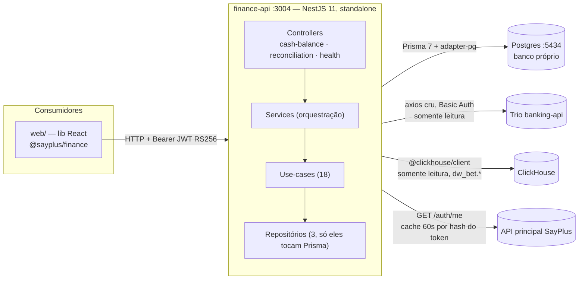
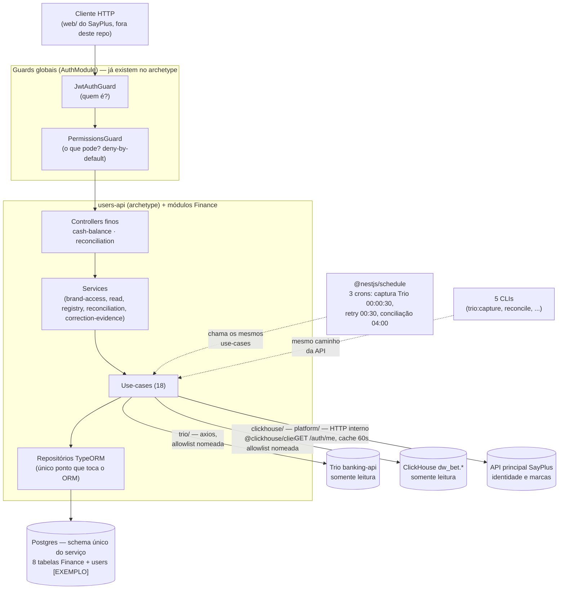

# Migração do módulo Finance (SayPlus) para o Archetype — plano técnico

**Origem:** `/home/feh/sayplus-modules/finance` (`finance-api`, NestJS 11 + Prisma 7, standalone)
**Destino:** este repositório (`simplified-traditional-archetype`), como módulo(s) novo(s) de domínio
**Baseado em:** `docs/BRIEFING-ARCHETYPE.md`, `docs/ARQUITETURA.md`, `HANDOFF.md`, `prisma/schema.prisma`,
controllers e `.env.example` do projeto de origem (lidos e citados neste documento), e no estado atual
deste archetype pós-`auth/` + RLS (commit `88e9cdf`).

Este documento cobre **só a API** (o `finance-api`). A lib React (`web/`) não migra para dentro deste
repositório — ela consome a API por HTTP e é tratada como "outro time, outro passo", exatamente como o
próprio `HANDOFF.md` do módulo de origem já separa incorporação de backend e de frontend.

---

## 0 · Resumo executivo

| Dimensão | Valor |
|---|---|
| Módulos de domínio a trazer | 2 — `cash-balance` e `reconciliation` |
| Rotas HTTP | 15 (14 de negócio + `/health`) em 2 controllers de domínio |
| Use-cases | 18 |
| Modelos de dado | 8 (Prisma → TypeORM) |
| Integrações externas novas para este archetype | ClickHouse (leitura), Trio banking API (leitura), `GET /auth/me` da SayPlus (identidade) |
| Testes hoje | **zero** unitários/e2e — só um script de fumaça com 190 verificações contra stubs |
| Obra central | troca de ORM (Prisma → TypeORM), rede de proteção de testes **antes** da troca, e uma allowlist nomeada no `architecture.spec.ts` para as capacidades novas |
| **Tempo de execução (agente, sem interrupção)** | **≈ 23–30h de trabalho ativo → 3 a 4 dias úteis** (jornadas de ~7–8h), com revisão humana rápida entre ondas — ver detalhe por fase e as ressalvas em §10.0 |
| Estimativa de referência (time humano, sem agente) | 8–10 semanas (1 dev) · 6–7 semanas (2 devs em paralelo) — número original do `BRIEFING-ARCHETYPE.md`, mantido aqui só como comparação de ordem de grandeza |

> ⚠️ **Sobre o número de 23–30h:** é tempo de **execução** (gerar código, rodar teste, corrigir, repetir),
> não tempo de calendário. Ele assume que as duas perguntas bloqueantes da Fase 0 e as coordenações
> externas da Fase 6 (registro de permissões na plataforma, credenciais reais de Trio/ClickHouse,
> aprovação do PR de frontend) são respondidas rápido — nenhuma delas é tempo de execução do agente, e
> qualquer uma pode fazer o calendário real esticar bem além de 4 dias sem que a Fase técnica correspondente
> tenha ficado mais lenta. Cada fase abaixo tem seu próprio comando de verificação local (§10), para que
> nenhuma onda dependa de "confiar" no resultado da anterior.

**A frase que resume o risco:** no `users-api` de exemplo deste archetype, o risco de uma migração é
estrutural (camadas, import errado). No Finance, a estrutura já está quase pronta — o risco real está
na **aritmética sem teste** (sinal do balanço, casamento de conciliação, saldo por instante da Trio,
liquidação de estorno). A ordem de execução deste documento existe para proteger essa aritmética
**antes** de tocar no ORM, não depois.

---

## 1 · Arquitetura atual (SayPlus `finance-api`)

### 1.1 Topologia



Quatro dependências externas; **as três remotas (Trio, ClickHouse, SayPlus) são somente leitura**. A
única escrita é no Postgres próprio do módulo.

### 1.2 Camadas (já em Clean Architecture leve)

```
modules/{cash-balance,reconciliation}/
├── domain/
│   ├── use-cases/     uma classe = uma operação de negócio
│   ├── services/       orquestração: resolve escopo do usuário e delega
│   ├── ports/           interfaces de saída (ex.: ClosingBalanceSource)
│   └── *.types.ts, matcher.ts, refund-settlement.ts, correction-matcher.ts (lógica pura)
├── infrastructure/
│   ├── *.repository.ts        única camada que toca Prisma
│   ├── trio/                  cliente axios + adapter point-in-time
│   ├── clickhouse/             serviços de consulta ao warehouse
│   ├── platform/               PlatformIdentityService (GET /auth/me)
│   └── *.scheduler.ts          crons
└── presenters/
    ├── controllers/
    └── dtos/
```

Fluxo obrigatório: **Controller → Service → Use-case → Repositório**. `domain/` nunca importa de
`infrastructure/` nem de `presenters/`. Isso já é compatível com as regras portáveis do
`architecture.spec.ts` deste archetype (controller não importa `typeorm`/persistência, service não
importa controller) — só falta um nível a mais (use-case) que a regra atual não proíbe.

### 1.3 Auth e identidade — a peça que **não** é igual à do archetype

| Aspecto | Finance (origem) | Archetype (destino, hoje) |
|---|---|---|
| Verificação do JWT | Passport JWT RS256, só chave pública | Igual — `JwtAuthGuard` + `jwt-public-key.provider.ts` |
| Autorização | `@RequirePermissions(...)` + `PermissionsGuard`, deny-by-default | Igual — `@Permissions(...)`/`@Public()` + `PermissionsGuard`, deny-by-default |
| **Chave de tenant** | **Não é `tenantId`: é a marca** (`suprema-bet`/`ultra-bet`/`maxima-bet`). O JWT carrega só o tenant ativo; as marcas do vínculo vêm de `GET /auth/me`, cacheado 60s por hash SHA-256 do token | `tenant_id` do claim do JWT, propagado por `TenantTransactionInterceptor` → RLS via GUC `app.tenant_id` (Step 5, ver `src/database/tenant-context.ts`) |
| Escopo | Um usuário pode ver **até 3 marcas simultâneas** por request | RLS do archetype assume **um tenant por request** |

Esta é a divergência mais importante do documento — está detalhada na seção 4.3.

### 1.4 O que já está no formato que o archetype pede

Direto do `BRIEFING-ARCHETYPE.md`, seção 4 — vale repetir porque reduz o escopo real da obra:

- `ValidationPipe` global (`whitelist`, `forbidNonWhitelisted`, `transform`) — igual ao archetype.
- Swagger code-first a partir dos DTOs.
- Migrations em SQL explícito, topologia simples: **zero CHECK, zero índice parcial** — troca de ORM
  bem menos arriscada do que seria com constraints condicionais.
- Camadas já aderentes às regras portáveis do `architecture.spec.ts`.
- Superfície do Prisma confinada a **7 arquivos**, sem vazamento para `domain/`/controllers.
- ClickHouse já encapsulado como read-model, nunca acesso cru espalhado.
- `helmet`, CORS e `@nestjs/throttler` configurados.

### 1.5 O que diverge (tabela condensada — detalhe nas seções seguintes)

| Item | Origem | Archetype | Onde tratamos |
|---|---|---|---|
| ORM | Prisma 7 | TypeORM | §6 |
| Contrato de erro | `{ statusCode, message, ...payload }` | `{ code, message }` | §4.1 |
| Envelope de resposta | `{ data, timestamp, path }` | sem envelope | §4.1 |
| Node | `>=20.19.0` | `22 <23` | checklist |
| Config | `ConfigModule.forRoot` sem schema; 10 `process.env` crus | `registerAs` + Joi fail-fast | §7.4 |
| Health | `GET /api/health`, sem ping de dependência, dentro do prefixo | Terminus, fora do prefixo, `/health/liveness`+`/health/readiness` | checklist |
| Prefixo | `api` | `api/v1` | checklist |
| Swagger | opt-out em produção (bug latente: env ausente **publica**) | opt-in fora de produção | checklist |
| PK | UUID nas 8 tabelas | `SERIAL` por padrão (regra 7) | §6.3 (decisão em aberto) |
| Anti-contrabando | `axios` cru (Trio) e `@clickhouse/client` não nomeados na regra atual | regex já bloqueia `@nestjs/axios`/`cache-manager`/SQS/AWS SDK | §4.2 |
| Testes | zero | jest + e2e Testcontainers + ArchUnitTS | §9 |
| Entrega (Dockerfile, Helm, CI) | nada | já existe no esqueleto | reaproveita |

---

## 2 · Arquitetura alvo — como fica dentro deste archetype

### 2.1 Árvore de diretórios proposta

```
src/
├── clickhouse/                         [NOVO — sibling de database/, ver §4.4]
│   ├── clickhouse.module.ts             conexão única, global
│   └── clickhouse.service.ts            query com query_params nomeados (nunca string interpolada)
├── database/                            (esqueleto, já existe)
│   └── migrations/
│       └── <timestamp>-FinanceInitialSchema.ts   [EXEMPLO-FINANCE]
└── modules/
    ├── users/                           [EXEMPLO] — apagável, como hoje
    ├── finance-cash-balance/            [EXEMPLO-FINANCE]
    │   ├── domain/
    │   │   ├── use-cases/               9 use-cases (capture-trio-closing, confirm-bank,
    │   │   │                            export-trio-statement/transactions, get-banks-state,
    │   │   │                            get-history, get-summary, import-balance-history,
    │   │   │                            register-brand, reopen-brand)
    │   │   ├── services/                brand-access.service.ts, cash-balance-read.service.ts,
    │   │   │                            cash-balance-registry.service.ts
    │   │   ├── ports/                   closing-balance-source.port.ts
    │   │   └── cash-balance.types.ts, kpi-card.util.ts
    │   ├── infrastructure/
    │   │   ├── cash-balance.repository.ts        [único arquivo que toca TypeORM aqui]
    │   │   ├── trio-closing-balance.repository.ts
    │   │   ├── trio/                              trio-banking.client.ts (axios),
    │   │   │                                      trio-point-in-time-balance.source.ts,
    │   │   │                                      trio-closing-balance.scheduler.ts (@Cron)
    │   │   ├── clickhouse/                        clickhouse-read.service.ts (consome src/clickhouse/)
    │   │   └── platform/                          platform-identity.service.ts (GET /auth/me)
    │   ├── entities/                    CashBalanceDay, CashBalanceDaily, CashBalanceBankEntry,
    │   │                                CashBalanceBrandSnapshot, TrioClosingBalance
    │   ├── dto/                         (renomeado de dtos/ — regra do archetype é singular)
    │   ├── cash-balance.constants.ts    catálogo dos 8 bancos
    │   ├── presenters/controllers/cash-balance.controller.ts
    │   └── cash-balance.module.ts
    └── finance-reconciliation/          [EXEMPLO-FINANCE]
        ├── domain/
        │   ├── use-cases/               6 use-cases (apply-correction-matches, get-reconciliation,
        │   │                            get-reconciliation-history, reopen-item, resolve-item,
        │   │                            run-reconciliation)
        │   ├── services/                correction-evidence.service.ts, reconciliation.service.ts
        │   └── matcher.ts, refund-settlement.ts, correction-matcher.ts, correction-note.ts,
        │       totals.util.ts, reconciliation.types.ts   [lógica pura — sem Prisma/TypeORM/HTTP]
        ├── infrastructure/
        │   ├── reconciliation.repository.ts
        │   ├── reconciliation.scheduler.ts (@Cron 04:00 BRT)
        │   ├── clickhouse/               correction-search.service.ts, platform-movements.service.ts
        │   └── trio/                     trio-movements.service.ts (varredura por bisseção)
        ├── entities/                     ReconciliationRun, ReconciliationItem
        ├── dto/
        ├── presenters/controllers/reconciliation.controller.ts
        └── reconciliation.module.ts     importa CashBalanceModule (BrandAccessService, TrioBankingClient)
```

**Por que dois módulos, e não um `finance/` com dois submódulos?** Porque é exatamente assim que o
código de origem já está desenhado (`ReconciliationModule` importa `CashBalanceModule` e usa só o que é
exportado), e é exatamente o padrão que a regra 3 do archetype (README §5) exige: "colaboração entre
módulos só via service exportado". Manter os dois módulos NestJS separados preserva essa fronteira já
correta em vez de escondê-la dentro de uma pasta comum.

`FinanceAuditLog` (a 8ª tabela) vira uma entidade "solta" em `finance-cash-balance/entities/` (ou um
terceiro módulo minúsculo `finance-common/`, se preferirem não acoplá-la a nenhum dos dois domínios) —
decisão de gosto, sem impacto arquitetural; este documento assume a primeira opção.

### 2.2 Diagrama da arquitetura alvo



O que muda de verdade em relação ao diagrama §1.1: os "3 processos separados" (finance-api standalone +
Postgres próprio na 5434) somem — vira **um processo, um schema**, dentro do `users-api` gerado pelo
archetype. Trio/ClickHouse/SayPlus continuam exatamente como hoje (somente leitura, mesmos contratos).

---

## 3 · Rotas migradas — o que cada uma faz

Todas sob o prefixo do archetype (`api/v1`, era `api`), todas autenticadas (Bearer), nenhuma pública
exceto `/health/*`. `date` é opcional e default é o dia anterior em BRT.

### 3.1 Módulo `finance-cash-balance` (Balanço de Caixa)

| Método | Rota | Permissão | Regra de negócio |
|---|---|---|---|
| GET | `/cash-balance/summary?date=` | `finance.cash-balance.summary.read` | 6 KPIs de depósito/saque (dia anterior e mês vigente) por marca, lidos do ClickHouse (`fct_kpi_daily`) a cada request — nunca persistidos como fonte primária |
| GET | `/cash-balance/banks?date=` | `finance.cash-balance.banks.read` | Estado dos 8 bancos por marca: banco `MANUAL` sugere o último saldo registrado (editável); banco `API` (Trio) mostra o fechamento já **capturado** em `trio_closing_balances` — **nenhuma leitura chama a Trio na hora**, por isso responde em ~135ms |
| GET | `/cash-balance/history?from=&to=` | `finance.cash-balance.summary.read` | Histórico por dia+marca: só dias **registrados** (`CONFIRMED` com snapshot) aparecem na tabela; KPIs do topo cobrem o intervalo inteiro via warehouse e podem divergir do somatório da tabela se algum dia não foi registrado — a tela precisa mostrar "X de Y dias". Teto de 180 dias, sem paginação |
| GET | `/cash-balance/trio/refresh?date=` | `finance.cash-balance.banks.read` | Único endpoint que **de fato chama a Trio** na hora — releitura do saldo point-in-time |
| POST | `/cash-balance/:brand/banks/:bank/confirm` | `finance.cash-balance.banks.confirm` | Confirma o saldo de **um** banco manual da marca. Cada confirmação é atômica; o card ganha badge `OK` |
| POST | `/cash-balance/:brand/register` | `finance.cash-balance.register.create` | Botão "OK" da marca. **Não aceita saldo no corpo, de propósito** — grava só o que já foi confirmado banco por banco, para a exigência de confirmação individual não virar contornável por uma chamada direta. Libera só quando **todos** os bancos da marca estão `confirmed = true` |
| POST | `/cash-balance/:brand/reopen` | `finance.cash-balance.register.create` | Devolve a marca a `DRAFT` e destrava edição. O dia só é `CLOSED` quando as 3 marcas (Suprema, Ultra, Maxima) estão `CONFIRMED` — reabrir uma marca reabre o dia |

**Fórmulas centrais** (calculadas em 3 lugares que precisam concordar: leitura, gravação e recálculo em
tempo real na tela — os 3 migram juntos ou nenhum):

```
Saldo Total Transacional  =  soma dos saldos de todos os bancos da marca
Saldo de Jogadores        =  dw_bet.fct_sigap_saldo_diario FINAL (saldo_financeiro_total_disponivel_apostadores)
Total do Balanço          =  Saldo Total Transacional − Saldo de Jogadores
Acumulado Mensal          =  soma dos "Total do Balanço" confirmados no mês
```

> ⚠️ O sinal foi **corrigido em 30/07/2026** (a especificação original tinha o inverso, `Jogadores −
> Transacional`, em 4 pontos). O código está certo hoje. Se alguém "corrigir de volta" citando a
> especificação antiga durante a migração, é regressão — vale a regra registrada no `ARQUITETURA.md`.

### 3.2 Módulo `finance-reconciliation` (Conciliação Bancária)

| Método | Rota | Permissão | Regra de negócio |
|---|---|---|---|
| GET | `/reconciliation?date=` | `finance.reconciliation.read` | Resultado já calculado (pelo cron ou por execução manual) do dia por marca, com as pendências. Nunca dispara varredura na hora |
| GET | `/reconciliation/history?from=&to=` | `finance.reconciliation.read` | Lista **todo dia do intervalo**, mesmo sem execução — de propósito: dia sem conciliação é o que impede o mês de fechar. Severidade por dia = a pior entre as marcas: `NOT_RUN > FAILED > RUNNING > PENDING > RECONCILED` (`NOT_RUN` é pior que `PENDING` porque não é pendência conhecida, é pendência **desconhecida**) |
| POST | `/reconciliation/run` | `finance.reconciliation.run` | Dispara a conciliação do dia. Responde **202 na hora** — a varredura do extrato leva ~2 min por marca (varredura por bisseção, nunca paginação simples — ver §7.2); a tela acompanha pelo `status` do GET |
| GET | `/reconciliation/:brand/corrections?date=` | `finance.reconciliation.read` | Busca, só leitura, a correção de saldo (`dw_bet.fct_correction`) que explica uma pendência de saque — caso de pagamento manual a jogador autoexcluído/bloqueado. 4 níveis de confiança: `EXACT_SAME_BRAND`, `EXACT_OTHER_BRAND`, `SUM` (2–3 correções fecham o valor), `PARTIAL` (mesmo CPF, valor diferente — não dá baixa). Janela de 7 dias, medida contra dado real |
| POST | `/reconciliation/:brand/corrections/apply` | `finance.reconciliation.resolve` | Reusa a mesma busca do GET (nunca repete com outro critério) e dá baixa só nas pendências com candidato **exato** (`differenceCents === 0`, confiança ≠ `PARTIAL`), com nota automática citando `correction_id` e jogador. Idempotente: filtra `status = OPEN` |
| POST | `/reconciliation/items/:id/resolve` | `finance.reconciliation.resolve` | Registra nota do operador (10–1000 caracteres, **obrigatória**) e fecha a pendência. Nota de operador nunca é sobrescrita por nota automática do sistema |
| POST | `/reconciliation/items/:id/reopen` | `finance.reconciliation.resolve` | Reabre a pendência, apagando o tratamento anterior |

**O casamento (`domain/matcher.ts`, lógica pura — sem Prisma/HTTP/ClickHouse/Trio):**

- Chave única: `gateway_external_id` (`dw_bet.fct_deposit`/`fct_withdrawal`, lado plataforma) casado 1:1
  contra `external_id` do extrato Trio (lado banco) — mesmo número gerado pelo PayBrokers ao criar a
  cobrança/pagamento. **Não existe mais casamento por valor** (removido em 13/08/2026 — um evento real
  de 37 jogadores inocentes marcados como pendência por causa de valores redondos coincidentes está
  documentado no `ARQUITETURA.md` §9 como a razão). Lançamento sem chave vira pendência direto, com
  `warn` no log.
- **Virada do dia — janelas assimétricas:** banco varre só o dia de referência (custoso); plataforma
  varre `D−1` a `D+1` (barato). Pares que atravessam a virada entram em `depositsCrossover`/
  `withdrawalsCrossover`. Invariante: `diferença (banco − plataforma) = virada + pendências`.
- **Dois instantes diferentes definem "o dia"** no warehouse: depósito usa `deposit_ts`; saque usa
  `transaction_date` (o `allow_ts` da liberação, não o pedido) — usar o campo errado abre diferença de
  caixa sem pendência nenhuma para explicar (caso real: R$ 5.755,00 na ULTRA).
- **Tesouraria nunca é pendência** — débito/crédito cuja contraparte é o CNPJ do próprio grupo
  (`OWN_TAX_NUMBERS`) é retirada de excedente, sem contrapartida na plataforma por definição.
- **Estorno liquida, não abre pendência.** `ref_type = payment_refund` na Trio dispara
  `domain/refund-settlement.ts` **antes** do casamento: remove das duas pontas as 3 linhas da chave
  estornada (estorno + débito original + saque da plataforma) — as três ou nenhuma. O item aparece
  `RESOLVED` com autor `sistema`. Se a operação **continuar `APPROVED`** na plataforma, ganha o selo
  "Reprocessar na plataforma" (`platformReprocessPending`) — não conta como pendência de caixa, é
  cobrança para o time de pagamentos.
- **CPF/CNPJ sai completo** da API (não mascarado) — é a única identidade da pendência que está no
  banco e não está na plataforma; sem ele o operador não acha o jogador no backoffice. Nunca vai para
  log.

> ⚠️ **Nota de verificação:** o `HANDOFF.md` (mais antigo) descreve casamento por **valor** e CPF
> **mascarado** como comportamento atual; o `ARQUITETURA.md` (mais recente, eventos até 19/08/2026)
> descreve casamento por `gateway_external_id` e CPF **completo**. Este documento segue o
> `ARQUITETURA.md` por ser posterior — **confirmar com o time de origem antes de migrar**, porque é
> exatamente o tipo de coisa que a suíte de testes da fase 1 (§9) precisa travar antes da troca de ORM.

---

## 4 · Decisões que precisam de ADR antes de codar

Estas quatro decisões não têm resposta "óbvia" — todas aparecem como perguntas em aberto no
`BRIEFING-ARCHETYPE.md` original. Recomendo uma posição em cada uma, mas a decisão final é de quem for
aprovar a migração.

### 4.1 Contrato de erro e envelope de resposta

| | Origem | Archetype |
|---|---|---|
| Erro | `{ statusCode, message, ...payload }` | `{ code, message }` (via `GlobalExceptionFilter`) |
| Sucesso | `{ data, timestamp, path }` | sem envelope — o DTO direto |

**Recomendação:** adotar o contrato do archetype (é regra 5 do README, não muda por módulo). Isso
**quebra** o cliente HTTP da lib `web/`, que lê `r.data.data` — a mudança precisa ir num PR único que
também ajusta `web/src/api/client.ts`. Fora do escopo deste documento (que é só a API), mas é bloqueante
para a UI funcionar depois da migração — registrar como dependência cruzada.

### 4.2 Allowlist nomeada para capacidades externas (extensão ao `architecture.spec.ts`)

A regra atual de anti-contrabando bloqueia `@aws-sdk/*`, `@ssut/nestjs-sqs`, `@nestjs/cache-manager`,
`@nestjs/axios`, `cache-manager`, `@keyv/*`. Ela **não nomeia** `axios` cru nem `@clickhouse/client` —
mas a intenção da regra ("capacidade só entra quando o domínio precisa, nunca por acidente") alcança os
dois. Trazer o Finance sem tratar isso deixaria essas duas dependências novas invisíveis ao gate.

**Recomendação — adicionar ao `src/architecture.spec.ts`, não afrouxar a regra existente:**

```ts
// ADR-FINANCE-1: HTTP externo (axios) só dentro do adapter da Trio, nunca solto
// pelo domínio — mesmo racional da regra de anti-contrabando, mas nomeando uma
// dependência que ela não cobria.
it('axios cru só existe no adapter da Trio', async () => {
  const violations = await projectFiles()
    .inFolder('src/**')
    .should()
    .adhereTo(
      (file) =>
        isSpecFile(file.path) ||
        file.directory.includes('infrastructure/trio') ||
        !/from 'axios'/.test(file.content),
      "axios só é permitido em modules/finance-*/infrastructure/trio/** — " +
        'HTTP externo em outro lugar é decisão que precisa de ADR próprio',
    )
    .check();
  expect(violations).toStrictEqual([]);
});

// ADR-FINANCE-2: ClickHouse é read-model, confinado à pasta que existe pra isso.
it('@clickhouse/client só existe em src/clickhouse/ e nos adapters de leitura', async () => {
  const violations = await projectFiles()
    .inFolder('src/**')
    .should()
    .adhereTo(
      (file) =>
        isSpecFile(file.path) ||
        file.directory.includes('src/clickhouse') ||
        file.directory.includes('infrastructure/clickhouse') ||
        !/from '@clickhouse\/client'/.test(file.content),
      "@clickhouse/client só é permitido em src/clickhouse/** e em " +
        'infrastructure/clickhouse/** de cada módulo',
    )
    .check();
  expect(violations).toStrictEqual([]);
});
```

`@nestjs/schedule` (os 3 crons) não precisa de regra nova — não é cache, mensageria nem HTTP externo, e
já é uma dependência first-party do Nest. Registrar mesmo assim no README do serviço gerado, como fez o
`BRIEFING-ARCHETYPE.md` para o Legal.

### 4.3 Identidade: marca como tenant, não `tenant_id`

O archetype tem RLS pronta (Step 5): `TenantTransactionInterceptor` abre uma transação com
`SET LOCAL app.tenant_id = <claim do JWT>` por request, e a policy de RLS filtra por essa GUC. Isso
assume **um tenant por request**.

O Finance não assume isso: um usuário pode enxergar até **3 marcas simultâneas**, e a marca não vem do
claim do JWT (que carrega só o tenant ativo da plataforma) — vem de `GET /auth/me`, resolvida por
request e cacheada 60s por hash do token. `BrandAccessService` já faz esse recorte hoje, na camada de
aplicação, não no banco.

**Recomendação — não forçar as tabelas do Finance para dentro do padrão de RLS de tenant único:**

1. **Caminho HTTP (as 14 rotas de negócio):** manter o recorte de marca na camada de serviço
   (`BrandAccessService`), como já é hoje. Não é regressão de segurança — é reconhecer que o problema é
   genuinamente multi-valorado e a RLS de tenant único do archetype não modela isso sem trabalho extra
   (policy com `= ANY(current_setting(...)::text[])` seria necessário, e ninguém pediu esse trabalho
   ainda).
2. **Caminho job (3 crons + 5 CLIs, que escrevem sem usuário/sem JWT):** aqui a RLS **ajuda**, porque não
   há guard nenhum protegendo esse caminho hoje. `runInTenantContext(dataSource, tenantId, work)` já
   aceita qualquer string como `tenantId` — os jobs, que já iteram as 3 marcas em loop, podem chamar
   `runInTenantContext(dataSource, brandSlug, work)` por iteração, usando o slug da marca como valor da
   GUC. Isso dá **defesa em profundidade no único caminho que hoje não tem nenhuma**, sem forçar o
   modelo de request HTTP a mudar.
3. Tratar como **decisão registrada em ADR**, não como padrão implícito — é o tipo de coisa que, feita
   silenciosamente, vira "por que essa tabela tem RLS e a outra não" um ano depois.

> ⚠️ **Achado a confirmar:** `docs/BRIEFING-ARCHETYPE.md` diz "Colunas `tenantId`: **0**" (a marca seria
> a única chave), mas o `prisma/schema.prisma` da origem mostra `CashBalanceDaily.tenantId` como coluna
> real, **além** do campo `brand` (`@@index([tenantId, brand, referenceDate])`). Ou o campo está
> vestigial (nunca populado) ou a documentação está desatualizada. **Confirmar com o time de origem
> antes de desenhar a migration** — se `tenantId` for de fato o tenant da plataforma SayPlus (não a
> marca), isso muda a resposta da pergunta 6 do `BRIEFING-ARCHETYPE.md` ("o contrato de identidade
> carrega isso?").

### 4.4 Onde mora o ClickHouse no esqueleto

Pergunta 5 do briefing original: "o esqueleto tem `database/` para o TypeORM e nada para uma segunda
fonte de leitura — o lugar certo é uma pasta irmã de `database/`, ou dentro do módulo que consome?"

**Recomendação:** as duas coisas, com papéis diferentes — **`src/clickhouse/`** (irmã de `database/`)
para a conexão única e o serviço de baixo nível (`query` com `query_params` nomeados, nunca string
interpolada — o próprio identificador dinâmico do nome do mart precisa ser validado por formato antes de
entrar na query, como já faz a origem); e **`infrastructure/clickhouse/` dentro de cada módulo** para o
serviço de leitura que conhece o mart específico (`fct_kpi_daily`, `fct_sigap_saldo_diario`,
`fct_correction`, `fct_deposit`/`fct_withdrawal`). Isso espelha exatamente a relação que `database/` já
tem com `infrastructure/*.repository.ts` de cada módulo — mesmo padrão, fonte de dado diferente.

### 4.5 `SERIAL` (regra 7) ou manter UUID

As 8 tabelas do Finance usam UUID gerado pela aplicação (`@id @default(uuid())`). A regra 7 do archetype
pede `SERIAL` por padrão.

**Recomendação:** manter UUID como **exceção documentada**, não seguir a regra à risca aqui. Motivos:
nenhuma tabela usa auto-incremento hoje, os identificadores de upsert (`(referenceDate, brand, bank)` em
`reconciliation_runs`, `(referenceDate, brand, bank, side, itemKey)` em `reconciliation_items`) já são
por chave natural — o tipo da PK é irrelevante para essas garantias — e, se o banco de homologação já
tiver dado (o `BRIEFING-ARCHETYPE.md` marca isso como pendência), trocar o tipo da PK é retrabalho sem
ganho. Registrar a exceção junto da regra 7 no README do serviço gerado.

---

## 5 · Modelo de dados

### 5.1 As 8 tabelas

| Tabela | Papel | Observação de migração |
|---|---|---|
| `cash_balance_days` | Estado do dia (`OPEN`/`CLOSED`). Só fecha com as 3 marcas `CONFIRMED` | 1:1, direto |
| `cash_balance_daily` | 1 linha por dia+marca: saldos e status (`DRAFT`/`CONFIRMED`) | Verificar a coluna `tenantId` (§4.3) antes de escrever a migration |
| `cash_balance_bank_entries` | Saldo confirmado banco a banco, antes do registro da marca | `@@unique([dailyId, bank])` |
| `cash_balance_brand_snapshots` | Snapshot **imutável** do que foi registrado (agregados calculados) | Corrigir dado errado nunca é `UPDATE` — é reabrir a marca e registrar de novo |
| `trio_closing_balances` | Fechamento capturado da Trio, com `method` (`POINT_IN_TIME`/`SNAPSHOT`/`RECONSTRUCTED`) e `exact` | Linhas antigas com `method` ≠ `POINT_IN_TIME` são suspeitas — ver §7.1 |
| `reconciliation_runs` | 1 execução por dia+marca+banco, **upsert** preservando `id`, com 16 totais | `@@unique([referenceDate, brand, bank])` — reexecutar atualiza, nunca duplica |
| `reconciliation_items` | A pendência. Identidade = `(referenceDate, brand, bank, side, itemKey)`, **não** `runId` — é isso que faz a nota sobreviver a reexecução | Campo `platformReprocessPending` é exclusivo do fluxo de estorno |
| `finance_audit_logs` | Auditoria local das mutações | Sem FK para as outras tabelas — `entity`/`entityId` livres |

Nenhuma tabela usa `DELETE` de dado de negócio, com uma exceção documentada: pendência sem nota que uma
reexecução deixou de existir é apagada; pendência **com** nota vira `stillPending = false` e some da
contagem, mas fica gravada para auditoria.

### 5.2 Enums (Postgres nativo, iguais nas duas ORMs)

```
cash_balance_day_status        OPEN | CLOSED
cash_balance_brand_status       DRAFT | CONFIRMED
cash_balance_bank_type          API | MANUAL
cash_balance_bank_source        TRIO | MANUAL
trio_closing_balance_method     POINT_IN_TIME | SNAPSHOT | RECONSTRUCTED
reconciliation_run_status       RUNNING | DONE | FAILED
reconciliation_match_key        AMOUNT | EXTERNAL_KEY
reconciliation_flow             DEPOSIT | WITHDRAWAL | TREASURY
reconciliation_side             PLATFORM | BANK
reconciliation_item_status      OPEN | RESOLVED
```

### 5.3 Exemplo de entidade TypeORM — `CashBalanceDay` (a mais simples, referência de padrão)

```ts
// src/modules/finance-cash-balance/entities/cash-balance-day.entity.ts
@Entity('cash_balance_days')
export class CashBalanceDay {
  @PrimaryGeneratedColumn('uuid')
  id!: string;

  @Column({ name: 'reference_date', type: 'date', unique: true })
  referenceDate!: string;

  @Column({ type: 'enum', enum: CashBalanceDayStatus, default: CashBalanceDayStatus.OPEN })
  status!: CashBalanceDayStatus;

  @Column({ name: 'closed_at', type: 'timestamptz', nullable: true })
  closedAt!: Date | null;

  @Column({ name: 'closed_by', nullable: true })
  closedBy!: string | null;

  @CreateDateColumn({ name: 'created_at' })
  createdAt!: Date;

  @UpdateDateColumn({ name: 'updated_at' })
  updatedAt!: Date;

  @DeleteDateColumn({ name: 'deleted_at' })
  deletedAt!: Date | null;

  @OneToMany(() => CashBalanceDaily, (d) => d.day)
  brands!: CashBalanceDaily[];
}
```

As outras 7 entidades seguem o mesmo padrão: `@map`/`@@map` do Prisma vira `name:` explícito em cada
`@Column`/`@Entity`; `Decimal(18,2)` vira `@Column({ type: 'numeric', precision: 18, scale: 2 })` com
transformer string↔number (nunca `float` — regra explícita da origem, "dinheiro nunca é float").

### 5.4 Migrations

**Recomendação:** não replicar as 7 migrations Prisma da origem 1:1. Este é um módulo novo dentro de um
serviço novo — a base limpa é uma **única migration** `FinanceInitialSchema` (nas convenções deste
archetype: SQL explícito, sem `synchronize`), com o RLS por marca (§4.3, opção 2) numa migration
separada posterior, mesmo padrão que `AddTenantId` → `EnableRowLevelSecurity` já seguiram para `users`.

Se o banco de homologação da origem **já tiver dado real** (pendência registrada no
`BRIEFING-ARCHETYPE.md`): a recomendação é **não portar o dado por dump/restore binário** — é
reconstruível a partir das próprias fontes autoritativas:
`npm run trio:capture -- <data> --overwrite` (Trio) e `npm run balance:import` (CSV) para o balanço;
`npm run reconcile -- <data>` para a conciliação. Portar dump é mais arriscado que recalcular a partir
da fonte, e a origem já tem os CLIs prontos para isso.

---

## 6 · Integrações externas

| Integração | Uso | Config |
|---|---|---|
| **ClickHouse** (`@clickhouse/client`) | Somente leitura, marts `dw_bet.*`. `fct_kpi_daily` (KPIs), `fct_sigap_saldo_diario FINAL` (saldo de jogadores), `fct_deposit`/`fct_withdrawal` (conciliação), `fct_correction` (busca de correção) | `CLICKHOUSE_URL`, `CLICKHOUSE_USER`, `CLICKHOUSE_PASSWORD`, `CLICKHOUSE_DATABASE=dw_bet` |
| **Trio banking-api** | Saldo de conta virtual num instante (`GET /banking/virtual_accounts/{id}/balances?at_datetime=`) e varredura de transações por bisseção (nunca cursor simples — perde linhas em empate de timestamp) | `TRIO_BASE_URL`, `TRIO_CLIENT_ID`, `TRIO_CLIENT_SECRET` (Basic Auth), `TRIO_AMOUNT_DIVISOR=100` (produção, centavos), `TRIO_ACCOUNT_ID_{SUPREMA,MAXIMA,ULTRA}` |
| **API principal SayPlus** (`GET /auth/me`) | Resolve as marcas do vínculo do usuário. Cache de 60s em memória, chaveado por hash SHA-256 do token — **nunca** o token em cache/log | `SAYPLUS_API_URL` — no archetype, provavelmente já coberto pelo mesmo host que emite o JWT (`authConfig.issuer`) |

Duas pegadinhas de contrato da Trio que **precisam** sobreviver à migração (documentadas em detalhe no
`ARQUITETURA.md` §10, resumidas aqui porque um reimplementador desavisado as perderia):

1. O id do saldo é da **conta virtual**, não do `bank_account` — a rota de `bank_accounts` rejeita
   parâmetro de data.
2. **Nunca paginar** a varredura de transações — o cursor perde linhas quando a borda de página cai no
   meio de um empate de `transaction_date` (cada operação gera 2 linhas com o mesmo timestamp: o
   lançamento e a tarifa). A única varredura correta é por **bisseção recursiva** até toda resposta
   terminar com `has_more = false`.

---

## 7 · Permissões

Convenção da origem: `finance.<recurso>.<ação>`. Convenção deste archetype (`PETSHOP_USERS`, em
`src/auth/permissions.constants.ts`): `<módulo>.<recurso>.<ação>`, verbos `read | create | edit | delete`
(nunca `update`). **São a mesma convenção** — a migração é literal:

```ts
// src/auth/permissions.constants.ts — adicionar ao arquivo existente
export const FINANCE_CASH_BALANCE = {
  SUMMARY_READ: 'finance.cash-balance.summary.read',
  BANKS_READ: 'finance.cash-balance.banks.read',
  BANKS_CONFIRM: 'finance.cash-balance.banks.confirm',
  REGISTER_CREATE: 'finance.cash-balance.register.create',
  EXPORT: 'finance.cash-balance.export', // declarada, sem endpoint ainda — reservada
} as const;

export const FINANCE_RECONCILIATION = {
  READ: 'finance.reconciliation.read',
  RUN: 'finance.reconciliation.run',
  RESOLVE: 'finance.reconciliation.resolve',
} as const;
```

8 códigos, idênticos aos que o `HANDOFF.md` já pede para o catálogo da plataforma SayPlus registrar em
`role_permissions` — **pré-requisito bloqueante** documentado na origem, continua valendo aqui: sem os
códigos no catálogo, o `PermissionsGuard` nega tudo (comportamento correto, deny-by-default).

---

## 8 · Jobs (crons e CLIs)

| Tipo | Nome | Quando | O que faz |
|---|---|---|---|
| `@Cron` | captura do fechamento Trio | `00:00:30` BRT | Point-in-time balance das 3 marcas |
| `@Cron` | retry da captura | `00:30` BRT | Reprocessa marca que faltou na primeira captura |
| `@Cron` | conciliação diária | `04:00` BRT | Concilia o dia anterior nas 3 marcas (folga para o warehouse ingerir) |
| CLI | `trio:capture -- <data> [--overwrite]` | manual | Backfill/recaptura do fechamento |
| CLI | `reconcile -- <data>` | manual | Mesmo caminho do cron das 04:00, sob demanda |
| CLI | `trio:statement -- --from= --to=` | manual | Extrato diário por marca (CSV) |
| CLI | `trio:transactions -- --from= --to=` | manual | Extrato analítico linha a linha (contém dado pessoal) |
| CLI | `balance:import -- <csv>` | manual | Carga de histórico de balanço |

Nenhum CLI é exposto por HTTP — continuam como scripts Node standalone (`npm run <script>`), batendo nos
mesmos use-cases que a API usa, hoje via Prisma e amanhã via TypeORM. `RECONCILIATION_SCHEDULE_ENABLED`
e `TRIO_CLOSING_CAPTURE_ENABLED` continuam controlando se os crons rodam (útil em réplica que não deve
disparar job).

**Nota de RLS (§4.3):** é exatamente este caminho — jobs sem usuário, sem JWT — que ganha proteção nova
ao adotar `runInTenantContext(dataSource, brandSlug, work)` por iteração de marca.

---

## 9 · Testes — a rede de proteção que hoje não existe

**Estado atual: zero testes automatizados.** Só um script de fumaça (`scripts/smoke-test.js`, 190
verificações, idempotente) contra stubs das 3 dependências externas.

### 9.1 Por que a ordem importa

A troca de ORM (Prisma → TypeORM) é o refactor de maior risco deste plano. Fazê-la **sem** rede de
proteção significa correr o risco de repetir, sem saber, um erro já cometido e corrigido na origem — por
exemplo, o sinal do Total do Balanço invertido (corrigido em 30/07/2026) ou a reconstrução de saldo por
replay que errou 8 de 18 fechamentos antes de ser trocada por leitura point-in-time. **A suíte precisa
existir antes da troca de ORM, não depois.**

### 9.2 Golden dataset — o oráculo

A conciliação da **Maxima em 2026-08-15** é o dia de referência: tem estorno liquidado
(`payment_refund`) e uma pendência real confirmada manualmente. Congelar como fixture (payload de
entrada da plataforma + extrato Trio do dia, já anonimizado de dado pessoal desnecessário ao teste) com
o resultado esperado (totais, pendências, itens liquidados) é o oráculo dos testes de integração da
conciliação — sem ele, um teste de `matcher.ts` isolado não pegaria bug de fronteira (é lógica pura, mas
a fronteira do dia e o `refund-settlement` são o que quebra na prática).

### 9.3 Testes unitários — o que escrever primeiro (lógica pura, sem infra)

| Arquivo | O que testar |
|---|---|
| `domain/matcher.ts` | Casamento 1:1 por `gateway_external_id`; lançamento sem chave vira pendência sem cair para nenhum outro critério; nenhuma degradação silenciosa para valor |
| `domain/refund-settlement.ts` | As 3 linhas da chave estornada saem juntas ou nenhuma sai; item de estorno nasce `RESOLVED` com autor `sistema`; `platformReprocessPending = true` só quando a operação original **continua** `APPROVED` no mart |
| `domain/correction-matcher.ts` | Os 4 níveis de confiança (`EXACT_SAME_BRAND`, `EXACT_OTHER_BRAND`, `SUM` de 2–3 correções, `PARTIAL`); `PARTIAL` nunca gera candidato de baixa automática |
| `domain/totals.util.ts` | Os 16 totais de `ReconciliationRun`, principalmente a invariante `diferença (banco − plataforma) = virada + pendências` |
| `domain/kpi-card.util.ts` | O sinal do Total do Balanço (`Transacional − Jogadores`) — é o bug histórico mais caro do módulo, merece teste nomeado explicitamente pelo sinal |
| `domain/services/cash-balance-registry.service.ts` (unit com repositório mockado) | `register` só libera com **todos** os bancos confirmados; `register` ignora qualquer saldo vindo no corpo da requisição; `reopen` sempre volta o dia para `OPEN` |
| `infrastructure/trio/trio-movements.service.ts` (a bisseção) | Requisição com `has_more = true` sempre resulta em duas metades sem overlap e sem buraco; o caso registrado (janela de 10h, 5.234 via cursor vs. 5.236 reais) vira teste de regressão |
| `common/utils/tax-number.util.ts` (`formatTaxNumber`) | Formato de saída do CPF/CNPJ — decidir aqui, no teste, se ele sai mascarado ou completo resolve a divergência da nota de verificação da seção 3.2 |

### 9.4 Testes e2e (Testcontainers — mesma infra que o `users-api` já usa)

- Boot do `AppModule` completo com o `finance-cash-balance`/`finance-reconciliation` registrados —
  prova o `Joi` fail-fast sobre as variáveis novas (`CLICKHOUSE_*`, `TRIO_*`, `RECONCILIATION_*`) e o
  wiring de DI.
- Fluxo completo do Balanço de Caixa: confirmar os 8 bancos → `register` libera só no 8º → `reopen`
  devolve a `DRAFT`.
- Fluxo completo da Conciliação contra o golden dataset (§9.2): rodar `reconcile`, conferir totais e
  pendências, tratar uma pendência com nota, reexecutar e confirmar que a nota sobreviveu.
- As 190 verificações do `scripts/smoke-test.js` da origem — portadas para dentro da suíte e2e, não
  descartadas. Já cobrem casos de borda valiosos: 401, 400 de whitelist, "Trio read-only", marca
  inválida, dia sem execução como `NOT_RUN`.
- `architecture.spec.ts`: as duas regras novas de allowlist (§4.2) mais as regras portáveis existentes,
  aplicadas aos dois módulos novos.

---

## 10 · Checklist de execução, em ondas

Adaptado das 7 fases do `BRIEFING-ARCHETYPE.md` original para a realidade de "migrar **para dentro**
deste archetype" em vez de "adequar o serviço standalone no lugar". A ordem central não muda: **medir,
proteger, e só então migrar.** Em relação ao plano original há uma mudança de sequência deliberada: o
`domain/` (lógica pura, sem Prisma/TypeORM) migra já na **Onda 1**, junto dos testes unitários — porque
não tem dependência de ORM nenhuma, dá para portar e testar antes de decidir uma linha sequer da tradução
de repositórios. Isso empurra o risco para mais cedo, não para mais tarde.

### 10.0 · Como ler o tempo de cada onda

Cada onda declara **tempo de execução** (trabalho ativo de geração de código + rodar teste + corrigir,
sem interrupção) e, quando existir, **tempo de espera** (resposta humana ou de outro time — não é
trabalho, é fila). As duas coisas não somam de forma óbvia: uma espera de 2 dias por uma resposta de
plataforma não torna a onda "2 dias mais lenta" tecnicamente, só adia o início da próxima.

| Onda | Execução (agente) | Espera externa | Bloqueia a próxima onda? |
|---|---|---|---|
| 0 — Medir | 30–45 min | variável — 2 perguntas ao time de origem | Sim (ambas) |
| 1 — Domínio + rede de proteção | 5–7h (~1 dia útil) | nenhuma | Sim (testes viram o oráculo da onda 3) |
| 2 — Esqueleto não-funcional | 1,5–2h | nenhuma | Não — pode rodar em paralelo com o fim da onda 1 |
| 3 — ORM: entidades, migration, repositórios | 8–10h (~1,5 dia útil) | nenhuma | Sim (onda 4 depende dos repositórios existindo) |
| 4 — Integrações externas e jobs | 4–5h | nenhuma (stubs locais bastam) | Não — cada integração testa isolada |
| 5 — Contrato e detalhes do archetype | 2–3h | nenhuma | Não |
| 6 — Fechamento e cutover | 2–3h | **sim** — registro de permissões, credenciais reais, PR de frontend | — (última onda) |
| **Total execução** | **≈ 23–30h → 3–4 dias úteis** | — | — |

### Onda 0 — Medir · execução: 30–45 min · espera: variável (bloqueante)
- [ ] Rodar o `eslint`/`sonarjs` deste archetype em modo relatório contra o código-fonte da origem (sem
      copiar ainda) — decidir entre corrigir até verde ou aceitar catraca por arquivo.
- [ ] Rodar `jscpd` contra a origem — hoje nunca foi medido lá.
- [ ] Confirmar com o time de origem a divergência apontada em §4.3 (`tenantId` em `CashBalanceDaily` —
      vestigial ou real?) e a divergência apontada em §3.2 (casamento por valor × `gateway_external_id`;
      CPF mascarado × completo). **Bloqueante para desenhar a migration e os testes** — é a única espera
      que não tem como ser paralelizada com trabalho técnico depois dela.

**▶ Testar esta onda localmente:**

```bash
# dentro de sayplus-modules/finance/finance-api — só relatório, nada quebra
npx eslint "src/**/*.ts" --no-eslintrc -c <path-do-eslint.config.mjs-do-archetype> || true
npx jscpd src --reporters console
```

Critério de saída da onda: os dois relatórios foram lidos (não precisam estar verdes — a decisão de
corrigir ou aceitar catraca é registrada, não automática) **e** as duas respostas do time de origem estão
por escrito neste próprio documento (substituir as notas de "⚠️ a confirmar" em §3.2 e §4.3).

### Onda 1 — Domínio puro + rede de proteção · execução: 5–7h
- [ ] Congelar o golden dataset (Maxima, 2026-08-15) como fixture (`test/fixtures/reconciliation-maxima-2026-08-15.json` ou similar).
- [ ] Portar **só** `domain/` para dentro de `src/modules/finance-cash-balance/domain/` e
      `src/modules/finance-reconciliation/domain/` — `matcher.ts`, `refund-settlement.ts`,
      `correction-matcher.ts`, `correction-note.ts`, `totals.util.ts`, `kpi-card.util.ts`,
      `*.types.ts`. Zero import de Prisma, TypeORM ou HTTP nesses arquivos hoje — copiar é literal.
- [ ] Escrever os testes unitários da tabela §9.3 **contra esse domínio já portado**, usando o `jest`
      que este archetype já tem configurado (`package.json` → `"test": "jest"`). Nenhum destes testes
      precisa de banco, HTTP ou Docker.
- [ ] Portar as 190 verificações do `smoke-test.js` da origem para uma suíte e2e Jest, marcando as que
      dependem de repositório (ainda não existe) como `.skip` — viram `it.todo` da onda 3.

**▶ Testar esta onda localmente:**

```bash
npm test -- --testPathPattern="finance-cash-balance|finance-reconciliation"
npm run test:cov -- --testPathPattern="finance"    # cobertura só do domínio novo
```

Critério de saída: suíte **100% verde**, sem Docker, sem `.env`, sem nenhuma dependência externa — se
algum teste desta onda precisar de infraestrutura, ele está no lugar errado (não é `domain/`). Este é o
oráculo que a Onda 3 vai rodar de novo, sem alterar, para provar que a tradução de ORM não mudou
comportamento.

### Onda 2 — Esqueleto não-funcional · execução: 1,5–2h

*(pode rodar em paralelo com o fim da Onda 1 — não depende dela, só precisa terminar antes da Onda 3.)*

- [ ] Criar `src/modules/finance-cash-balance/` e `src/modules/finance-reconciliation/` com os
      `*.module.ts` (vazios de infra por enquanto) e registro em `AppModule`.
- [ ] Adicionar ao `Joi` (`env.validation.ts`): `CLICKHOUSE_URL`, `CLICKHOUSE_USER`,
      `CLICKHOUSE_PASSWORD`, `CLICKHOUSE_DATABASE`, `TRIO_BASE_URL`, `TRIO_CLIENT_ID`,
      `TRIO_CLIENT_SECRET`, `TRIO_AMOUNT_DIVISOR`, `TRIO_ACCOUNT_ID_{SUPREMA,MAXIMA,ULTRA}`,
      `RECONCILIATION_SCHEDULE_ENABLED`, `RECONCILIATION_BANK_KEY_FIELD`,
      `TRIO_CLOSING_CAPTURE_ENABLED`.
- [ ] Adicionar os namespaces `registerAs` correspondentes em `configuration.ts`
      (`clickhouseConfig`, `trioConfig`, `reconciliationConfig`).
- [ ] Adicionar as 8 permissões (§7) a `permissions.constants.ts`.
- [ ] Adicionar as duas regras de allowlist (§4.2) ao `architecture.spec.ts` — **em vermelho** até o
      código chegar (é esperado; a regra existe para o código que vem depois — vira verde sozinha na
      Onda 4).
- [ ] Portar `scripts/dev-stubs.js` da origem (identidade `:3100`, Trio `:9001`, ClickHouse `:8123`) para
      `scripts/finance-dev-stubs.js` neste repo — é o que torna as Ondas 3 e 4 testáveis sem credencial
      real de nada.

**▶ Testar esta onda localmente:**

```bash
cp .env.example .env    # adicionar as chaves novas com valores de dev/stub
npm run lint            # confirma que o Joi novo e os módulos vazios não quebram o build
npm test                # architecture.spec.ts roda; as 2 regras novas aparecem VERMELHAS — esperado
node scripts/finance-dev-stubs.js &   # sobe os 3 stubs; Ctrl+C ou `kill %1` para derrubar
curl -s localhost:3100/auth/me        # confirma que o stub de identidade responde
```

Critério de saída: `npm run lint` verde, app sobe com `npm run start:dev` sem crashar (rotas novas ainda
não existem, e tudo bem), e os 3 stubs respondem a uma chamada simples.

### Onda 3 — ORM: entidades, migration, repositórios · execução: 8–10h — o caminho crítico
- [ ] Escrever as 8 entidades TypeORM (§5.3), com `@map`/`@@map` do Prisma virando `name:` explícito.
- [ ] Escrever a migration `FinanceInitialSchema` (SQL explícito, `synchronize: false` — já é o padrão
      do `DatabaseModule` deste archetype, nada muda ali).
- [ ] Portar os 3 repositórios (`cash-balance.repository.ts`, `trio-closing-balance.repository.ts`,
      `reconciliation.repository.ts`), trocando chamadas Prisma por `Repository<T>`/`QueryBuilder`
      TypeORM. **Este é o único lugar onde a tradução de fato acontece** — o domínio já veio pronto da
      Onda 1.
- [ ] Partir os 2 arquivos que estouram `max-lines: 400` (`reconciliation.repository.ts`, 692 linhas, e
      `cash-balance.repository.ts`, 624 linhas) durante a tradução, não depois — é o momento mais barato
      para fazer isso.
- [ ] Portar `presenters/` (controllers + DTOs), renomeando `dtos/` → `dto/` (regra do archetype).
- [ ] Ligar os use-cases da Onda 1 aos repositórios novos (wiring de DI nos `*.module.ts`).

**▶ Testar esta onda localmente:**

```bash
docker compose up -d                 # Postgres do archetype
npm run migration:run                # aplica FinanceInitialSchema
npm run test:e2e                     # Testcontainers — sobe Postgres efêmero, migrations reais,
                                      # AppModule completo com os 2 módulos Finance registrados
npm test                             # a MESMA suíte da Onda 1, sem alteração — precisa continuar 100% verde
```

Critério de saída: a suíte de e2e sobe o `AppModule` real (prova o wiring de DI), os endpoints de
`cash-balance`/`reconciliation` respondem via `curl`/Postman contra o Postgres do `docker compose`, e —
o mais importante — **os testes unitários da Onda 1 continuam passando sem uma linha alterada**. Se
algum precisar mudar aqui, é sinal de que a tradução alterou comportamento, não só implementação.

### Onda 4 — Integrações externas e jobs · execução: 4–5h
- [ ] Criar `src/clickhouse/` (conexão global) + `infrastructure/clickhouse/` em cada módulo (§4.4).
- [ ] Portar `infrastructure/trio/` inteiro (cliente axios + adapter point-in-time + scheduler) —
      preservar as duas pegadinhas de contrato (§6) literalmente, com teste de regressão para a
      bisseção (já coberto na Onda 1 se `trio-movements.service.ts` for tratado como domínio puro o
      suficiente; senão, escrever agora).
- [ ] Portar `infrastructure/platform/platform-identity.service.ts` (`GET /auth/me`, cache 60s por hash
      do token) — decidir aqui, com base em §4.3, se o cache muda de lugar.
- [ ] Portar os 3 `@Cron` e os 5 CLIs, todos batendo nos mesmos use-cases que a API usa.
- [ ] Decidir e implementar §4.3 opção 2 (`runInTenantContext` por marca, só no caminho job) — ou
      registrar a decisão de não fazer isso agora, com o motivo.

**▶ Testar esta onda localmente:**

```bash
node scripts/finance-dev-stubs.js &         # stubs de Trio/ClickHouse/identidade (da Onda 2)
CLICKHOUSE_URL=http://localhost:8123 TRIO_BASE_URL=http://localhost:9001 npm run start:dev
curl -s localhost:3005/api/v1/cash-balance/trio/refresh?date=2026-08-15 -H "Authorization: Bearer <dev-token>"
npm run test:e2e -- --testPathPattern="trio|clickhouse|scheduler"
npm test                                    # architecture.spec.ts: as 2 regras da Onda 2 agora VERDES
```

Critério de saída: as duas regras de allowlist do `architecture.spec.ts` (vermelhas desde a Onda 2)
ficam verdes — é a prova objetiva de que `axios` e `@clickhouse/client` só existem onde deveriam. Os 3
crons disparam manualmente uma vez cada (via CLI portado) contra os stubs, sem erro.

### Onda 5 — Contrato e detalhes finais do archetype · execução: 2–3h
- [ ] Contrato de erro: trocar `{ statusCode, message, ...payload }` por `{ code, message }` —
      **coordenar com o PR do cliente HTTP da lib `web/`** (§4.1).
- [ ] Remover o envelope `{ data, timestamp, path }`.
- [ ] Health: migrar para Terminus, `/health/liveness` + `/health/readiness` (pingando Postgres **e**
      ClickHouse — a origem só tinha `{status:'ok'}` sem ping de dependência).
- [ ] Swagger: trocar o opt-out de produção (bug latente identificado no `BRIEFING-ARCHETYPE.md`) pelo
      opt-in fora de produção que o archetype já usa.
- [ ] Prefixo: `api` → `api/v1`.
- [ ] `overrides` de `js-yaml` (supply chain) — já resolvido no `package.json` deste archetype, só
      confirmar que a versão consolidada do Finance não reintroduz a vulnerável.
- [ ] Money: confirmar que toda coluna monetária usa o transformer `Decimal(18,2)` → string, nunca
      `number`/`float`.

**▶ Testar esta onda localmente:**

```bash
npm run start:dev
curl -s localhost:3005/health/liveness
curl -s localhost:3005/health/readiness      # precisa refletir Postgres E ClickHouse
curl -s -X POST localhost:3005/api/v1/cash-balance/SUPREMA/register -d '{"saldo":100}' \
  -H 'content-type: application/json'         # 400 no contrato { code, message } — não mais { statusCode, message }
npm run test:e2e                              # os asserts de contrato de erro/envelope precisam ter sido atualizados junto
```

Critério de saída: toda resposta de erro do serviço sai no formato `{ code, message }`; nenhuma resposta
de sucesso sai envelopada em `{ data, timestamp, path }`; Swagger não aparece com `NODE_ENV` vazio.

### Onda 6 — Fechamento e cutover · execução: 2–3h · espera externa: sim (não controlável pelo agente)
- [ ] `npm run lint && npm run dup:check && npm run format:check && npm run test:cov && npm run build`
      — os mesmos gates do `quality-validation` do CI.
- [ ] `npm run test:e2e` completo, incluindo as 190 verificações portadas e o golden dataset.
- [ ] Atualizar `catalog-info.yaml`, título do Swagger, `values.yaml` do Helm (novo `requirements.yaml`
      precisa declarar egress para Trio e ClickHouse, além do Postgres).
- [ ] Cutover do banco de homologação — via recriação a partir das fontes autoritativas (§5.4), não
      dump/restore.
- [ ] Handoff de auth para a plataforma: confirmar que os 8 códigos de permissão (§7) estão registrados
      em `role_permissions` **antes** do deploy — sem isso, `PermissionsGuard` nega tudo (comportamento
      correto, mas é um bloqueio de lançamento, não um bug). **Esta confirmação é a espera externa da
      onda** — o trabalho técnico pode estar 100% pronto e ainda assim esperar por ela.

**▶ Testar esta onda localmente (o mesmo comando que o CI vai rodar):**

```bash
npm ci --ignore-scripts
npm run lint && npm run dup:check && npm run format:check && npm run test:cov && npm run build
npm run test:e2e
docker build -t users-api:finance-ci .
docker compose -f docker-compose.yml -f docker-compose.ci.yml --profile full up -d
curl -fsS http://localhost:3005/health/readiness
docker compose -f docker-compose.yml -f docker-compose.ci.yml --profile full down -v
```

Critério de saída: exatamente os passos do job `quality-validation` + `build-image` do CI, verdes na
máquina local, **antes** de abrir o PR — se algo quebrar aqui, quebra no CI, então mais barato pegar
agora.

---

## 11 · Riscos e observações finais

- **A UI (`web/`) não migra neste plano** — ela consome a API por HTTP. As mudanças de contrato
  (§4.1) quebram o cliente atual e exigem um PR coordenado, fora do escopo deste documento.
- **Duas divergências entre a documentação de origem e o código/lógica de negócio real** foram
  encontradas durante esta análise e ficam registradas como bloqueantes da Fase 0: a coluna `tenantId`
  em `CashBalanceDaily` (§4.3) e a regra de casamento/mascaramento de CPF (§3.2, nota de verificação).
  Nenhuma das duas foi resolvida aqui — exigem confirmação de quem mantém o `finance-api` original.
- **O maior risco não é estrutural, é aritmético.** A ordem deste checklist (medir → proteger → migrar)
  existe precisamente para não repetir, sem saber, um dos três incidentes reais já documentados na
  origem: o sinal do balanço invertido, os 37 jogadores marcados como pendência por casamento de valor,
  e os 8 fechamentos Trio errados por reconstrução em vez de leitura point-in-time.
- **Este archetype já resolveu, sem saber, boa parte do problema de auth do Finance** — o padrão JWT
  RS256 + guards globais deny-by-default + `@Public()`/`@Permissions()` deste repositório (commit
  `88e9cdf`) é estruturalmente idêntico ao que o Finance já usa hoje. A única lacuna real é a semântica
  de tenant (§4.3), não o mecanismo de autenticação em si.

---

## Anexo · Diagrama complementar

Ver [`arquitetura-finance.html`](./arquitetura-finance.html) nesta mesma pasta — mapa visual das 15
rotas por módulo, com as dependências externas de cada uma.
